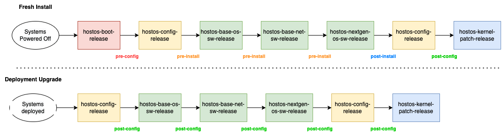

##  Deployment Flow Diagram



The above figure depicts the steps associated with a hostos deployment

  


## Fresh Deployment steps:

1. Fresh Install always begins with deployment of **hostos\-boot\-release**. This is to boot a newly provisioned physical system or can also be used to boot a new hostos kernel version on an existing deployed system
2. HostOS makes use of deployment stages to indicate the deployment status of a system.This status is stored on every mzone node under the file : **/etc/genesis/deploy\_stage**
3. After deployment of the **hostos\-boot\-release** the deployment status is set to **pre\-config**
4. The **hostos\-config\-release** is deployed and the sets the deployment status to **pre\-install**
5. The system is now configured for installing required Debian packages through the **base\-os\-sw, base\-net\-sw and nextgen\-os\-sw** releases
6. The system deployment status is set to **post install** at the end of **nextgen\-os\-sw** release deployment
7. The **hostos\-config\-release** is deployed again to complete any pending application and network configuration
8. The deployment status is now set to **post\-config** and is never changed until the next boot cycle
9. The kernel patch release is deployed to install any live kernel patch updates. This stage does not affect the system deployment status
10. It's important to follow the deployment order as shown above. Skipping any deployment release bundle will fail the overall deployment

## Deployment upgrade steps:

1. The steps are same as that for a fresh deployment except that the **hostos\-boot\-release** is not installed
2. There is no need to follow any deployment order and the upgrade can be performed with any release bundle as desired.
3. Also is not necessary to always upgrade will all the release bundles and individual release upgrades can be performed. For example: we can deploy only base\-os\-sw release when there is an upgrade required.
4. Upgrade deployment does not allow to deploy an older version of a release bundle. For example: if a system is deployed with base\-os\-sw:2\.1\.1 the we cannot deploy base\-os\-sw:2\.1\.0
5. Upgrade will be skipped if the node under deployment has a different release version of deployment than the one that’s required.For example if a node has 3\.x release bundles then we cannot upgrade it with 2\.x or even 5\.x release bundles. The deployment should only use 3\.x release bundles with a higher version

  


## Deployment Tools and configuration flags

HostOS release bundles are mainly deployed using the DDT tool: <https://pages.github.ibm.com/genctl/ddtool/>

The tools uses a hjson manifest to provide the release bundles that need to be deployed.The tool also provides provisions to add any deployment configuration flags associated with the release bundles.  
  
A sample ddt hjson file is as follows:


```
{
  components: {
    hostos: {
      packages: {
        hostos-boot-release: {
          tag: 3.0.6-20220602T124916Z_887ca13
          forcereboot: yes
          artifrepo: wcp-genctl-docker-local.artifactory.swg-devops.com
        }
        hostos-config-release: {
          tag: 3.5.79-20220716T084253Z_0ffa960
          artifrepo: wcp-genctl-docker-local.artifactory.swg-devops.com
        }
        hostos-nextgen-os-sw-release: {
          artifrepo: wcp-genctl-docker-local.artifactory.swg-devops.com
          tag: 3.1.96-20220721T153534Z_de4442c
        }

        hostos-base-os-sw-release: {
          tag: 3.4.83-20220708T144532Z_1b241f2
          artifrepo: wcp-genctl-docker-local.artifactory.swg-devops.com
        }
        hostos-base-net-sw-release: {
          tag: 3.8.16-20220722T190519Z_018cee7
          artifrepo: wcp-genctl-docker-local.artifactory.swg-devops.com
        }
        hostos-post-config-release: {
          tag: 3.5.79-20220716T084253Z_0ffa960
          artifrepo: wcp-genctl-docker-local.artifactory.swg-devops.com
        }
        hostos-kernel-patch-release: {
          tag: 3.1.10-20220622T070711Z_1412be2
          artifrepo: wcp-genctl-docker-local.artifactory.swg-devops.com
        }
      }
    }
  }
  mzone: mzone7204
}


```

  


* The hostos\-boot\-release only reboots a system when **forcereboot** is set to **yes.**No system reboot will be performed if this flag is set to No
* The ddt config has 2 sections for config, namely hostos\-config\-release and hostos\-post\-config\-release.Both the sections point to the same config release and control the deployment flow as need for config before and after installation of base\-os\-sw,base\-net\-sw and nextgen\-os\-sw release bundles
* Most HostOS release bundles support a dry\-run mode that can be used to test if pre\-requisite conditions are met for a release deployment
* HostOS tools are designed to provide detailed error for investigating any deployment failures.The DDT console always provides a snippet summary of the failure that occurred.
* A detailed set of verbose logs can be checked under the **deploy\_logs** folder of ddt or the mds tools for different releases that are deployed.
* When an error is encountered for any release bundle deployment step, pending release bundles if any are skipped from deployment.

  


## Common deployment errors and Troubleshooting

Kindly note that in case if any of the deployment failures are reported for platform z/s390x machines then **IT NEEDS TO BE RE\-DIRECTED TO THE Z TEAM**.HostOS does not manage or support z systems

### hostos\-boot\-release errors:

* The most common errors include issues connecting to machine BMC interface that prevent any further progress of the release deployment.One needs to check the platform inventory files associated with the mzone and confirm that the mzone nodes and other details are correct.Also please try to reach out to the infra management team for any additional troubleshooting help

### hostos\-config\-release errors:

* **Personality morph error**. Example “unable to morph node personality to master from compute”  
This error is observed when the underlying mzone node has a different node personality than the one defined in the platform inventory file. The solution is to check the node personalities under NODE\_TYPES properties in the file /etc/genesis/network.conf and ensure that the same personalities are defined in its associated platform inventory file.The node may have multiple personalities and they need to match against the personalities defined in platform inventory file.Platform inventory files are available at [https://github.ibm.com/cloudlab/platform\-inventory](https://github.ibm.com/cloudlab/platform-inventory)
* **Failure getting nodetype from get\_node\_type()**  
These errors are caused due to invalid MAC address values for the node in the platform inventory file.We need to check the files and ensure that the values are correct
* Hostos\-confilg\-release is heavily dependent on vault secrets and may fail if invalid or expired vault access token has been provided
* The **/var/log/deployment\_history.log** provides a history of config deployment and status and is useful

### base\-os\-sw,base\-net\-sw and nextgen\-os\-sw release errors:

* The errors in these bundles are rare and limited to debian package installations issues due to dependency problems. Error may arise if packages on a system have been manually removed or upgraded and fail to satisfy dependency for an incoming package update or installation.

### hostos\-kernel\-patch\-release errors:

* HostOS Kernel Patch release deployment fails with error:  **Device or resource busy**  
There is a detailed runbook created to remediate this issue: [https://pages.github.ibm.com/cloudlab/internal\-docs/kernel\_patch\_failure.html](https://pages.github.ibm.com/cloudlab/internal-docs/kernel_patch_failure.html)

  


### HostOS files for troubleshooting

Following are a list of HostOS file that hold important node config or deployment information:

1. /etc/genesis/release\-bundles: provides a complete list of release bundles deployed on the system.Can be used to track the history of deployments and upgrades performed on a system
2. /etc/genesis/network.conf: contains information about node network properties
3. /var/log/deployment\_history.log : provides verbose details of config release upgrades

These files may assist with the troubleshooting process at times.

  

