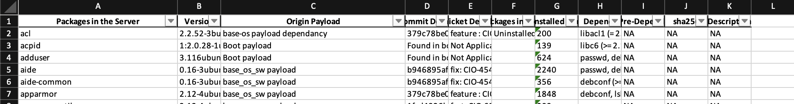

# Audience

VPC Security and Compliance team. 

# Purpose and scope

This page describes the methods used to validate Debian Installed on HostOS  Mzone node.  

As an organization under IBM Corporate, our project follows IBM Corporate policies in addition to our project's procedures to validate packages installed on node.   
While packages installation is driven by HostOS release bundles, we identify packages installed, we do rely on larger control  enforced by IBM Corporate policies to avoid unwanted packages installed on node( e.g restricted access to zones ) and also on service teams to provide justification of packages In case they were installed outside of HostOS release bundle process. 

# Definitions

* **Mzone node:** A NextGen (NG)  server running IBM customised HostOS installation. These servers exist inside data centre. node type included are 
	+ Control node
	+ Compute node
	+ Service node
	+ Edge node
	+ Master node

# Managing Gentor Debian inventory  changes

Mzone node Debian intended inventory is available at centralised location on Github  
[https://github.ibm.com/cloudlab/hostos\-upgrade\-payloads](https://github.ibm.com/cloudlab/hostos-upgrade-payloads)   
[https://github.ibm.com/cloudlab/hostos\-boot\-payloads](https://github.ibm.com/cloudlab/hostos-boot-payloads)  


# Policy overview

**DebianInventory**

```
      - name: aide
        personalities:
        - all
        arch_versions:
          all: 0.16-3ubuntu0.1


```

here  code indicates that package "aide"  needs to be installed on "all" node types ( compute/control/... ) with version 0\.16\-3ubuntu0\.1   


# Validation Overview

  
  
  


This is example of validation done on Mzone \- important fields from data are 

* **Packages** : This field list Package name
* **Version** : This field list Package version
* **Origin Payload :** This is internal mapping of data, it shows which HostOS release bundle installed that package
* **Commit ID** : This field tracks what commit in source code got that package
* **Ticket ID :** The field shows associated Jira tickets

# Review process

We have qutaterlyvalidation review process. 

# Quarterly review process

Quarterly SOC2 control for Debian inventory revalidation requires that we review the packages installed on Mzone and also cross verify it with data on GitHub. We  gather information from random  Mzone production node to ensure that we only have expected packages installed 

The following procedure describes what to include in the JIRA ticket and steps to perform on your local machine:

1. In JIRA open a new**SCE task** in the **CloudLab** project.
2. In JIRA open a new**CIO task** in the **CloudLab** project.
	1. This is used mainly for internal team assignment for quarterly  GitHub and scripts validation.
3. In the title and description fields, use "Perform Second Quarter \<year\> Review of Gentor Debian Inventory"
4. Get data output from production Mzone node.
5. Attach output to SCE task

  


# Evidence


| 1 | Quarterly review process evidence | [SCE\-2724](https://jiracloud.swg.usma.ibm.com:8443/browse/SCE-2724?src=confmacro) \- Jira issue doesn't exist or you don't have permission to view it.    SCE Ticket for Quarterly Validation   [CIO\-5881](https://jiracloud.swg.usma.ibm.com:8443/browse/CIO-5881?src=confmacro) \- Jira issue doesn't exist or you don't have permission to view it.     CIO Ticket for Quaterly Validation |
| --- | --- | --- |

# Enforcement

* Company executives, leaders, and senior management are required to ensure that internal audit mechanisms exist to monitor and measure compliance with this procedure.
* Managers and senior managers have the responsibility to enforce compliance with the procedure.


## Attachments:


 


Document generated by Confluence on Jul 16, 2024 23:12


[Atlassian](https://www.atlassian.com/)


 


