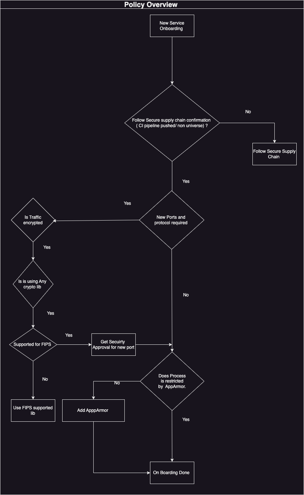

# Audience

VPC Security and Compliance team. 

# Purpose and scope

This page describes the methods used to onboarding any services/protocol/daemon  on mzone node. 

  


# Definitions

* **Mzone node:** A NextGen (NG)  server running IBM customised HostOS installation. These servers exist inside data centre. node type included are 
	+ Control node
	+ Compute node
	+ Service node
	+ Edge node
	+ Master node

  


# Policy overview

  


Any new service/Damon which needs to be onboarded on system needs to fill out template which has these questions . 


```
1. Are any new ports opened due to this new Debian package(s)? 
2. Is there any communication with an external server/service? 
3. Are new iptables rules required to support this? 
4. Is traffic encrypted ? 
5. Any crypto content used ? if Yes if it's Fips supported either by canonical or third party.
6. Third Party
   a. Obtain sign-off from Control Plane VP 
   b. Follow VPC SRB process 
   c. Provide a detailed test plan, including all necessary testing procedures and expected outcomes.
   d. Develop a comprehensive production support plan to address potential failures.
   e. if the package update is automatically pushed from the server:
        a. Outline the staged testing plan.
        b. Ensure sign-off from the RE (Release Engineering) lead.
7. Are there additional packages being installed apart from one listed?
8. if package creates any new process, document the new precess and plan for process restriction using Apparmor.  
9. CI pipeline information 
10. Opensource approval information 
```

## Workflow Diagram for Policy




 


