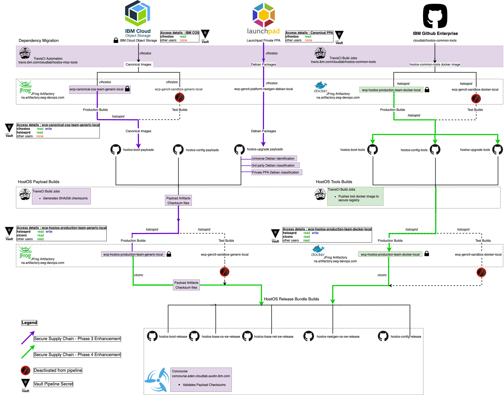
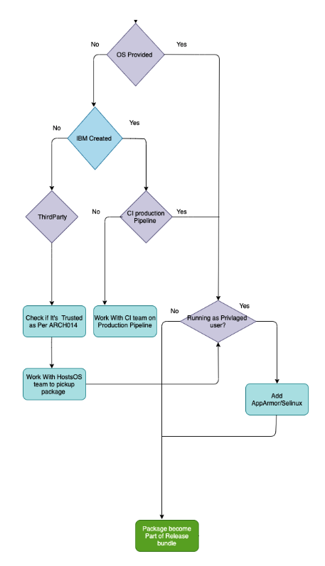

# Audience

VPC Security and Compliance team. 

# Purpose and scope

This page describes the methods used to enable, update, and maintain secure supply chain on HostOS. This does not include packages installed outside of what HostOS provides \- example packages installed manually/installed by kube or other service teams bundled.

  

Primary purpose of HostOS Secure supply chain is \- 

* Integrity management and validation of all consumed artifacts
* Secure storage and restricted access to the artifacts consumed or produced
* Secure storage of pipeline secrets in IBM Hashicorp Vault

# Policy Overview

The HostOS supply chain is responsible for providing the building blocks for various HostOS components and is mainly collected from Canonical and other sources.

This includes artifacts such as Debian packages, boot images and kernel patches.

### Canonical Dependencies

The HostOS supply chain obtains and consumes the following artifacts from Canonical:

1. Boot Images (.cpio files)
2. Kernel patches (.ko files)
3. Custom Debian Packages (Canonical Private PPA at [https://launchpad.net/\~ibm\-cloud](https://launchpad.net/~ibm-cloud))
4. Debian Packages from Ubuntu bionic main/universe public repositories

### Key features:

**1\.Automation of Manual supply chain processes**

The process of retrieving debian packages from Canonical PPA Private repository has now been automated and is executed on a periodic basis using Travis CI.  
The integrity of imported Debian packages is verified against the supplied original checksums and stored into secure debian repository in IBM Artifactory.

**2\.Automated migration of Canonical boot images to secure Artifactory storage**

We now have an automated process to migrate Release Boot images provided by canonical from IBM Cloud Object Storage instance to secure and restricted location in IBM Artifactory.  
The COS bucket access is associated with an IBM Functional ID with **read\-only** access to Canonical Content and is used by automation to retrieve boot images and checksums.  
The integrity of all artifacts collected from COS bucket is validated against the original checksums provided by Canonical before and after importing into IBM Artifactory.

**3\.Secure storage of HostOS payload archives and tool docker images to secure Artifactory storage**

All artifacts produced by HostOS pipelines such as payloads and tools are stored in a new, secure and restricted IBM Artifactory location.The write access to these artifactory locations  
is associated with a single IBM Functional ID whereas other users and dependent pipelines are allowed only read access for their retrieval. 

**4\.Integrity Verification through sha256 checksums for all HostOS artifacts consumed or produced**

End to End  Integrity check is now applied to all artifacts produced or consumed by Host OS.For example: sha256 checksums are now produced for every hostos payload tar packages  
and are verified by the release bundle builds when they are consumed.

**5\.Secure storage of pipeline secrets in IBM's internal Vault instance (pok\-dev)**

All pipeline secrets,tokens and api keys associated with build tasks are only associated to IBM FUNCTIONAL Id's.These secrets are securely stored in IBM's Internal Hashicorp Vault Instance  
and are rotated every 90 days.

  

Below is a diagrammatic representation of secure supply chain

  

  

  

## Incorporating new Packages

Following process flow is followed to include new packages in HostOS release bundle 

| **Step** | **Role** | **Narrative** |
| --- | --- | --- |
|  |  | **Start HostOS package update** |
| 1 | Service Team | **Identify new package requirement for service**Proceed to 2 Create JIRA Issue |
| 2 | Service Team | **Create Jira Issue**Create a new issue in JIRA to request HostOS team to integrate new package Proceed to 3 |
| 3 | HostOS Team | **Initial evaluation of new  requirement and request to fill up data template about new package**Proceed to 4 |
| 4 | Service Team | **Fill up template with relevant data for secure supply chain**Proceed to 5 |
| 5\. | HostOS Team | **Do necessary code changes to update to include new package if it adheres to all all requirement of secure supply chain.** |
|  |  | **End**HostOS  Package update Procedure is complete |

## Attachments:

 

Document generated by Confluence on Jul 16, 2024 23:12

[Atlassian](https://www.atlassian.com/)

 

