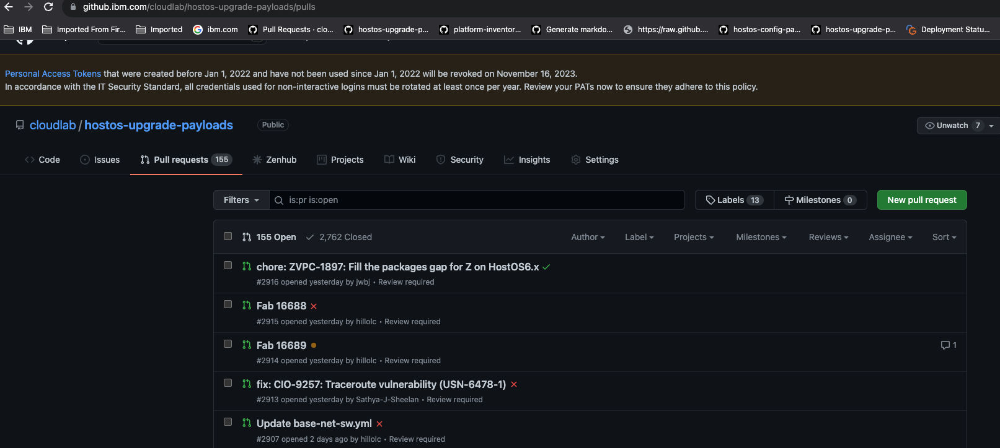
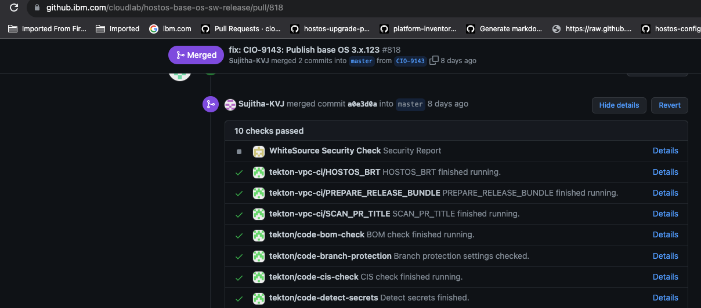
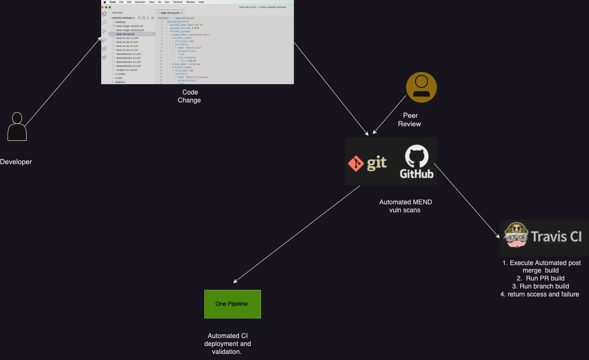

## Peer code review

Every code change goes through compulsory Peer review process. this helps in 

1. Finding bugs
2. Improving code quality
3. More distributed knowledge of code.

## Automated checksEvery PR goes through Automated checks which

a. Builds code to detect any errors   
b. Deployment checks through concourse 

Every change request goes through Github Pull request to main repo where code is reviewed and automated checks are performed 

  

Peer Review : 

  

  

  
Automated Test execution 

  

  

## This workflow captures overall Process

1. Developer Creates Pull request
2. Code goes through Peer code review process
3. Code goes through automated checks and deployment

  

  

  

  

  

  

## Attachments:

 

Document generated by Confluence on Jul 16, 2024 23:12

[Atlassian](https://www.atlassian.com/)

 

