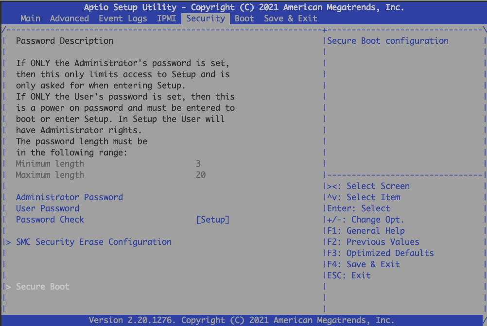
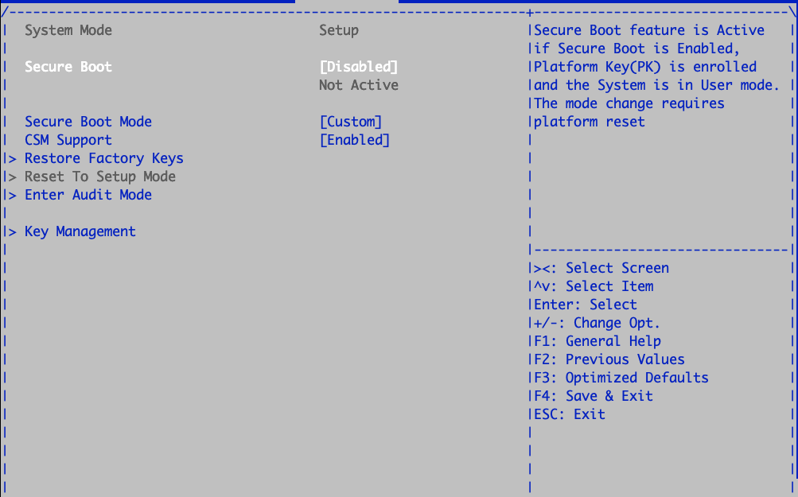
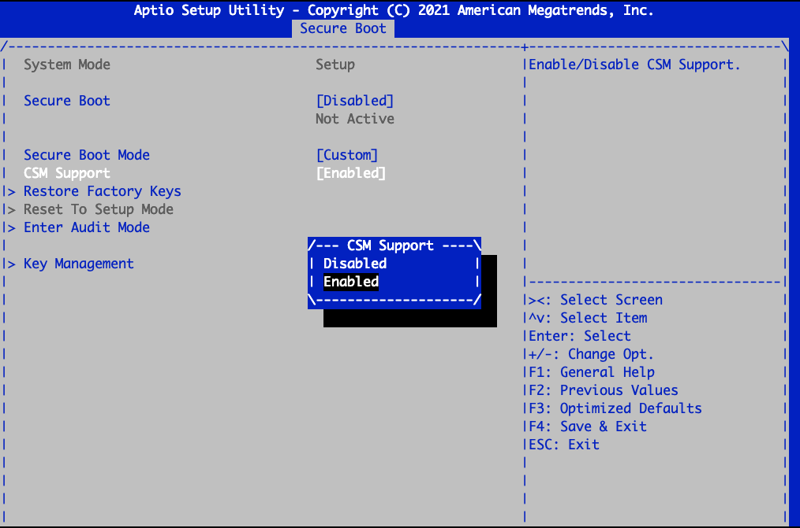
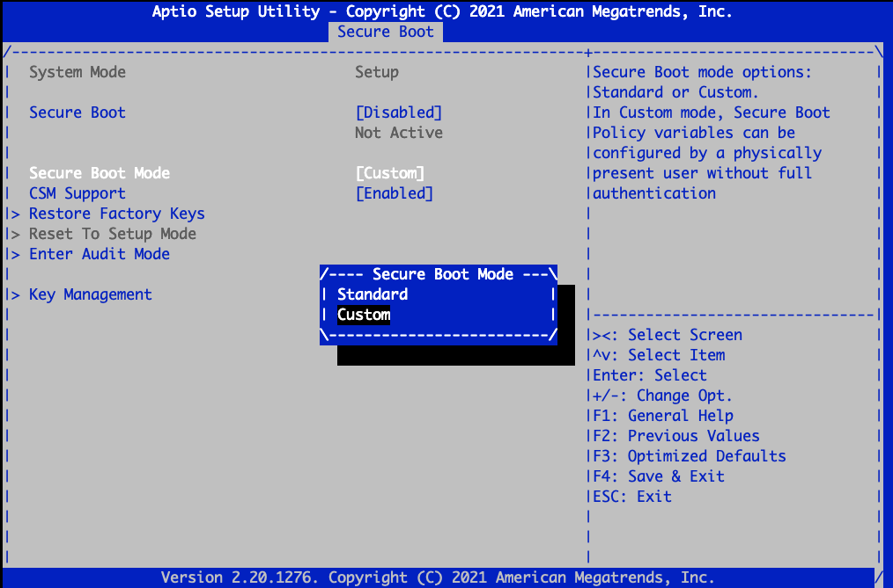
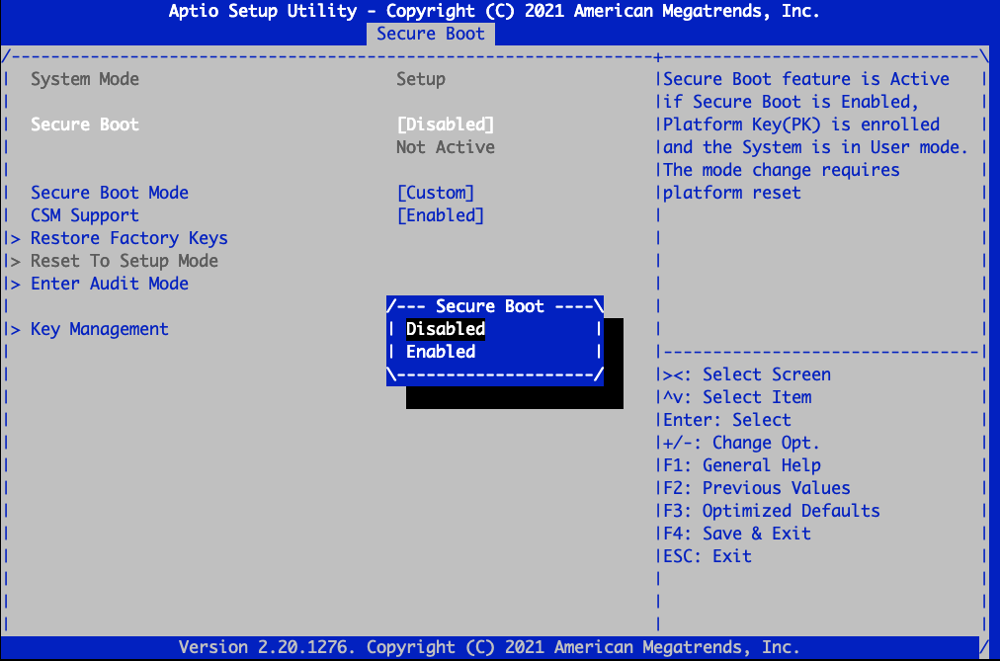

### Pre Requisites

* Node IPMI address
* IPMI Password for that node

### Steps

* NOTE: Using 192\.168\.88\.40 as an example. This is the BMC address of an mzone node.
* Power cycle the node:
	+ ipmitool \-I lanplus \-H 192\.168\.88\.40  \-U root \-P \<ipmi password\> chassis power cycle
* Enter boot options:

	+ ipmitool \-I lanplus \-H 192\.168\.88\.40  \-U root \-P \<ipmi password\>  sol activate
* Switch to the "Security" Tag

  

* Once in security tab, Select the "Secure Boot" at the bottom

* If the "Secure Boot" mode is "Disabled"
* Disable CSM support

* Powercycle the node and enter boot options
	+ ipmitool \-I lanplus \-H 192\.168\.88\.40  \-U root \-P \<ipmi password\> chassis power cycle
	+ ipmitool \-I lanplus \-H 192\.168\.88\.40  \-U root \-P \<ipmi password\>  sol activate
* Set Secure Boot Mode to "Standard"

* Powercycle the node and enter the boot options again
	+ ipmitool \-I lanplus \-H 192\.168\.88\.40  \-U root \-P \<ipmi password\> chassis power cycle
	+ ipmitool \-I lanplus \-H 192\.168\.88\.40  \-U root \-P \<ipmi password\>  sol activate
* Set the Secure Boot option to Enabled

* Power cycle the node

  

  

## Attachments:

 

Document generated by Confluence on Jul 15, 2024 13:04

[Atlassian](https://www.atlassian.com/)

 

