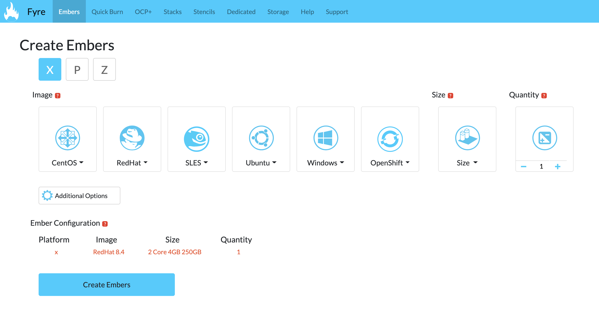
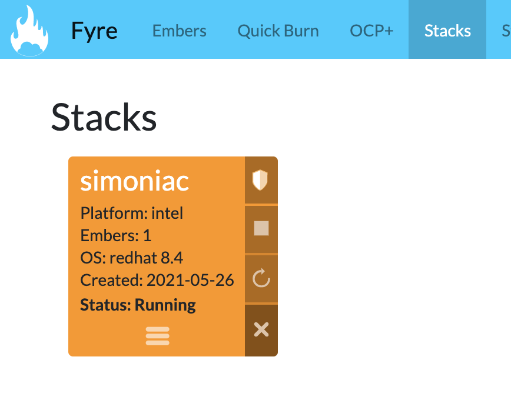

# Requesting a VM using Fyre

This document provides steps to register and setup a vm instance using DevIT's Fyre Hybrid Cloud

1. Log into your new Fyre account at fyre.ibm.com/account using your IBM intranet login (W3 ID)
2. Set your "Central Root Password". This will be the initial password for the  account on Windows deployments or for the  account on all other deployments.
3. Choose your default deployment site. It is initially set to SVL (Silicon Valley Lab) where the majority of Fyre resource resides and ,therefore, usually the best performance. Choose another default site only if you have specific network location requirements. You can change this at any time or override it for any individual deployments.
4. Request to join the product group IBM NextGen Cloud - All.Anytime you deploy to Fyre, you will need to be part of a product group quota. You can be part of one group or many groups. Once you have requested group access the owner of the group will be notified and either approve or reject your request.
5. Once you have been added to the product group, you may start deploying an ember by clicking on the Embers link
6. Select the required vm configuration values and click on Create Embers button. Example below:

7. Your ember is now ready can can be viewed under the Stacks link
