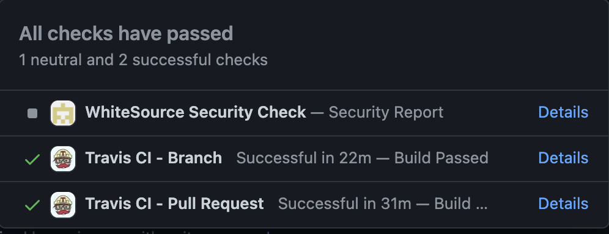
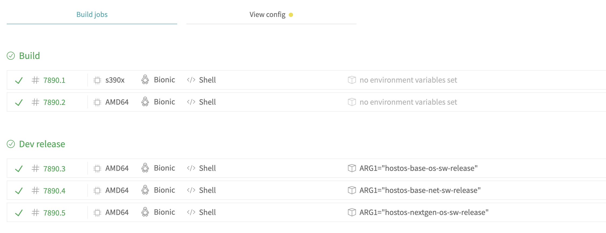
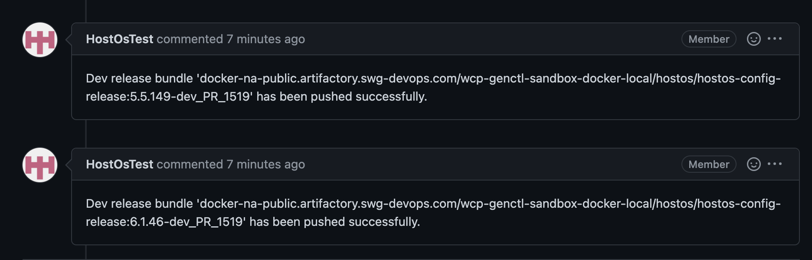

##### (Note: These steps are applicable for hostos\-upgrade\-payloads and hostos\-config\-payloads repos)

### Steps \-

1. Create new branch for your changes in payloads.
2. Rebase branch with latest changes.
3. Add your changes in payload manifest files and raise PR.
4. Once PR is raised, two builds will start in travis \-

5. The dev release bundles will be created by jobs under **"Travis CI \- Pull Request"** build \- 

6. As it can be seen in above screenshot, **"Build"** stage will build the payload and upload it to artifactory at \-[https://na\-public.artifactory.swg\-devops.com/artifactory/wcp\-genctl\-sandbox\-generic\-local/cloudlab/hostos/](https://na-public.artifactory.swg-devops.com/artifactory/wcp-genctl-sandbox-generic-local/cloudlab/hostos/) and the dev release bundles will be created in **"Dev release"** stage.
7. The dev release bundles will have tag like this \- **\<Release\_Bundle\_name\>:\<Incremented\_Release\_version\>\-dev\_PR\_\<Your\_PR\_Number\>**
E.g. hostos\-base\-os\-sw\-release:5\.4\.139\-dev\_PR\_3554
Where, hostos\-base\-os\-sw\-release \- This can be either hostos\-base\-os\-sw\-release, hostos\-base\-net\-sw\-release, hostos\-nextgen\-os\-sw\-release or hostos\-config\-release5\.4\.139 \- The dev release minor version will be incremented by 1 than the vetted version.dev\_PR\_3554 \- This is your PR number. 
8. The dev release bundles will be uploaded in sandbox artifactory repo like this \- [docker\-na\-public.artifactory.swg\-devops.com/wcp\-genctl\-sandbox\-docker\-local/hostos](http://docker-na-public.artifactory.swg-devops.com/wcp-genctl-sandbox-docker-local/hostos/hostos-base-os-sw-release:5.4.139-dev_PR_3554)
E.g. [docker\-na\-public.artifactory.swg\-devops.com/wcp\-genctl\-sandbox\-docker\-local/hostos/hostos\-base\-os\-sw\-release:5\.4\.139\-dev\_PR\_3554](http://docker-na-public.artifactory.swg-devops.com/wcp-genctl-sandbox-docker-local/hostos/hostos-base-os-sw-release:5.4.139-dev_PR_3554)
9. Once dev release bundles are pushed, a comment per each dev release bundle will be added in PR so that you don't have to go and search for dev release bundle tag in build logs.
 E.g.

10. **Please note that for every new commit in your PR will replace the dev release image created by the prev commit in same PR.**
11. "**Dev release**" jobs will not be triggered in post merge builds.
12. Builds generated by payloads \-

| payloads repo | Branch | Release Bundles Examples |
| --- | --- | --- |
| hostos\-upgrade\-payloads | master | hostos\-base\-os\-sw\-release 5\.4\.139\-dev\_PR\_3554hostos\-base\-net\-sw\-release 5\.12\.83\-dev\_PR\_3554hostos\-nextgen\-os\-sw\-release 5\.1\.133\-dev\_PR\_3554 |
| hostos\-upgrade\-payloads | release\-6 | hostos\-base\-os\-sw\-release 6\.1\.35\-dev\_PR\_3567 hostos\-base\-net\-sw\-release 6\.12\.83\-dev\_PR\_3567 hostos\-nextgen\-os\-sw\-release 6\.1\.31\-dev\_PR\_3567 |
| hostos\-config\-payloads | master | hostos\-config\-release:5\.5\.149\-dev\_PR\_1518hostos\-config\-release:6\.1\.46\-dev\_PR\_1518 |

