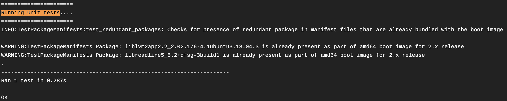
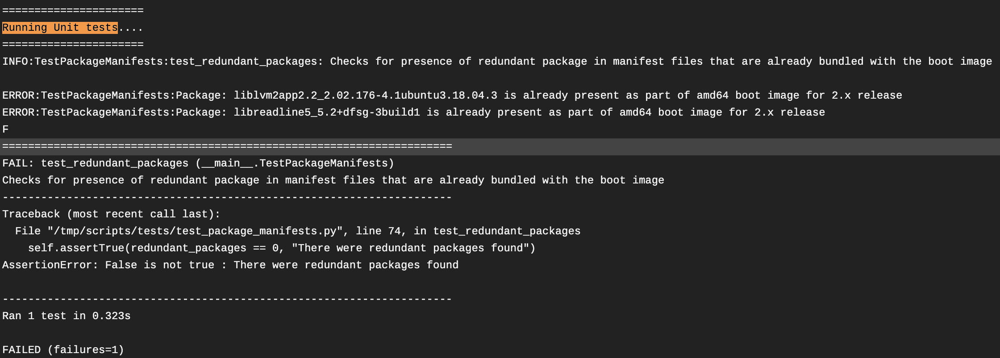

## Implementation

The initial enhancement is implemented as part of following PR:

[https://github.ibm.com/cloudlab/hostos\-upgrade\-payloads/pull/1567](https://github.ibm.com/cloudlab/hostos-upgrade-payloads/pull/1567)

## Design

Current design executes the tests at the commencement of the build process as part of the build\_payload.sh build script for every hostos release.

#### Non Enforced mode

The tests are currently executed in non\-enforced mode (default mode) where failures if any are ignored without affecting the overall build results.

However the warning logs are always displayed in the travis build console as shared below.

  

#### Enforced mode

We can also enforce the tests to impact the build results by using the build command :

> make ENFORCE\_UT\=1

This will ensure that the build fails if any test fail and the developer is notified of any corrections to be handled.

  

#### Future scope

The framework may be expanded in future to include more scenarios, such as:

* Identify mismatch in package versions across hostos versions and many more

## Attachments:

 

Document generated by Confluence on Jul 15, 2024 13:04

[Atlassian](https://www.atlassian.com/)

 

