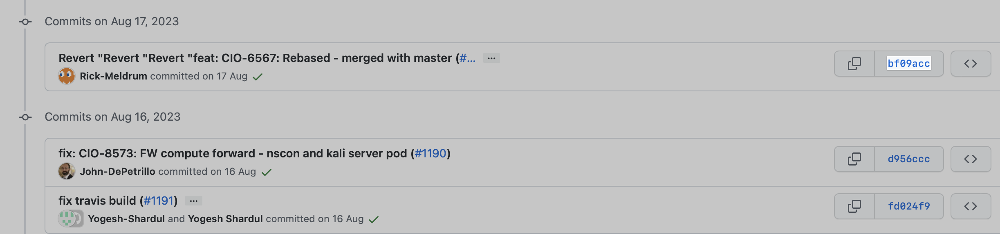
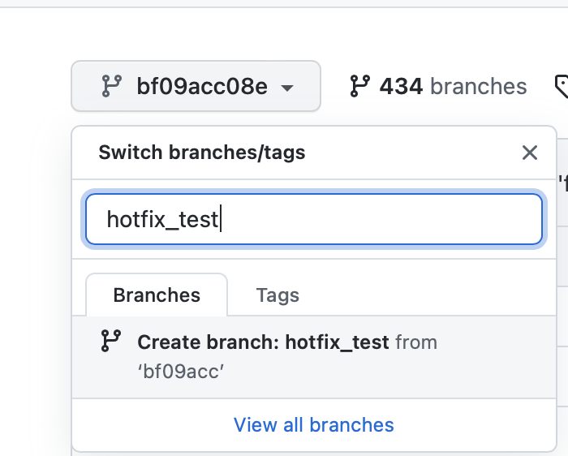
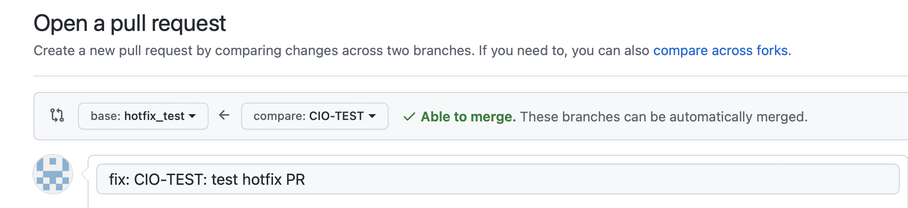

## **Introduction**

Hotfix branches are created to fix specific bugs in production environment which were introduced after deploying previous release branches. 

* Branch naming convention is hotfix\_x\-x\-x\_config. The x\[major release]\-x\[release]\-x\[hot\-fix] signs represent the hotfix tag. Ex. If the current tag in your repository is "0\.1\.4" then your next tag will be "0\.1\.5" for hotfix branch. The one at the end gets bumped up by "1" so our new hotfix branch name should be hotfix\_0\.1\.5\_config.
* Best Practice \- When working with hotfix branches, you should open up a "pull request" in GitHub so that other team members can see what we are preparing to fix.

## **Preparing a hostos\-config hotfix**

The high level workflow in summary:

1. You must find out what branch/payload hash to target. (hotfix\-XXXXXXX)
2. Identify the key changes you intend to hotfix.
3. You checkout the target branch locally.
4. Create a new branch based off that target branch. This will be the branch that forms your PR.
5. Run make build and see that the build still works with your changes and there are no lingering problems.
6. Deploy the sandbox release to a relevant mzone that will allow you to test the changes. See that the hotfix changes worked.
7. Create a PR, ensure travis.sh is updated with hotfix\-XXXXXXXX target branch. So it pushes the artifacts/payloads to production Artifactory.
8. Get at least one reviewer. It does not go through CI/CD so it is up to the author of the hotfix to ensure that the changes will not break anything.
9. Merge that PR to the `hotfix-XXXXXXXX` target branch.
10. Using merge hash create config\-release PRs.

### What branch/hash to target?

It is recommended that there is some time spent to use git log and to talk with people in team to ensure the right branches are used. This should be a hash which was used in previous release PR as payload\_version.

In this example, we had config .118 released and we wanted only one fix of containerd removed off it, we created a hotfix branch above that commit/hash (bf09acc)



  


**Browse the repo at this hash and create a hotfix branch.**  
  


 

### Checkout the target branch locally


```
git clone --branch hotfix_test git@github.ibm.com:cloudlab/hostos-config-payloads.git
```

**checkout a new branch off hotfix branch to add fix though a PR.**


```
shashikantshelke@Shashikants-MacBook-Pro hostos-config-payloads % git checkout -b CIO-TEST
Switched to a new branch 'CIO-TEST'
```

**commit changes and push to hotfix branch.** 


```
shashikantshelke@Shashikants-MacBook-Pro hostos-config-payloads % git commit -m "fix: CIO-TEST: test hotfix PR" README.md 
[CIO-TEST 10cccbc] fix: CIO-TEST: test hotfix PR
 1 file changed, 1 insertion(+)
shashikantshelke@Shashikants-MacBook-Pro hostos-config-payloads % git push origin CIO-TEST
```

**At this point ensure to update branch name here in travis.sh   
[https://github.ibm.com/cloudlab/hostos\-config\-payloads/blob/bf09acc08e8cc27a8ec8ae58ae6ad3d1e4780206/travis.sh\#L63](https://github.ibm.com/cloudlab/hostos-config-payloads/blob/bf09acc08e8cc27a8ec8ae58ae6ad3d1e4780206/travis.sh#L63)**

This ensures the build artifacts are pushed to prod artif repo.   
  
  


**Compare CIO\-TEST branch against target branch \- hotfix\_test.  Open a PR  and get a reviewer to review it.**

A reviewer should be selected from people familiar with the hosts\-config\-\* repository to ensure that the commits make sense. There are no traditional CI steps for a hotfix, which is why it needs to be tested manually.

  


### Deploying and Testing Changes

As the stable branch is an older version of the code it is imperative that you test using the target branch as it stands today. Deploy the stable version to a particular DEV mzone so that you are testing the feature accurately in the target branch. Run `make tests`, deploy, and live testing steps on nodes again until the hotfix in question appears to be functional and ready.

Refer [HostOS Config Test Procedure](HostOS-Config-Test-Procedure_182225323.html) for config testing. 

Once the hotfix appears functional and ready, often running a smoke test is also a good idea if available.

### Merge the PR

Once someone reviews your change, you may merge it to the hotfix\_test branch. At this point you can update team that your hotfix is ready and pick the merged hash to update hostos\-config\-release PRs. 

 If the current tag in your config\-release is "0\.1\.4" then your next tag will be "0\.1\.5" for hotfix to avoid any confusion. The one at the end gets bumped up by "1" so our new hotfix branch name should be hotfix\_0\.1\.5\_config.

  


  


  


## Attachments:


 


Document generated by Confluence on Jul 15, 2024 13:04


[Atlassian](https://www.atlassian.com/)


 


