## KVM\-Security\-Matters

\-   Document Author \-  Rafael  Tinoco (Canonical))  
[Webex Session Link](https://ibm.ent.box.com/folder/278058885490)   
 
TABLE OF CONTENTS

* QEMU/KVM Security Matters
	+ 1\-) Introduction
		- 1\.a\-) QEMU basics
		- 1\.b\-) KVM basics
		- 1\.c\-) Device Assignment Methods
			* 1\.c.1\-) IOMMU
			* 1\.c.2\-) VFIO
			* 1\.c.3\-) vIOMMU
			* 1\.c.4\-) vIOMMU and DPDK
			* 1\.c.5\-) SR\-IOV
		- 1\.d\-) Device Para\-Virtualization
			* 1\.d.1\-) virtio
			* 1\.d.2\-) virtio\-net vhost\-net
			* 1\.d.3\-) virtio\-net openvswitch
			* 1\.d.4\-) virtio\-net SR\-IOV
			* 1\.d.5\-) virtio\-pci
		- 1\.e\-) Block Devices, LUNs and Disks
			* 1\.e.1\-) virtio\-blk
			* 1\.e.2\-) virtio\-scsi
				+ i. virtio\-scsi: **QEMU target** SCSI handling
				+ ii. virtio\-scsi: **LIO target** SCSI handling
				+ iii. virtio\-scsi: **libiscsi target** SCSI handling
			* 1\.e.3\-) SCSI dev assignment
	+ 2\-) QEMU Internals
		- 2\.a\-) Networking
			* 2\.a.1\-) User Networking \- SLIP
			* 2\.a.2\-) Networking \- TUN/TAP scenario
		- 2\.b\-) Common Inter\-Process Communication (IPC) methods
		- 2\.c\-) Virtio specification
		- 2\.d\-) Vhost protocol
			* 2\.d.1\-) The vhost\-user protocol
	+ 3\-) QEMU security surface
		- 3\.a\-) QEMU and OS intersection
		- 3\.b\-) QEMU vCPU assignment \& side\-channel observations
		- 3\.c\-) QEMU devices emulation
		- 3\.e\-) QEMU devices acceleration
		- 3\.f\-) QEMU virtual disk devices
		- 3\.g\-) QEMU storage backends
		- 3\.h\-) QEMU vNIC AND SR\-IOV
		- 3\.i\-) QEMU monitor (QMP and HMP)
		- 3\.j\-) QEMU confinement
			* 3\.j.1\-) Guest isolation
			* 3\.j.2\-) Principle of Least Privilege
			* 3\.j.3\-) Isolation Mechanisms
			* 3\.j.4\-) Isolation: apparmor
				+ @ \- PROPOSITION 1
			* 3\.j.5\-) Isolation: cgroups (as resources manager)
			* 3\.j.6\-) Isolation: namespaces
				+ namespace kinds
				+ @ \- PROPOSITION 2
			* 3\.j.7\-) Isolation: seccomp (sandbox)
				+ QEMU seccomp
				+ @ \- PROPOSITION 2' (comments)
		- 3\.l\-) QEMU logging: tracing execution not a good idea
			* 3\.l.1\-) QEMU Machine Protocol
			* 3\.l.2\-) QEMU QMP commands to change VM disks
			* 3\.l.3\-) QEMU Monitor Event Loop
			* 3\.l.4\-) QEMU LOGGING
			* 3\.l.5\-) LIBVIRT LOGGING
	+ 4\-) Learning with history: QEMU CVEs: study case
		- 4\.a\-) CVE\-2019\-6778 \- heap buffer overflow in SLIRP
		- 4\.b\-) CVE\-2019\-14835 \- V\-gHost escape in virtio\-net / vhost\-net
	+ 5\-) QEMU CVEs instrospection: a study case
		- 5\.a\-) Lessons learned: avoid it happening again
		- 5\.b\-) Introspection tools: avoid overhead
			* events
			* kprobes \& uprobes
			* eBPF
		- 5\.c\-) Near future: predict/log unwanted known behavior
			* Falco Security
			* Tracee
			* @ \- PROPOSITION 3
	+ 6\-) REFERENCE

\" because \"request\" is null")**QEMU/KVM Security Matters**  
\" because \"request\" is null")**1\-) Introduction**  
This document describes how QEMU works, pointing out how its behavior can be analyzed, audited and logged having in mind execution escapes and privilege escalations.  
Before moving into virtual machines logs and confinement options, it is imperative that **some basics** of how QEMU works are understood so there is a clear picture on how difficult is to predict a machine (virtual) behavior (specially when parts of it are being emulated by the host kernel and parts are being emulated by userland binary code).  
At the end of this document you will have a basic understanding of most of the intersection points between QEMU and the host OS, and this is where security concerns will rise most of the times (mostly due to memory address space sharing among the parts).  
\" because \"request\" is null")**1\.a\-) QEMU basics**  
QEMU is a hosted virtual machine emulator that provides a set of different hardware and device models for the guest machine. For the host, QEMU appears as a regular process scheduled by the standard Linux scheduler, with its own process memory. In the process, QEMU allocates a memory region that the guest see as physical, and executes the virtual machine's CPU instructions.  
To perform I/O on bare metal hardware, like storage or networking, the CPU has to interact with physical devices performing special instructions and accessing particular memory regions, such as the ones that the device is mapped to.  
When the guests access these memory regions, control is returned to QEMU, which performs the device's emulation in a transparent manner for the guest.  
**QEMU has multiple operating modes**

* **User\-mode emulation**: In this mode QEMU runs single Linux programs that were compiled for a different instruction set. System calls are thunked for endianness and for 32/64 bit mismatches. Fast cross\-compilation and cross\-debugging are the main targets for user\-mode emulation.
* **System emulation**: In this mode QEMU emulates a full computer system, including peripherals. It can be used to provide virtual hosting of several virtual computers on a single computer. QEMU can boot many guest operating systems and it supports emulating several instruction sets, including x86, MIPS, 32\-bit ARMv7, ARMv8, PowerPC, SPARC, ETRAX CRIS and MicroBlaze.

When used as user\-mode or system emulator, QEMU can run OSes and programs made for one machine on a different machine. The Tiny Code Generator (TCG) is the core binary translation engine that is responsible for QEMU ability to emulate foreign processors on any given supported host:  
The TCG works by translating each guest instruction into a sequence of host instructions. As a result there will be a level of inefficiency which means TCG code will not be as fast as running native code. However with a reasonable host system you can get a pretty good experience, especially when emulating older and slower chips.  
\[ 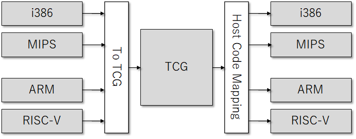 \|https://github.com/rafaeldtinoco/howtos/blob/main/images/HLBv0iCYU.png]  
The Tiny Code Generator (TCG) aims to remove the shortcoming of relying on a particular compiler, instead incorporating the compiler (code generator) into other tasks performed by QEMU at run time. The whole translation task thus consists of two parts: basic blocks of target code (TBs) being rewritten in TCG ops \- a kind of machine\-independent intermediate notation \- and subsequently this notation being compiled for the host's architecture by TCG (with optional optimisation passes done by the just\-in\-time compiler (JIR).  
**KVM Hosting**: Here QEMU deals with the setting up and migration of KVM images. It is still involved in the emulation of hardware, but the execution of the guest is done by KVM as requested by QEMU. The picture above showing TCG and the JIT technique does not apply in this case, as KVM only works when HOST and GUEST are in the same architecture (guest binaries are executed without any type of modification/interpretation).  
**Xen Hosting:**: QEMU is involved only in the emulation of hardware; the execution of the guest is done within Xen and is totally hidden from QEMU.  
When used as a virtualizer, QEMU achieves near native performance by executing the guest code directly on the host CPU. QEMU supports virtualization when executing under the KVM kernel module or Xen hypervisor.  
\" because \"request\" is null")

1. Physical Functions (PFs) are full PCIe devices that include the SR\-IOV capabilities. Physical Functions are discovered, managed, and configured as normal PCI devices. Physical Functions configure and manage the SR\-IOV functionality by assigning Virtual Functions.
2. Virtual Functions (VFs) are simple PCIe functions that only process I/O. Each Virtual Function is derived from a Physical Function. The number of Virtual Functions a device may have is limited by the device hardware. A single Ethernet port, the Physical Device, may map to many Virtual Functions that can be shared to virtual machines.

The hypervisor can assign one or more Virtual Functions to a virtual machine, an OS process or its own kernel. If assigned to a virtual machine, the virtual function's configuration space is assigned to the configuration space presented to the guest.  
Each Virtual Function can only be assigned to a single guest at a time, as Virtual Functions require real hardware resources. A virtual machine can have multiple Virtual Functions. A Virtual Function appears as a network card in the same way as a normal network card would appear to an operating system.  
The SR\-IOV drivers are implemented in the kernel. The core implementation is contained in the PCI subsystem, but there must also be driver support for both the Physical Function (PF) and Virtual Function (VF) devices. An SR\-IOV capable device can allocate VFs from a PF. The VFs appear as PCI devices which are backed on the physical PCI device by resources such as queues and register sets.  
Some advantages for using SR\-IOV:

* When an SR\-IOV VF is assigned to a virtual machine, it can be configured to (transparently to the virtual machine) place all network traffic leaving the VF onto a particular VLAN. The virtual machine cannot detect that its traffic is being tagged for a VLAN, and will be unable to change or eliminate this tagging.
* Virtual Functions have near\-native performance and provide better performance than paravirtualized (virtio) drivers and emulated access. Virtual Functions provide data protection between virtual machines on the same physical server as the data is managed and controlled by the hardware.

This method is very used in environments with NICs w/ 10GbE or more, supporting virtual functions, and able to do RoCE (like Mellanox ConnectX cards).  
\" because \"request\" is null")

* VIRTIO element (1\): **control plane** used for capability exchange negotiation between the host and guest both for establishing and terminating the data plane.
* VIRTIO element (2\): **data plane**: used for transferring the actual data (packets) between host and guest.

We can also split VIRTIO into those different parts:

* VIRTIO part (1\): **virtio spec** defines how to create a control plane (1\) and the data plane (2\) between the guest and host. The data plane (2\) is composed of buffers and rings layouts defined in the spec.

The control plane (1\) for VIRTIO is implemented in the QEMU process based on the VIRTIO spec however the data plane (2\) is not. Thus the question is why wasn't the data plane (2\) also implemented in the QEMU process ? The answer is performance.  
If VIRTIO spec data plane was implemented in QEMU, for every packget going from kernel to the guest, and vice\-versa, theere would be a context switch. Context switches are expensive adding latency to the application and requires more processing time (as QEMU is yet another linux process).  
\[ 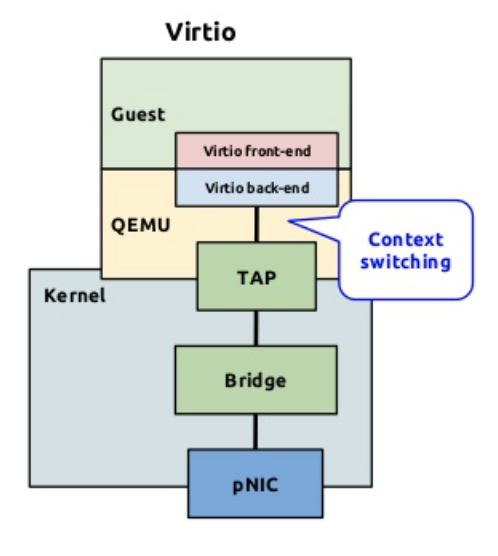 \|https://github.com/rafaeldtinoco/howtos/blob/main/images/42Zz5ctJt.png]

* VIRTIO part (2\): **vhost protocol** allows the VIRTIO dataplane implementation to be offloaded to another element (**user process or kernel module**) in order to enhance performance.

Vhost implements a data plane going directly from the host kernel to the guest, bypassing QEMU process entirely. The vhost only describes how to establish the data plane, however. Whoever implements it is also expected to implement the ring layout for describing the data buffers (both host and guest) and the actual send/receive packets.  
The vhost protocol can be implemented in the kernel (vhost\-net) or in the user space (vhost\-user). The vhost\-net/virtio\-net architecture described in this post focuses on the kernel implementation also known as vhost\-net.  
\" because \"request\" is null")

* vhost\-net \= backend component: host side of the VIRTIO interface
* virtio\-net \= frontend component: guest side of the VIRTIO interface

\[ 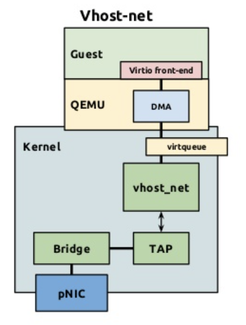 \|https://github.com/rafaeldtinoco/howtos/blob/main/images/DG\-1FvSQM.png]  
vhost\-net is part of the host kernel but and yet still called 'driver'  
Both components:

* vhost\-net (backend)
* virtio\-net (frontend)

Have separate control plane (1\) and data plane (2\) between the backend and frontend:

* control plane implements VIRTIO spec for vhost\-net (module) \<\-\> QEMU\-process communication.
* vhost protocol sets communication for data plane to fwd pkts from host to guest using shared memory.
* data plane communication is accomplished through dedicated queues
* each guest vCPU has at least 1 RX/TX queue

\[ 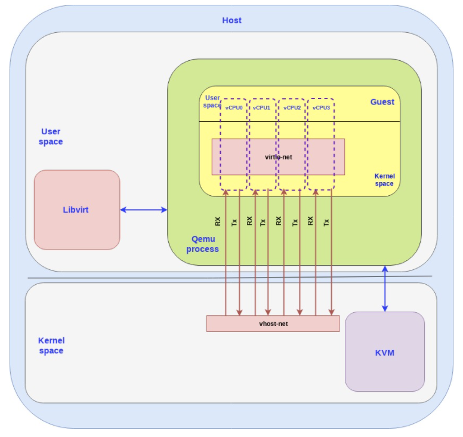 \|https://github.com/rafaeldtinoco/howtos/blob/main/images/3vFpxsnbh.png]  
Up to this point we have described how the guest can pass the packets to the host kernel using the virtio\-networking interface.  
ATTENTION: This is the method that will be used as an example further in this document.  
\" because \"request\" is null")

* User space \- database (ovsdb\-server) and an OVS daemon/controller (ovs\-vswitchd)
* Kernel space \- ovs kernel (module responsible for the datapath or forwarding plane)

The OVS controller communicates both with the database server and the kernel forwarding plane. To push packets in and out of the OVS we use Linux ports.  
\[ 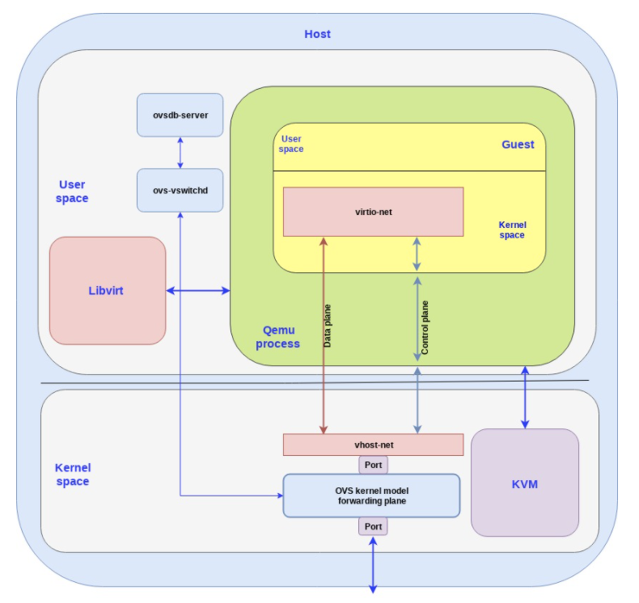 \|https://github.com/rafaeldtinoco/howtos/blob/main/images/3R2WwClFm.png]  
In the example above we have one port that connects the OVS kernel forwarding plane to a physical NIC while the other port connects to the vhost\-net backend (which will communicate with the virtio\-net frontend).  
\" because \"request\" is null")

* Control plane: config changes and capability negotiation between the NIC and guest (establishing and terminating the data plane)
* Data plane: transfer the actual data (packets) between NIC and guest. When connecting the NIC directly to the guest, this implies that the NIC is required to support the VIRTIO ring layout.

\[ 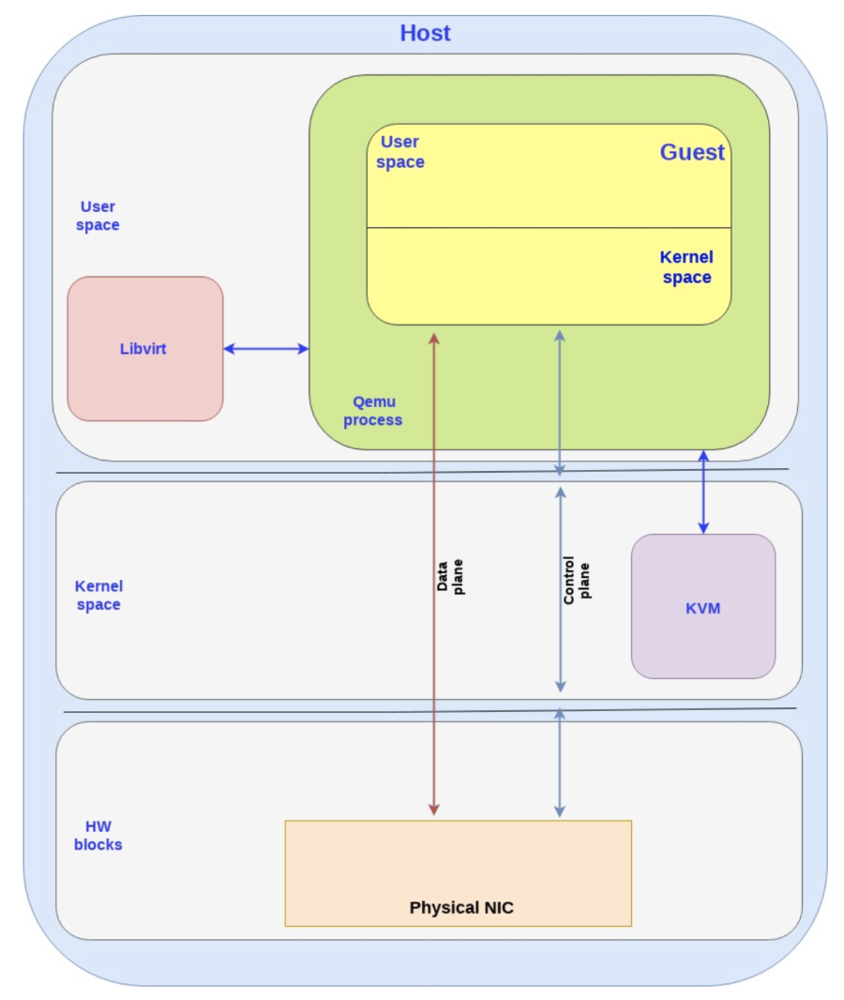 \|https://github.com/rafaeldtinoco/howtos/blob/main/images/CpDycbt\-4\.png]  
This is the model we will be analyzing further in a virtual machine XML example.

* The data plane goes directly from the NIC to the guest and this is implemented by a shared memory the guest and the NIC can access (shared by the guest), bypassing the host kernel (differently than vhost\-net when the host kernel is the one accessing the shared memory).

both sides need to use the exact same ring layout or translations will be required and translations have a performance penalty attached.  
\" because \"request\" is null")

* virtio\-blk SCSI handling

\[ 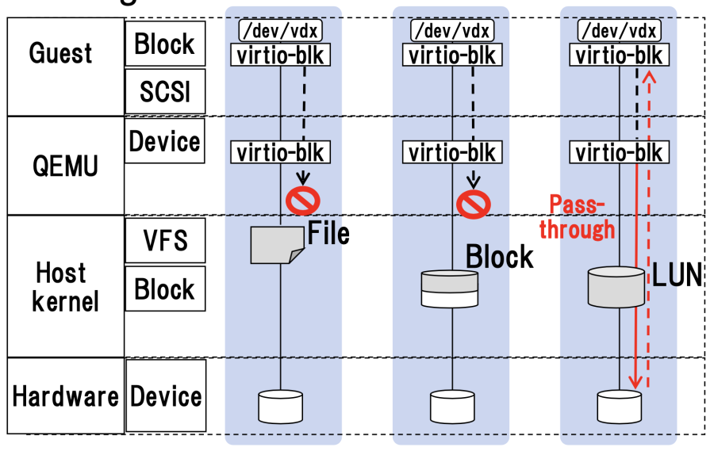 \|https://github.com/rafaeldtinoco/howtos/blob/main/images/ufy9WbRgw.png]  
SCSI passthrough was removed from the Linux virtio\-blk driver in v5\.6 in favor of using virtio\-scsi  
\" because \"request\" is null")

* tap \= layer 2 (ethernet frames) tun \= layer 3 (IP packets)

When the tun kernel module is loaded it creates a special device /dev/net/tun. A process can create a tap device opening it and sending special ioctl commands to it. The new tap device has a name in the /dev filesystem and another process can open it, send and receive Ethernet frames.  
\" because \"request\" is null")**2\.b\-) Common Inter\-Process Communication (IPC) methods**  
Unix sockets are one of the ways to do IPC: server binds a socket to a path in the filesystem so a client can connect to it and exchange messages. Unix sockets are also capable of exchanging file descriptors among 2 different processes.  
An eventfd is a lighter IPC: while sockets allow to send and receive data, eventfd is basically an integer that might be changed by a producer to signalize a consumer to poll and read data somewhere else. It works as a wait/notify mechanism.  
Shared memory is, like the name says, a portion of the OS memory reserved so two or more processes can exchange data from the same pages: one process writes and affects subsequent reads from another process accessing the same memory pages.  
\" because \"request\" is null")**2\.c\-) Virtio specification**  
Virtqueues are the mechanism for bulk data transport on VIRTIO devices. Each device can have zero or more virtqueues. It is a queue of guest\-allocated buffers that the host interacts with (rw). In addition, the VIRTIO specification also defines bi\-directional notifications:

* Available Buffer Notification: Used by the driver (guest) to signal there are buffers ready to be processed by the device (QEMU process)
* Used Buffer Notification: Used by the device (QEMU process) to signal driver (guest) it has finished processing some buffers.

In the PCI case, the guest sends the available buffer notification by writing to a specific memory address, and the device (QEMU) uses a vCPU interrupt to send the used buffer notification.  
The VIRTIO specification also allows the notifications to be enabled or disabled dynamically. That way, devices and drivers can batch buffer notifications or even actively poll for new buffers in virtqueues (busy polling). This approach is better suited for high traffic rates.  
In summary, the VIRTIO driver interface exposes:

* Device's feature bits (which device and guest have to negotiate)
* Status bits
* Configuration space (that contains device specific information, like MAC address)
* Notification system (configuration changed, buffer available, buffer used)
* Zero or more virtqueues
* Transport specific interface to the device

\[ 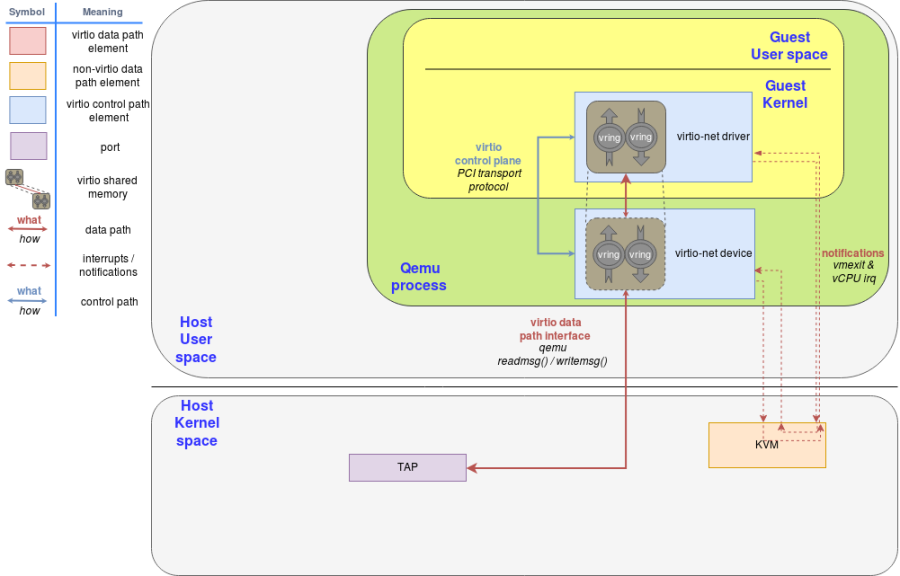 \|https://github.com/rafaeldtinoco/howtos/blob/main/images/vKU\-wZ0a1\.png]  
The VIRTIO network device is a virtual ethernet card, and it supports multiqueue for TX/RX. Empty buffers are placed in N virtqueues for receiving packets, and outgoing packets are enqueued into another N virtqueues for transmission.  
Another virtqueue is used for driver\-device communication outside of the data plane, like to control advanced filtering features, settings like the mac address, or the number of active queues. As a physical NIC, the VIRTIO device supports features such as many offloadings, and can let the real host's device do them.  
To send a packet, the driver sends to the device a buffer that includes metadata information such as desired offloadings for the packet, followed by the packet frame to transmit. The driver can also split the buffer into multiple gather entries, e.g. it can split the metadata header from the packet frame.  
These buffers are managed by the driver and mapped by the device. In this case the device is "inside" the hypervisor. Since the hypervisor (QEMU) has access to all the guests' memory it is capable of locating the buffers and reading or writing them.  
The following flow diagram shows the virtio\-net device configuration and the sending of a packet using virtio\-net driver, that communicates with the virtio\-net device over PCI. After filling the packet to be sent, it triggers an "available buffer notification", returning the control to QEMU so it can send the packet through the TAP device.  
QEMU then notifies the guest that the buffer operation (reading or writing) is done, and it does that by placing the data in the virtqueue and sending a used notification event, triggering an interruption in the guest vCPU.  
The process of receiving a packet is similar to that of sending it. The only difference is that, in this case, empty buffers are pre\-allocated by the guest and made available to the device so it can write the incoming data to them.  
\[ 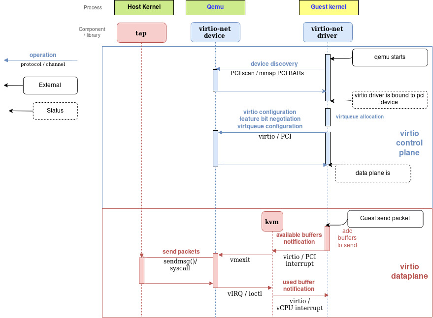 \|https://github.com/rafaeldtinoco/howtos/blob/main/images/DDq5fRI9x.png]  
\" because \"request\" is null")

* CVE\-2017\-5753 \- Bounds Check Bypass (Variant 1 / Spectre)
* CVE\-2017\-5715 \- Branch Target Injection (Variant 2 / Spectre)
* CVE\-2017\-5754 \- Rogue Data Cache Load (Variant 3 / Meltdown)

Side Channel Attacks \- Others

* CVE\-2018\-3665 \- Lazy FP Save/Restore (LazyFP)
* CVE\-2018\-3693 \- Bounds Check Bypass Store (Variant (or Spectre) 1\.1 and 1\.2 / BCBS)
* CVE\-2018\-3640 \- Rogue System Register Read (RSRE / Variant 3a)
* CVE\-2018\-3639 \- Speculative Store Bypass (SSB / Variant 4 / Spectre\-NG)

L1 Terminal Fault (L1TF)

* CVE\-2018\-3615 \- Intel SGX (Software Guard Extensions) (Foreshadow / L1TF)
* CVE\-2018\-3620 \- Operating Systems and System Management Mode (Fault\-OS / SMM) (L1TF)
* CVE\-2018\-3646 \- Virtualization Extensions (L1TF)

Microarchitectural Data Sampling (MDS)

* CVE\-2018\-12126 \- Microarchitectural Store Buffer Data Sampling (MSBDS / Fallout)
* CVE\-2018\-12127 \- Microarchitectural Load Port Data Sampling (MLPDS / RIDL)
* CVE\-2018\-12130 \- Microarchitectural Fill Buffer Data Sampling (MFBDS / ZombieLoad)
* CVE\-2019\-11091 \- Microarchitectural Data Sampling Uncacheable Memory (MDSUM)

This list isn't fully updated to the latest, check official sources for updated information  
And this is why it's important to understand risks and mitigations for this class of security vulnerabilities.  
If we take as an example the following domain XML definition:  
\<vcpu placement\='static' cpuset\='17,19,49,51'\>4\</vcpu\>  
\<cputune\>  
\<vcpupin vcpu\='0' cpuset\='17,49'/\>  
\<vcpupin vcpu\='1' cpuset\='17,49'/\>  
\<vcpupin vcpu\='2' cpuset\='19,51'/\>  
\<vcpupin vcpu\='3' cpuset\='19,51'/\>  
\<emulatorpin cpuset\='17,19,49,51'/\>  
\</cputune\>  
\<numatune\>  
\<memory mode\='strict' nodeset\='1'/\>  
\<memnode cellid\='0' mode\='strict' nodeset\='1'/\>  
\</numatune\>  
...  
\<cpu mode\='custom' match\='exact' check\='full'\>  
\<model fallback\='forbid'\>Broadwell\-IBRS\</model\>  
\<vendor\>Intel\</vendor\>  
\<topology sockets\='1' cores\='2' threads\='2'/\>  
\<feature policy\='require' name\='vme'/\>  
\<feature policy\='require' name\='ss'/\>  
\<feature policy\='require' name\='vmx'/\>  
\<feature policy\='require' name\='f16c'/\>  
\<feature policy\='require' name\='rdrand'/\>  
\<feature policy\='require' name\='hypervisor'/\>  
\<feature policy\='require' name\='arat'/\>  
\<feature policy\='require' name\='tsc\_adjust'/\>  
\<feature policy\='require' name\='stibp'/\>  
\<feature policy\='require' name\='ssbd'/\>  
\<feature policy\='require' name\='xsaveopt'/\>  
\<feature policy\='require' name\='pdpe1gb'/\>  
\<feature policy\='require' name\='abm'/\>  
\<numa\>  
\<cell id\='0' cpus\='0\-3' memory\='16781312' unit\='KiB'/\>  
\</numa\>  
\</cpu\>  
We can see that libvirt \& QEMU will operate together in order to create 4 x OS processes acting as vCPUs for the virtual machine being created. This can also be seen at the top of the descriptive XML file (after machine is already running):  
\<vcpus\>  
\<vcpu id\='0' pid\='60568'/\>  
\<vcpu id\='1' pid\='60569'/\>  
\<vcpu id\='2' pid\='60570'/\>  
\<vcpu id\='3' pid\='60571'/\>  
\</vcpus\>  
Without entering the performance world, trying to stay only in the security effectiveness of this setup, we have to understand why each of those PIDs were placed in specific CPUs. If we take a look at the 'lscpu' output we will understand how NUMA architecture was designed for the host chipset:  
NUMA node0 CPU(s): 0,2,4,6,8,10,12,14,16,18,20,22,24,26,28,30,32,34,36,38,40,42,44,46,48,50,52,54,56,58,60,62  
NUMA node1 CPU(s): 1,3,5,7,9,11,13,15,17,19,21,23,25,27,29,31,33,35,37,39,41,43,45,47,49,51,53,55,57,59,61,63  
We still don't know how memory displacement is set within the NUMA domains, but this is already enough for to understand that this machine has 2 x NUMA domains, each one with 1 x socket with 16 x cores (and 2 x threads) each. That will give enough information about CPU sharing among different virtual machines and that information is imperative for us to understand side\-channel attack techniques (and how they could affect the environment).  
By creating processor sets:  
\<cputune\>  
\<vcpupin vcpu\='0' cpuset\='17,49'/\>  
\<vcpupin vcpu\='1' cpuset\='17,49'/\>  
\<vcpupin vcpu\='2' cpuset\='19,51'/\>  
\<vcpupin vcpu\='3' cpuset\='19,51'/\>  
\<emulatorpin cpuset\='17,19,49,51'/\>  
\</cputune\>  
and placing QEMU vCPU and emulation processes (at least 5 x OS processes in this example) in the same processor set (placed in real CPUs \#17, \#49, \#19, \#51\), libvirt uses the host kernel cgroup facility to provide isolation for these vCPUs: they will only migrate in between the real CPUs defined int the XML.

* vCPUs 0 \& 1 will migrate between real CPUs 17 and 49
* vCPUs 2 \& 3 will migrate between real CPUs 19 and 51
* QEMU emulation thread will migrate in between the 4 real CPUs

Having only 2 real CPUs available to each vCPU, and those 2 real CPUs shared among the 2 vCPUs as well, tell us something: there is clearly an intent to keep the vCPU scheduled within the same real CPU core. It is likely working as a "2 threads" per 2 vCPUs virtual machine.  
We can confirm that by checking topology in sysfs:  
/sys/devices/system/cpu/cpu17/topology:  
$ cat thread\_siblings\_list  
17,49  
/sys/devices/system/cpu/cpu19/topology:  
$ cat thread\_siblings\_list  
19,51  
This means that this virtual machine has 4 vCPUs (2 cores and 2 threads) and both of its cores are placed in the same NUMA domain (anything different from this could cause performance problems because of memory latency being bigger in between the NUMA domains).  
Why is it important to understand the CPU pinning and sharing concepts ?  
Side channel attacks are related to CPU sharing: an attacker tries to discover information from internal (to CPU) cached data by executing other instructions in the CPU right after a task migration (in\-off the CPU) happened. Some vulnerabilities are related to boundaries on branch instructions (Spectre / Variant 1\), others are related to CPU indirect branches (Spectre / Variant 2\).  
Particularly for Spectre Variant 2, there are some mitigations that we can mention here that is worth. CPU firmware might have mitigations for this side channel attack type: IBRS, STIBP and IPBP. Some of those terms can be found in the virtual machine definition XML from our example:  
\<cpu mode\='custom' match\='exact' check\='full'\>  
\<model fallback\='forbid'\>Broadwell\-IBRS\</model\>  
\<vendor\>Intel\</vendor\>  
\<topology sockets\='1' cores\='2' threads\='2'/\>  
\<feature policy\='require' name\='stibp'/\>  
\<feature policy\='require' name\='ssbd'/\>  
...  
\</cpu\>  
This XML is telling that any CPU not containing the mitigation STIBP will not satisfy the VM needs to be started: The Single Thread Indirect Branch Predictors (STIBP) prevents indirect branch predictions from being controlled by the sibling HW thread. This might also explain why a 1:1 relationship between the CPU HW threads and the vCPU pinnings exist:  
\<cputune\>  
\<vcpupin vcpu\='0' cpuset\='17,49'/\>  
\<vcpupin vcpu\='1' cpuset\='17,49'/\>  
...  
By not sharing CPUs \#17 and \#49 (HW siblings threads) with any workload (just this VM) you could be mitigating risks for this side channel technique. By having the STIBP firmware mitigation you reduce risks of sharing the CPU HW thread between different workloads.  
This was just 1 example, for 1 specific CVE and its mitigation. There are many other side channel attacks reported and mitigated already, for multiple architectures, and the intent of this document is only to instruct reader how to better understand the correlation between the mitigation technique, mitigation nomenclature and how QEMU deals with it.  
More details can be found at [this place](https://wiki.ubuntu.com/rafaeldtinoco?action=AttachFile&do=view&target=QEMU_vuln_and_mit_explained.html)  
A quick observation about side channel attacks logging and introspection: it is very hard, if not impossible, to see if a user is targeting a system with those types of techniques. For some cases a CPU instruction introspection would be needed \- to realize that a particular CPU part is being speculated \- as the workload would not differentiate much from the regular CPU workloads. That is why most of these mitigations are better handled by CPU firmware changes and those also try to cope with performance penalties the mitigations will cause.  
Note: There are also some software only mitigations, like Kernel Page\-Table Isolation \- KPTI, or just PTI \- which is software\-only technique that helped in the Meltdown vulnerability.  
\" because \"request\" is null")**3\.c\-) QEMU devices emulation**  
Whenever QEMU is using KVM as its VMM (virtual machine manager) it does not have to emulate (or intercept) instructions unless some emulation is required. Without entering in too many technical details on how this is done, the important part to understand is this:  
\[ 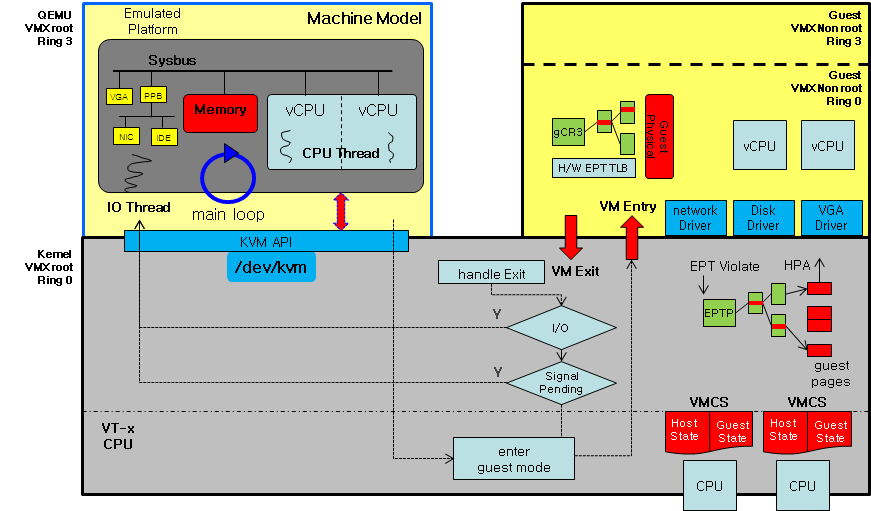 \|https://github.com/rafaeldtinoco/howtos/blob/main/images/ItBWTnHn\-.png]  
Paying special attention to the right side of the picture above, you can see "VM Entry" and "VM Exist" signs. The main idea is this: the KVM module sets the logical vCPU states registers into a specific area and, using an OS process (in name of a vCPU) it calls a "enter virtualization" instruction, that will start running code pointed by the logical vCPU registers (and the vCPU assumes control). The QEMU OS vCPU process will be waiting for this call to return meanwhile the vCPU process is running guest OS instructions.  
Now, imagining the guest as a machine, it will be running its kernel and all its user\-land code inside those 4 vCPUs \- let's say \- and causing its OS processes to enter and leave the vCPUs. This won't affect QEMU vCPU processes (4 of them), that will stay waiting the "enter virtualization" instruction to end. If, for any reason, the guest touches memory addresses of an area that was described in the logical vCPU registes as an area that needs emulation... it will cause a VM\_EXIT and the QEMU vCPU process will return from the "enter virtualization" call.  
QEMU will have to understand the reason for the VM\_EXIT to happen \- and there is a specific reason for EMULATED I/O need \- and deal with the emulation for the memory address change before returning control to the vCPU again, doing another "enter virtualization" call for the same vCPU OS process.  
This process can be seen when using tracing tools like systemtap (ebpf, ftrace, etc). Those traces allows you to do something on a software break point (QEMU). With systemtap, a simple script such as:  
probe process("QEMU\-system\-x86\_64").function("KVM\_arch\_post\_run")  
{  
try {  
reason \= $cpu\-\>KVM\_run\-\>exit\_reason;  
if (reason !\= 2) {  
printf("EXIT reason: %u\\n", reason);  
}  
if (reason \=\= 2) {  
port \= $cpu\-\>KVM\_run\-\>io\-\>port;  
printf("I/O port: %x\\n", port)  
}  
} catch (msg) {  
println("error\\n", msg)  
}  
}  
will tell you the reason for a vCPU to have exited the 'virtualization function' (Intel VT\-x). In the code above, we are focusing in an exist through IO emulation, like being discussed in this topic.  
As you might already have thought by now, security issues for emulated devices rise from the fact that the guest OS kernel driver communicates to hypervisor through this emulation. Vulnerabilities here are tightly coupled to QEMU emulation code and could case QEMU to run arbitrary instructions on behalf of a guest, for example.  
From the example we are using in this document, the emulation would come from the follow devices being defined to this virtual machine:  
\<devices\>  
\<controller type\='usb' index\='0' model\='piix3\-uhci'\>  
\<alias name\='usb'/\>  
\<address type\='pci' domain\='0x0000' bus\='0x00' slot\='0x01' function\='0x2'/\>  
\</controller\>  
\<controller type\='pci' index\='0' model\='pci\-root'\>  
\<alias name\='pci.0'/\>  
\</controller\>  
\<serial type\='pty'\>  
\<source path\='/dev/pts/0'/\>  
\<target type\='isa\-serial' port\='0'\>  
\<model name\='isa\-serial'/\>  
\</target\>  
\<alias name\='serial0'/\>  
\</serial\>  
\<console type\='pty' tty\='/dev/pts/0'\>  
\<source path\='/dev/pts/0'/\>  
\<target type\='serial' port\='0'/\>  
\<alias name\='serial0'/\>  
\</console\>  
\<input type\='mouse' bus\='ps2'\>  
\<alias name\='input0'/\>  
\</input\>  
\<input type\='keyboard' bus\='ps2'\>  
\<alias name\='input1'/\>  
\</input\>  
\<video\>  
\<model type\='cirrus' vram\='16384' heads\='1' primary\='yes'/\>  
\<alias name\='video0'/\>  
\<address type\='pci' domain\='0x0000' bus\='0x00' slot\='0x02' function\='0x0'/\>  
\</video\>  
\</devices\>  
From the current list we have the following emulated devices:

* ISA controller
* PS2 controller (mouse and keyboard)
* PCI controller
* USB controller in PCI bus
* ISA Serial Controller
* Cirrus PCI VGA Adapter

The security surface here relies in how the devices are emulated inside the QEMU code and potential CVEs targeting the device emulation code within QEMU.  
If we take the QEMU serial emulation by an example of vulnerability surface:

\[ 0\.750547] Serial: 8250/16550 driver, 32 ports, IRQ sharing enabled

  
Anytime the guest writes to its internal ISA address 0x3ff \- the old 16\-bit internal BUS, being emulated by QEMU as well \- using the following instructions:  
\_\_asm("movw $0x3ff, %dx"); // ttys0 isa i/o address  
\_\_asm("movb $0x1f, %al"); // moves ascii unit sep. char to %al  
\_\_asm("outb %al, (%dx)"); // writes the char to scratch register (0x3ff)  
the vCPU (inside guest) responsible for the execution of the I/O instruction will exit the virtualization function (VM\_EXIT) on the host so QEMU can emulate the 8250 serial controller HW (the virtualized memory registers) and, right after, return control to the guest vCPU.  
If, again, using systemtap, we create a script like:  
probe process("QEMU\-system\-x86\_64").function("KVM\_arch\_post\_run")  
{  
try {  
reason \= $cpu\-\>KVM\_run\-\>exit\_reason;  
if (reason \=\= 2) {  
port \= $cpu\-\>KVM\_run\-\>io\-\>port;  
dir \= $cpu\-\>KVM\_run\-\>io\-\>direction;  
size \= $cpu\-\>KVM\_run\-\>io\-\>size;  
count \= $cpu\-\>KVM\_run\-\>io\-\>count;   
if (port \=\= 0x3ff) {  
ptr \= $cpu\-\>KVM\_run;  
offset \= $cpu\-\>KVM\_run\-\>io\-\>data\_offset;  
data \= ptr \+ offset;  
// do something  
}  
}  
} catch {   
}  
}  
systemtap is capable of probing QEMU\-system\-x86\_64 process internal functions and executing code described above, whenever described probe (function KVM\_arch\_post\_run) is called (similarly to a debugger break point).  
We will be able to monitor (trace / debug) each time a single character is written to device "/dev/ttyS0" inside the virtual machine. Each character written to an ISA 8250 controller causes a VM\_EXIT of exec'ing vCPU: it gives the real CPU back to the QEMU process and it will emulate the 8250 controller (internal registers and behavior) for the guest BEFORE returning the real CPU back to the vCPU by executing the virtualization function.  
An example of this scenario \- for an emulation that is not being used in our virtual machine example \- is described in CVE\-2019\-6778 subtopic of QEMU CVEs session bellow  
\" because \"request\" is null")

  

* memballoon: allows virtual machine memory to be reclaimed by the Host OS in order to better control its resources.
* random number generator: fills guest with entropy to its entropy pools.

Attack surface for this session is either one device or another:

1. *SECURITY*: **virtio rng**

Most of the security CVEs related to entropy is due to insufficient randomness (entropy) in a particular device that should act as a generator. QEMU implements some different rng implementations internally.  
By using a VIRTIO rng device, GUEST requests entropy from QEMU process through the VIRTIO ring data structures, just like explained at session **How does VIRTIO devices work ?**. By default, QEMU provides entropy to a VIRTIO rng device by reading /dev/urandom of the Host OS (it could also be through gathering daemon: egd).  
The HostOS kernel might be able to get entropy from different HW (or software) sources, most commonly:

* Intel RDRAND CPU instruction (pseudo\-random number generator).
* Intel RDSEED instruction (better entropy based on thermal events).

This attack surface has **MUCH TO DO** with the side channel attack techniques called **Microarchitectural Data Sampling**, described in item **QEMU vCPU assignment \& side\-channel attacks** previously, but they are tightly related to a recent side\-channel type vulnerability:

* Special Register Buffer Data Sampling

On affected processors, Intel has released microcode updates whose default behavior is to modify the RDRAND, RDSEED, and EGETKEY instructions to overwrite stale special register data in the shared staging buffer before the stale data can be accessed by any other logical processor on the same core or on a different core.  
During execution of the RDRAND, RDSEED, or EGETKEY instructions, off\-core accesses from other logical processors will be delayed until the special register read is complete and the stale data in the shared staging buffer is overwritten.  
Obviously this mitigation has performance impacts for overall RAND/SEED CPU instructions

1. *SECURITY*: **memory ballooning**

Attack surface here would be related to how the guest inflates or deflates its memory to force the HostOS to either provide it more memory, or reclaim memory being used by it. There is no automatic ballooning being done but there is an interface configured (device) to make it available if requested by the VMM administrator.  
CVE\-2021\-28039 is an example of ballooning CVE (although is for Xen hypervisor) trying to harm HostOS by exploring the ballooning configuration interface (in between hypervisor and guest).  
\" because \"request\" is null")**3\.f\-) QEMU virtual disk devices**  
In previous item we've seen all accelerated (or sometimes called virtio) devices other than disks. Now it is time to concentrate a bit in the security surface of disks and how they can be accessed by virtual machines.  
With our initial virtual machine definition example:  
\<devices\>  
\<disk type\='file' device\='disk'\>  
\<driver name\='QEMU' type\='qcow2' cache\='writethrough' error\_policy\='report'/\>  
\<source file\='xxxxxxxx\-xxxx\-xxxx\-xxxx\-xxxxxxxxxxxx.qcow2' index\='3'/\>  
\<backingStore type\='file' index\='4'\>  
\<format type\='qcow2'/\>  
\<source file\='xxxxxxxx\-xxxx\-xxxx\-xxxx\-xxxxxxxxxxxx.qcow2'/\>  
\</backingStore\>  
\<target dev\='vda' bus\='virtio'/\>  
\<alias name\='virtio\-disk0'/\>  
\</disk\>  
\<disk type\='file' device\='disk'\>  
\<driver name\='QEMU' type\='raw' cache\='writethrough' error\_policy\='report'/\>  
\<source file\='xxxxxxxx\-xxxx\-xxxx\-xxxx\-xxxxxxxxxxxx/init\-disk' index\='2'/\>  
\<backingStore/\>  
\<target dev\='vdb' bus\='virtio'/\>  
\<alias name\='virtio\-disk1'/\>  
\</disk\>  
\<disk type\='file' device\='disk'\>  
\<driver name\='QEMU' type\='raw' cache\='writethrough' error\_policy\='report'/\>  
\<source file\='xxxxxxxx\-xxxx\-xxxx\-xxxx\-xxxxxxxxxxxx/swap' index\='1'/\>  
\<backingStore/\>  
\<target dev\='vdc' bus\='virtio'/\>  
\<alias name\='virtio\-disk2'/\>  
\</disk\>  
\</devices\>  
we have the following vdisks:

* virtio\-disk0: vda virtio\-blk device with a qcow2 backing device (root disk)
* virtio\-disk1: vdb virtio\-blk device with a raw backing device (swap disk)
* virtio\-disk2: vdc virtio\-blk device with a raw backing device (cloud\-init)

As described earlier, there are many, many, ways to either emulate or accelerate a disk device, just like a network device. In this particular session we're only focusing in the virtio\-blk approach (not virtio\-scsi with other backing device/library). Thus, the security surface being described here is only related to virtio\-blk devices (and not complete).  
If you remember how the VIRTIO transport layer worked, with its vring buffers shared between the virtual machine and the QEMU process (or the kernel vhost thread on behalf of a virtual machine), you will also remember that this 'buffer intersection' is just one attack surface that exists when it comes to vdisks subject.  
By also checking how vdisks can be cached by the HostOS:  
\[ 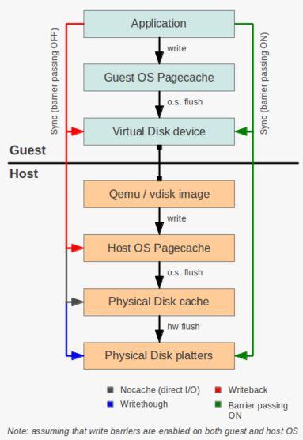 \|https://github.com/rafaeldtinoco/howtos/blob/main/images/hV8kGrwut.png]  
It is clear that vdisk's security depends on the type of I/O being used by the virtual machine (sync, async, buffered, direct) and the HostOS pagecache exposure as well.  
Historically, the virtio\-blk driver/interface has always been very stable, with almost no CVEs. There were some old CVEs related to HEAP memory overflows because of bad memory alignment: [CVE\-2011\-1750](https://cve.mitre.org/cgi-bin/cvename.cgi?name=CVE-2011-1750), but nothing recent.  
virtio\-blk devices security surface depends on backing storage driver (Ceph, Gluster, Local File) internals.  
virtio\-scsi devices security surface depends on backing storage driver (QEMU, LIO and libISCSI targets) internals.  
\" because \"request\" is null")

* **Device Para\-Virtualization**: explaining VIRTIO acceleration
* **QEMU Internals**: explaining Virtio Implementation and Protocol

As described earlier, there are many different ways you can have a vNIC declared in a virtual machine and backed by either the QEMU process or the Host OS kernel (or some other off load user\-land tool such as DPDK and/or OpenVswitch):

* virtio\-net \<\=\> tun/tap device (driven by QEMU)
* virtio\-net \<\=\> vhost\-net (driven by kernel)
* virtio\-net \<\=\> openvswitch
* virtio\-net \<\=\> SR\-IOV (backed by macvtap/vhost\-user)
* virtio\-net \<\=\> SR\-IOV (with VF directly assigned to guest)

As in other parts, this document is narrowing the scope to a specific virtual machine declaration and that is where we get the following vNIC from:  
\<interface type\='direct'\>  
\<mac address\='aa:bb:cc:aa:bb:cc'/\>  
\<source dev\='if0aabbccaabbc' mode\='passthrough'/\>  
\<target dev\='macvtap0'/\>  
\<model type\='virtio'/\>  
\<driver queues\='3'/\>  
\<alias name\='net0'/\>  
\</interface\>  
As you can see this is not a typical VIRTIO \<\=\> tun/tap scenario, nor a virtio\-net \<\=\> vhost\-net typical scenario. This is a virtio\-net \<\=\> SR\-IOV configuration in what we call 'indirect mode' (where the host OS kernel still has some role in packet processing, with macvtap driver). The SR\-IOV configuration can be done in different ways:

* pass\-through device access as SR\-IOV VF PCI device (direct mode)
* use a pool of virtual function devices (direct mode)
* use a macvtap as the SR\-IOV network adapter (indirect mode)

The indirect mode approach \- of using a macvtap driver in the Host, letting the HostOS kernel to manage the virtual function network interfaces \- makes the SR\-IOV easier to be configured to virtual machines and allows live migrations to happen: you don't have to rely on PCI bus information to spin up a VM, you can simply tell the HostOS to use a free virtual function it already has configured.  
Unfortunately the indirect mode adds some burden to the HostOS kernel, as it will have vhost kernel\-threads coordinating data \- shared memory \- between the vm's VIRTIO buffers and the kernel threads, AND the macvtap driver responsible to transfer packets in and out to HW virtual functions.  
This can also be seen by, like explained before, checking the existence of specific kernel threads in charge of the Vhost part of the interface for the QEMU process of the virtual machine in question:

1 0 60564 2 20 0 0 0 vhost\_ S ? 0:01 \[vhost\-60547]

  

1 0 60565 2 20 0 0 0 vhost\_ S ? 0:01 \[vhost\-60547]

  

1 0 60566 2 20 0 0 0 vhost\_ S ? 0:01 \[vhost\-60547]

  
By choosing different methods to deliver the SR\-IOV virtual function to the guest you are also growing, or shrinking, the security surface of the system: If, instead of using macvtap, the SR\-IOV virtual function was bound directly to the virtual machine, by using Intel VTd and IOMMU virtualization, virtio\-net \<\=\> vhost\-net communication would be happening among the guest vm kernel memory and HW internal buffers only.  
With the macvtap approach, showed here, the HostOS kernel also has tasks manipulating/coordinating VIRTIO memory buffers (on behalf of the virtual machine).  
\" because \"request\" is null")**3\.i\-) QEMU monitor (QMP and HMP)**  
There is a communication channel used for an external tool \- like libvirt \- to communicate with QEMU and operate its instances from external world:

  

* The QEMU Machine Protocol (QMP).

QMP is JSON based and features the following:

* Lightweight, text\-based, easy to parse data format
* Asynchronous messages support (events)
* Capabilities negotiation
* API/ABI stability guarantees

Through QMP (or its Human read\-able version: HMP) one can communicate with a QEMU instance and do many different tasks. A simple example checking the current status of a virtual machine is:  
C: { "execute": "query\-status" }  
S: {  
"return": {  
"status": "running",  
"singlestep": false,  
"running": true  
}  
}  
You can get all supported commands through the following command:  
$ virsh qemu\-monitor\-command \-\-domain \<vm.name\> \-\-hmp \-\-cmd "help info"   
info balloon – show balloon information

info block \[\-n] \[\-v] \[device] – show info of one block device or all block devices (\-n: show named nodes; \-v: show details)

  
info block\-jobs – show progress of ongoing block device operations  
info blockstats – show block device statistics  
info capture – show capture information  
info chardev – show the character devices  
info cpus – show infos for each CPU  
info cpustats – show CPU statistics  
info dump – Display the latest dump status  
info history – show the command line history  
info hotpluggable\-cpus – Show information about hotpluggable CPUs  
info ioapic – show io apic state  
info iothreads – show iothreads  
info irq – show the interrupts statistics (if available)  
info jit – show dynamic compiler info  
info KVM – show KVM information

info lapic \[apic\-id] – show local apic state (apic\-id: local apic to read, default is which of current CPU)

  
info mem – show the active virtual memory mappings  
info memdev – show memory backends  
info memory\-devices – show memory devices  
info memory\_size\_summary – show the amount of initially allocated and present hotpluggable (if enabled) memory in bytes.  
info mice – show which guest mouse is receiving events  
info migrate – show migration status  
info migrate\_cache\_size – show current migration xbzrle cache size  
info migrate\_capabilities – show current migration capabilities  
info migrate\_parameters – show current migration parameters

info mtree \[\-f]\[\-d]\[\-o] – show memory tree (\-f: dump flat view for address spaces;\-d: dump dispatch tree, valid with \-f only);\-o: dump region owners/parents

  
info name – show the current VM name  
info network – show the network state  
info numa – show NUMA information  
info opcount – show dynamic compiler opcode counters  
info pci – show PCI info  
info pic – show PIC state  
info profile – show profiling information  
info qdm – show qdev device model list

info qom\-tree \[path] – show QOM composition tree

  
info qtree – show device tree  
info ramblock – Display system ramblock information  
info rdma – show RDMA state

info registers \[\-a] – show the cpu registers (\-a: all \- show register info for all cpus)

  
info rocker name – Show rocker switch

info rocker\-of\-dpa\-flows name \[tbl\_id] – Show rocker OF\-DPA flow tables

  

info rocker\-of\-dpa\-groups name \[type] – Show rocker OF\-DPA groups

  
info rocker\-ports name – Show rocker ports  
info roms – show roms  
info sev – show SEV information  
info snapshots – show the currently saved VM snapshots  
info spice – show the spice server status  
info status – show the current VM status (running\|paused)

info sync\-profile \[\-m] \[\-n] \[max] – show synchronization profiling info, up to max entries (default: 10\), sorted by total wait time. (\-m: sort by mean wait time; \-n: do not coalesce objects with the same call site)

  
info tlb – show virtual to physical memory mappings  
info tpm – show the TPM device

info trace\-events \[name] \[vcpu] – show available trace\-events \& their state (name: event name pattern; vcpu: vCPU to query, default is any)

  
info usb – show guest USB devices  
info usbhost – show host USB devices  
info usernet – show user network stack connection states  
info uuid – show the current VM UUID  
info version – show the version of QEMU  
info vm\-generation\-id – Show Virtual Machine Generation ID  
info vnc – show the vnc server status  
This command 'talks' in HMP format with the QEMU monitor device, giving it commands, or querying status of specific internal structures/emulations. Another example would be:  
$ virsh qemu\-monitor\-command \-\-domain \<vm.name\> \-\-hmp \-\-cmd info block \-v   
libvirt\-1\-format: /var/lib/libvirt/images/vm.name\-disk01\.qcow2 (qcow2\)  
Attached to: /machine/peripheral/virtio\-disk0/virtio\-backend  
Cache mode: writeback   
Images:  
image: /var/lib/libvirt/images/vm.name\-disk01\.qcow2  
file format: qcow2  
virtual size: 30 GiB (32212254720 bytes)  
disk size: 19\.3 GiB  
cluster\_size: 65536  
Format specific information:  
compat: 0\.10  
refcount bits: 16  
to get information from a particular VM block device backend.  
As you might have already guessed, this is an important feature to be secured as it allows anyone with permissions to read/write to this interface to change practically anything in the virtual machine.  
It is so important that one can get all internal \- to the virtual machine \- virtual address space of drivers mappings:  
$ virsh qemu\-monitor\-command \-\-domain \<vm.name\> \-\-hmp \-\-cmd info mtree \-f \-o   
FlatView \#0  
AS "memory", root: system  
AS "cpu\-memory\-0", root: system  
AS "cpu\-memory\-1", root: system  
AS "cpu\-memory\-2", root: system  
AS "cpu\-memory\-3", root: system  
AS "cpu\-memory\-4", root: system  
AS "cpu\-memory\-5", root: system  
AS "cpu\-memory\-6", root: system  
AS "cpu\-memory\-7", root: system  
AS "piix3\-ide", root: bus master container  
AS "piix3\-usb\-uhci", root: bus master container  
AS "virtio\-serial\-pci", root: bus master container  
AS "virtio\-blk\-pci", root: bus master container  
AS "virtio\-net\-pci", root: bus master container  
AS "virtio\-balloon\-pci", root: bus master container  
Root memory region: system  
0000000000000000\-00000000000bffff (prio 0, ram): pc.ram owner:{obj path\=/objects/pc.ram} KVM  
00000000000c0000\-00000000000c0fff (prio 0, rom): pc.ram @00000000000c0000 owner:{obj path\=/objects/pc.ram} KVM  
00000000000c1000\-00000000000c3fff (prio 0, ram): pc.ram @00000000000c1000 owner:{obj path\=/objects/pc.ram} KVM  
00000000000c4000\-00000000000e7fff (prio 0, rom): pc.ram @00000000000c4000 owner:{obj path\=/objects/pc.ram} KVM  
00000000000e8000\-00000000000effff (prio 0, ram): pc.ram @00000000000e8000 owner:{obj path\=/objects/pc.ram} KVM  
00000000000f0000\-00000000000fffff (prio 0, rom): pc.ram @00000000000f0000 owner:{obj path\=/objects/pc.ram} KVM  
0000000000100000\-00000000bfffffff (prio 0, ram): pc.ram @0000000000100000 owner:{obj path\=/objects/pc.ram} KVM  
00000000feb80000\-00000000feb8002f (prio 0, i/o): msix\-table owner:{dev id\=net0}  
00000000feb80800\-00000000feb80807 (prio 0, i/o): msix\-pba owner:{dev id\=net0}  
00000000feb81000\-00000000feb8101f (prio 0, i/o): msix\-table owner:{dev id\=virtio\-serial0}  
00000000feb81800\-00000000feb81807 (prio 0, i/o): msix\-pba owner:{dev id\=virtio\-serial0}  
00000000feb82000\-00000000feb8201f (prio 0, i/o): msix\-table owner:{dev id\=virtio\-disk0}  
00000000feb82800\-00000000feb82807 (prio 0, i/o): msix\-pba owner:{dev id\=virtio\-disk0}  
00000000feb83000\-00000000feb8300f (prio 1, i/o): i6300esb owner:{dev id\=watchdog0}  
00000000febf0000\-00000000febf0fff (prio 0, i/o): virtio\-pci\-common owner:{dev id\=net0}  
00000000febf1000\-00000000febf1fff (prio 0, i/o): virtio\-pci\-isr owner:{dev id\=net0}  
00000000febf2000\-00000000febf2fff (prio 0, i/o): virtio\-pci\-device owner:{dev id\=net0}  
00000000febf3000\-00000000febf3fff (prio 0, i/o): virtio\-pci\-notify owner:{dev id\=net0}  
00000000febf4000\-00000000febf4fff (prio 0, i/o): virtio\-pci\-common owner:{dev id\=virtio\-serial0}  
00000000febf5000\-00000000febf5fff (prio 0, i/o): virtio\-pci\-isr owner:{dev id\=virtio\-serial0}  
00000000febf6000\-00000000febf6fff (prio 0, i/o): virtio\-pci\-device owner:{dev id\=virtio\-serial0}  
00000000febf7000\-00000000febf7fff (prio 0, i/o): virtio\-pci\-notify owner:{dev id\=virtio\-serial0}  
00000000febf8000\-00000000febf8fff (prio 0, i/o): virtio\-pci\-common owner:{dev id\=virtio\-disk0}  
00000000febf9000\-00000000febf9fff (prio 0, i/o): virtio\-pci\-isr owner:{dev id\=virtio\-disk0}  
00000000febfa000\-00000000febfafff (prio 0, i/o): virtio\-pci\-device owner:{dev id\=virtio\-disk0}  
00000000febfb000\-00000000febfbfff (prio 0, i/o): virtio\-pci\-notify owner:{dev id\=virtio\-disk0}  
00000000febfc000\-00000000febfcfff (prio 0, i/o): virtio\-pci\-common owner:{dev id\=balloon0}  
00000000febfd000\-00000000febfdfff (prio 0, i/o): virtio\-pci\-isr owner:{dev id\=balloon0}  
00000000febfe000\-00000000febfefff (prio 0, i/o): virtio\-pci\-device owner:{dev id\=balloon0}  
00000000febff000\-00000000febfffff (prio 0, i/o): virtio\-pci\-notify owner:{dev id\=balloon0}  
00000000fec00000\-00000000fec00fff (prio 0, i/o): KVM\-ioapic owner:{dev path\=/machine/i440fx/ioapic}

00000000fed00000\-00000000fed003ff (prio 0, i/o): hpet owner:{dev path\=/machine/unattached/device\[14]}

  
Security surface related to this communication channel is either a file or a file descriptor, opened by either libvirt or QEMU with that intent. From the QEMU instance command line:  
libvirt\+ 3660 0\.0 1\.6 6357284 3250448 ? Sl May19 144:53 /bin/QEMU\-system\-x86\_64 name guest\=\_dropbox,debug\-threads\=on \-S \-object secret,id\=masterKey0,format\=raw,file\=/var/lib/libvirt/QEMU/domain\-3\_dropbox/master\-key.aes \-machine pc\-i440fx\-2\.12,accel\=KVM,usb\=off,vmport\=off,dump\-guest\-core\=off \-cpu SandyBridge\-IBRS,vme\=on,ss\=on,vmx\=on,pdcm\=on,hypervisor\=on,arat\=on,tsc\-adjust\=on,umip\=on,md\-clear\=on,stibp\=on,arch\-capabilities\=on,ssbd\=on,xsaveopt\=on,pdpe1gb\=on,ibpb\=on,ibrs\=on,amd\-stibp\=on,amd\-ssbd\=on,pschange\-mc\-no\=on \-m 4096 \-overcommit mem\-lock\=off \-smp 4,sockets\=4,cores\=1,threads\=1 \-uuid 1370902f\-4cd4\-47bb\-bbf3\-58134444c692 \-no\-user\-config \-nodefaults \-chardev socket,id\=charmonitor,fd\=29,server,nowait \-mon chardev\=charmonitor,id\=monitor,mode\=control \-rtc base\=utc,driftfix\=slew \-global KVM\-pit.lost\_tick\_policy\=delay \-no\-hpet \-no\-shutdown \-global PIIX4\_PM.disable\_s3\=1 \-global PIIX4\_PM.disable\_s4\=1 \-boot menu\=off,strict\=on \-device ich9\-usb\-ehci1,id\=usb,bus\=pci.0,addr\=0x3\.0x7 \-device ich9\-usb\-uhci1,masterbus\=usb.0,firstport\=0,bus\=pci.0,multifunction\=on,addr\=0x3 \-device ich9\-usb\-uhci2,masterbus\=usb.0,firstport\=2,bus\=pci.0,addr\=0x3\.0x1 \-device ich9\-usb\-uhci3,masterbus\=usb.0,firstport\=4,bus\=pci.0,addr\=0x3\.0x2 \-device virtio\-serial\-pci,id\=virtio\-serial0,bus\=pci.0,addr\=0x5 \-blockdev {"driver":"file","filename":"/var/lib/libvirt/images/\_dropbox\-disk01\.qcow2","node\-name":"libvirt\-1\-storage","auto\-read\-only":true,"discard":"unmap"} \-blockdev {"node\-name":"libvirt\-1\-format","read\-only":false,"driver":"qcow2","file":"libvirt\-1\-storage","backing":null} \-device virtio\-blk\-pci,bus\=pci.0,addr\=0x6,drive\=libvirt\-1\-format,id\=virtio\-disk0,bootindex\=1 \-netdev tap,fd\=31,id\=hostnet0 \-device virtio\-net\-pci,netdev\=hostnet0,id\=net0,mac\=52:54:00:da:42:09,bus\=pci.0,addr\=0x2 \-chardev spicevmc,id\=charchannel0,name\=vdagent \-device virtserialport,bus\=virtio\-serial0\.0,nr\=1,chardev\=charchannel0,id\=channel0,name\=com.redhat.spice.0 \-device usb\-tablet,id\=input2,bus\=usb.0,port\=1 \-spice port\=5900,addr\=127\.0\.0\.1,disable\-ticketing,image\-compression\=off,seamless\-migration\=on \-device qxl\-vga,id\=video0,ram\_size\=67108864,vram\_size\=67108864,vram64\_size\_mb\=0,vgamem\_mb\=16,max\_outputs\=1,bus\=pci.0,addr\=0x4 \-device AC97,id\=sound0,bus\=pci.0,addr\=0x8 \-chardev spicevmc,id\=charredir0,name\=usbredir \-device usb\-redir,chardev\=charredir0,id\=redir0,bus\=usb.0,port\=2 \-chardev spicevmc,id\=charredir1,name\=usbredir \-device usb\-redir,chardev\=charredir1,id\=redir1,bus\=usb.0,port\=3 \-device virtio\-balloon\-pci,id\=balloon0,bus\=pci.0,addr\=0x7 \-sandbox on,obsolete\=deny,elevateprivileges\=deny,spawn\=deny,resourcecontrol\=deny \-msg timestamp\=on  
we have:  
chardev socket,id\=charmonitor,fd\=29,server,nowait \-mon chardev\=charmonitor,id\=monitor,mode\=control  
which means libvirt has a file descriptor pointing to a unix socket that has likely being unlinked already \- so it will vanish after the socket is closed \- and it passed the file descriptor to QEMU process after exec'ing it.  
If one is executing QEMU directly, it is possible to have different files/sockets opened to QEMU/HMP by having QEMU cmdline with the following arguments:  
\-chardev socket,id\=monitor,path\=/tmp/guest.monitor,server,nowait {color}  
\-monitor chardev:monitor {color}  
\-chardev socket,id\=serial,path\=/tmp/guest.serial,server,nowait {color}  
\-serial chardev:serial {color}  
\-qmp unix:/tmp/guest.sock,server,nowait {color}  
and then using either screen (or minicom) to open the unix socket:  
sudo minicom \-D unix\#/tmp/kguest.monitor \# HMP (Human Monitor) \- txt  
sudo minicom \-D unix\#/tmp/kguest.socket \# QMP (Machine Monitor) \- json  
sudo minicom \-D unix\#/tmp/kguest.serial \# Guest Serial Console  
and communicate with the QEMU instance by using QMP/HMP commands.  
This session shows that, despite not being obvious, the QEMU instance security surface might be extended to many different things such as internal (to libvirt and QEMU) communication channels.  
\" because \"request\" is null")**3\.j\-) QEMU confinement**  
As we've seen, QEMU supports many different use cases, some of which have stricter security requirements than others. The community has agreed on the overall security requirements that users may depend on. These requirements define what is considered supported from a security perspective.  
\" because \"request\" is null")**3\.j.1\-) Guest isolation**  
Guest isolation is the confinement of guest code to the virtual machine. When guest code gains control of execution on the host this is called escaping the virtual machine. Isolation also includes resource limits such as throttling of CPU, memory, disk, or network. Guests must be unable to exceed their resource limits.  
QEMU presents an attack surface to the guest in the form of emulated devices. The guest must not be able to gain control of QEMU. Bugs in emulated devices could allow malicious guests to gain code execution in QEMU. At this point the guest has escaped the virtual machine and is able to act in the context of the QEMU process on the host.  
Guests often interact with other guests and share resources with them. A malicious guest must not gain control of other guests or access their data. Disk image files and network traffic must be protected from other guests unless explicitly shared between them by the user.  
\" because \"request\" is null")**3\.j.2\-) Principle of Least Privilege**  
The principle of least privilege states that each component only has access to the privileges necessary for its function. In the case of QEMU this means that each process only has access to resources belonging to the guest.  
The QEMU process should not have access to any resources that are inaccessible to the guest. This way the guest does not gain anything by escaping into the QEMU process since it already has access to those same resources from within the guest.  
Following the principle of least privilege immediately fulfills guest isolation requirements. For example, guest A only has access to its own disk image file a.img and not guest B's disk image file b.img.  
In reality certain resources are inaccessible to the guest but must be available to QEMU to perform its function. For example, host system calls are necessary for QEMU but are not exposed to guests. A guest that escapes into the QEMU process can then begin invoking host system calls.  
New features must be designed to follow the principle of least privilege. Should this not be possible for technical reasons, the security risk must be clearly documented so users are aware of the trade\-off of enabling the feature.  
\" because \"request\" is null")**3\.j.3\-) Isolation Mechanisms**  
Several isolation mechanisms are available to realize this architecture of guest isolation and the principle of least privilege. With the exception of Linux seccomp, these mechanisms are all deployed by management tools that launch QEMU, such as libvirt.  
The fundamental isolation mechanism is that QEMU processes must run as unprivileged users. Sometimes it seems more convenient to launch QEMU as root to give it access to host devices (e.g. /dev/net/tun) but this poses a huge security risk. File descriptor passing can be used to give an otherwise unprivileged QEMU process access to host devices without running QEMU as root. It is also possible to launch QEMU as a non\-root user and configure UNIX groups for access to /dev/KVM, /dev/net/tun, and other device nodes. Some Linux distros already ship with UNIX groups for these devices by default.

  

* SELinux and AppArmor make it possible to confine processes beyond the traditional UNIX process and file permissions model. They restrict the QEMU process from accessing processes and files on the host system that are not needed by QEMU.
* Resource limits and cgroup controllers provide throughput and utilization limits on key resources such as CPU time, memory, and I/O bandwidth.
* Linux namespaces can be used to make process, file system, and other system resources unavailable to QEMU. A namespaced QEMU process is restricted to only those resources that were granted to it.
* Linux seccomp is available via the QEMU \-\-sandbox option. It disables system calls that are not needed by QEMU, thereby reducing the host kernel attack surface.

IMPORTANT IDEA HERE IS that, by having an isolation mechanism, one escape due to a security vulnerability, for example, would also have to break the isolation mechanism in order to be fully prejudicial to other OS resources (most of the times).  
**Some important isolation mechanisms**:  
\" because \"request\" is null")**3\.j.4\-) Isolation: apparmor**  
AppArmor ("Application Armor") is a Linux kernel security module that allows the system administrator to restrict programs' capabilities with per\-program profiles. Profiles can allow capabilities like network access, raw socket access, and the permission to read, write, or execute files on matching paths. AppArmor supplements the traditional Unix discretionary access control (DAC) model by providing mandatory access control (MAC).  
First, the libvirtd process is considered trusted and is therefore confined with a lenient profile that allows the libvirt daemon to launch VMs or containers, change into another AppArmor profile and use virt\-aa\-helper to manipulate AppArmor profiles. virt\-aa\-helper is a helper application that can add, remove, modify, load and unload AppArmor profiles in a limited and restricted way. libvirtd is not allowed to adjust anything in /sys/kernel/security directly, or modify the profiles for the virtual machines directly. Instead, libvirtd must use virt\-aa\-helper, which is itself run under a very restrictive AppArmor profile. Using this architecture helps prevent any opportunities for a subverted libvirtd to change its own profile (especially useful if the libvirtd profile is adjusted to be restrictive) or modify other AppArmor profiles on the system.  
libvirt apparmor important files:

* /etc/apparmor.d/usr.sbin.libvirtd : profile for libvirtd
* /etc/apparmor.d/usr.lib.virt\-aa\-helper : profile for virt\-aa\-helper
* /etc/apparmor.d/libvirt/TEMPLATE.QEMU : consulted to create new profile
* /etc/apparmor.d/abstractions/libvirt\-qemu : shared among all VMs
* /etc/apparmor.d/libvirt/libvirt\- unique base profile for a VM
* /etc/apparmor.d/libvirt/libvirt\-.files guest\-specific files required

The confinement process is as follows (assume the VM has a libvirt UUID of 'xxxxxxxx\-xxxx\-xxxx\-xxxx\-xxxxxxxxxxxx'):  
If libvirtd is both, confined by AppArmor and configured to use it in /etc/libvirt/QEMU.conf, it will use the AppArmor security driver. When a VM is started, libvirtd decides whether to ask virt\-aa\-helper to create a new profile or modify an existing one. If no profile exists, libvirtd asks virt\-aa\-helper to generate the new base profile, in this case /etc/apparmor.d/libvirt/libvirt\-xxxxxxxx\-xxxx\-xxxx\-xxxx\-xxxxxxxxxxxx, which it does based on /etc/apparmor.d/libvirt/TEMPLATE.QEMU.  
Notice, the new profile has a profile name that is based on the guest's UUID. Once the base profile is created, virt\-aa\-helper works the same for create and modify: virt\-aa\-helper will determine what files are required for the guest to run (eg kernel, initrd, disk, serial, etc), updates /etc/apparmor.d/libvirt/libvirt\-xxxxxxxx\-xxxx\-xxxx\-xxxx\-xxxxxxxxxxxx.files, then loads the profile into the kernel.  
libvirtd will proceed as normal at this point, until just before it forks a QEMU/KVM/container process, it will call aa\_change\_profile() to transition into the profile 'libvirt\-xxxxxxxx\-xxxx\-xxxx\-xxxx\-xxxxxxxxxxxx' (the one virt\-aa\-helper loaded into the kernel in the previous step).  
When the VM is shutdown, libvirtd asks virt\-aa\-helper to remove the profile, and virt\-aa\-helper unloads the profile from the kernel.  
From the examples being used in this document, you will see the process just described by executing:  
$ ls \-a1 /etc/apparmor.d/libvirt/   
TEMPLATE.lxc  
TEMPLATE.QEMU  
libvirt\-6814edd9\-cd66\-4256\-a603\-6f6591841c8c  
libvirt\-6814edd9\-cd66\-4256\-a603\-6f6591841c8c.files   
$ sudo aa\-status   
apparmor module is loaded.  
17 profiles are loaded.  
17 profiles are in enforce mode.  
...  
/sbin/capause  
/sbin/computeproxy  
/sbin/dhclient  
/usr/lib/ipsec/stroke  
/usr/sbin/swanctl  
/usr/sbin/tcpdump  
docker\-default  
fluentd\-logs  
fluentd\-qradar  
libvirt\-6814edd9\-cd66\-4256\-a603\-6f6591841c8c  
libvirtd  
libvirtd/QEMU\_bridge\_helper  
virt\-aa\-helper  
0 profiles are in complain mode.  
133 processes have profiles defined.  
132 processes are in enforce mode.  
/sbin/computeproxy (12410\)   
docker\-default (722\)   
...  
docker\-default (65128\)   
libvirt\-6814edd9\-cd66\-4256\-a603\-6f6591841c8c (60547\)   
libvirtd (12355\)   
0 processes are in complain mode.  
1 processes are unconfined but have a profile defined.  
/usr/lib/ipsec/charon (6245\)   
Considering all the new VM profiles will be based on:

* /etc/apparmor.d/libvirt/TEMPLATE.QEMU : consulted to create new profile

and seeing its contents:  
\#include \<tunables/global\>   
profile LIBVIRT\_TEMPLATE flags\=(attach\_disconnected) {  
\#include \<abstractions/libvirt\-qemu\>  
}  
$ cat /etc/apparmor.d/abstractions/libvirt\-qemu  
You will realize there is room for maneuvers for more or less confinement based on the type of network and storage backends you're using to support the virtio\-net / virtio\-blk and/or virtio\-xxx devices you're delivering to the virtual machines.  
\#include \<abstractions/base\>  
\#include \<abstractions/consoles\>  
\#include \<abstractions/nameservice\>   
\# required for reading disk images  
capability dac\_override,  
capability dac\_read\_search,  
capability chown,   
\# needed to drop privileges  
capability setgid,  
capability setuid,   
\# for 9p  
capability fsetid,  
capability fowner,   
network inet stream,  
network inet6 stream,   
ptrace (readby, tracedby) peer\=libvirtd,  
ptrace (readby, tracedby) peer\=/usr/sbin/libvirtd,   
signal (receive) peer\=libvirtd,  
signal (receive) peer\=/usr/sbin/libvirtd,   
/dev/KVM rw,  
/dev/net/tun rw,  
/dev/ptmx rw,  
@{PROC}/\*/status r,  
\# When QEMU is signaled to terminate, it will read cmdline of signaling  
\# process for reporting purposes. Allowing read access to a process  
\# cmdline may leak sensitive information embedded in the cmdline.  
@{PROC}/@{pid}/cmdline r,  
\# Per man(5\) proc, the kernel enforces that a thread may  
\# only modify its comm value or those in its thread group.  
owner @{PROC}/@{pid}/task/@{tid}/comm rw,  
@{PROC}/sys/kernel/cap\_last\_cap r,  
owner @{PROC}/\*/auxv r,  
@{PROC}/sys/vm/overcommit\_memory r,   
\# For hostdev access. The actual devices will be added dynamically  
/sys/bus/usb/devices/ r,  
/sys/devices/\*\*

/usb\[0\-9]

\*/\*\* r,  
\# libusb needs udev data about usb devices (\~equal to content of lsusb \-v)  
/run/udev/data/\+usb\* r,

/run/udev/data/c16\[6,7]

\* r,

/run/udev/data/c18\[0,8,9]

\* r,   
\# WARNING: this gives the guest direct access to host hardware and specific  
\# portions of shared memory. This is required for sound using ALSA with KVM,  
\# but may constitute a security risk. If your environment does not require  
\# the use of sound in your VMs, feel free to comment out or prepend 'deny' to  
\# the rules for files in /dev.  
/dev/snd/\* rw,  
/{dev,run}/shm r,  
/{dev,run}/shmpulse\-shm\* r,  
/{dev,run}/shmpulse\-shm\* rwk,  
capability ipc\_lock,  
\# spice  
owner /{dev,run}/shm/spice.\* rw,  
\# 'kill' is not required for sound and is a security risk. Do not enable  
\# unless you absolutely need it.  
deny capability kill,   
\# Uncomment the following if you need access to /dev/fb\*  
\#/dev/fb\* rw,   
/etc/pulse/client.conf r,  
@{HOME}/.pulse\-cookie rwk,  
owner /root/.pulse\-cookie rwk,  
owner /root/.pulse/ rw,  
owner /root/.pulse/\* rw,  
/usr/share/alsa/\*\* r,  
owner /tmp/pulse\-\*/ rw,  
owner /tmp/pulse\-\*/\* rw,  
/var/lib/dbus/machine\-id r,   
\# access to firmware's etc  
/usr/share/AAVMF/\*\* r,  
/usr/share/bochs/\*\* r,  
/usr/share/edk2\-ovmf/\*\* r,  
/usr/share/KVM/\*\* r,  
/usr/share/misc/sgabios.bin r,  
/usr/share/openbios/\*\* r,  
/usr/share/openhackware/\*\* r,  
/usr/share/OVMF/\*\* r,  
/usr/share/ovmf/\*\* r,  
/usr/share/proll/\*\* r,  
/usr/share/QEMU\-efi/\*\* r,  
/usr/share/QEMU\-KVM/\*\* r,  
/usr/share/QEMU/\*\* r,  
/usr/share/seabios/\*\* r,  
/usr/share/sgabios/\*\* r,  
/usr/share/slof/\*\* r,  
/usr/share/vgabios/\*\* r,   
\# pki for libvirt\-vnc and libvirt\-spice (LP: \#901272, \#1690140\)  
/etc/pki/CA/ r,  
/etc/pki/CA/\* r,  
/etc/pki/libvirt{,\-spice,\-vnc}/ r,  
/etc/pki/libvirt{,\-spice,\-vnc}/\*\* r,  
/etc/pki/QEMU/ r,  
/etc/pki/QEMU/\*\* r,   
\# the various binaries  
/usr/bin/KVM rmix,  
/usr/bin/qemu rmix,  
/usr/bin/qemu\-aarch64 rmix,  
/usr/bin/qemu\-alpha rmix,  
/usr/bin/qemu\-arm rmix,  
/usr/bin/qemu\-armeb rmix,  
/usr/bin/qemu\-cris rmix,  
/usr/bin/qemu\-i386 rmix,  
/usr/bin/qemu\-KVM rmix,  
/usr/bin/qemu\-m68k rmix,  
/usr/bin/qemu\-microblaze rmix,  
/usr/bin/qemu\-microblazeel rmix,  
/usr/bin/qemu\-mips rmix,  
/usr/bin/qemu\-mips64 rmix,  
/usr/bin/qemu\-mips64el rmix,  
/usr/bin/qemu\-mipsel rmix,  
/usr/bin/qemu\-mipsn32 rmix,  
/usr/bin/qemu\-mipsn32el rmix,  
/usr/bin/qemu\-or32 rmix,  
/usr/bin/qemu\-ppc rmix,  
/usr/bin/qemu\-ppc64 rmix,  
/usr/bin/qemu\-ppc64abi32 rmix,  
/usr/bin/qemu\-ppc64le rmix,  
/usr/bin/qemu\-s390x rmix,  
/usr/bin/qemu\-sh4 rmix,  
/usr/bin/qemu\-sh4eb rmix,  
/usr/bin/qemu\-sparc rmix,  
/usr/bin/qemu\-sparc32plus rmix,  
/usr/bin/qemu\-sparc64 rmix,  
/usr/bin/qemu\-system\-aarch64 rmix,  
/usr/bin/qemu\-system\-alpha rmix,  
/usr/bin/qemu\-system\-arm rmix,  
/usr/bin/qemu\-system\-cris rmix,  
/usr/bin/qemu\-system\-hppa rmix,  
/usr/bin/qemu\-system\-i386 rmix,  
/usr/bin/qemu\-system\-lm32 rmix,  
/usr/bin/qemu\-system\-m68k rmix,  
/usr/bin/qemu\-system\-microblaze rmix,  
/usr/bin/qemu\-system\-microblazeel rmix,  
/usr/bin/qemu\-system\-mips rmix,  
/usr/bin/qemu\-system\-mips64 rmix,  
/usr/bin/qemu\-system\-mips64el rmix,  
/usr/bin/qemu\-system\-mipsel rmix,  
/usr/bin/qemu\-system\-moxie rmix,  
/usr/bin/qemu\-system\-nios2 rmix,  
/usr/bin/qemu\-system\-or1k rmix,  
/usr/bin/qemu\-system\-or32 rmix,  
/usr/bin/qemu\-system\-ppc rmix,  
/usr/bin/qemu\-system\-ppc64 rmix,  
/usr/bin/qemu\-system\-ppcemb rmix,  
/usr/bin/qemu\-system\-riscv32 rmix,  
/usr/bin/qemu\-system\-riscv64 rmix,  
/usr/bin/qemu\-system\-s390x rmix,  
/usr/bin/qemu\-system\-sh4 rmix,  
/usr/bin/qemu\-system\-sh4eb rmix,  
/usr/bin/qemu\-system\-sparc rmix,  
/usr/bin/qemu\-system\-sparc64 rmix,  
/usr/bin/qemu\-system\-tricore rmix,  
/usr/bin/qemu\-system\-unicore32 rmix,  
/usr/bin/qemu\-system\-x86\_64 rmix,  
/usr/bin/qemu\-system\-xtensa rmix,  
/usr/bin/qemu\-system\-xtensaeb rmix,  
/usr/bin/qemu\-unicore32 rmix,  
/usr/bin/qemu\-x86\_64 rmix,  
\# for Debian/Ubuntu QEMU\-block\-extra / RPMs QEMU\-block\-\* (LP: \#1554761\)  
/usr/{lib,lib64}/QEMU/\*.so mr,  
/usr/lib/@{multiarch}/QEMU/\*.so mr,   
\# let QEMU load old shared objects after upgrades (LP: \#1847361\)  
/{var/,}run/QEMU/\*/\*.so mr,  
\# but explicitly deny with auditing writing to these files  
audit deny /{var/,}run/QEMU/\*/\*.so w,   
\# swtpm  
/{usr/,}bin/swtpm rmix,  
/usr/{lib,lib64}/libswtpm\_libtpms.so mr,  
/usr/lib/@{multiarch}/libswtpm\_libtpms.so mr,   
\# for save and resume  
/{usr/,}bin/dash rmix,  
/{usr/,}bin/dd rmix,  
/{usr/,}bin/cat rmix,   
\# for restore  
/{usr/,}bin/bash rmix,   
\# for usb access  
/dev/bus/usb/ r,  
/etc/udev/udev.conf r,  
/sys/bus/ r,  
/sys/class/ r,   
\# for rbd  
/etc/ceph/ceph.conf r,   
\# Various functions will need to enumerate /tmp (e.g. ceph), allow the base  
\# dir and a few known functions like samba support.  
\# We want to avoid to give blanket rw permission to everything under /tmp,  
\# users are expected to add site specific addons for more uncommon cases.  
\# QEMU processes usually all run as the same users, so the "owner"  
\# restriction prevents access to other services files, but not across  
\# different instances.  
\# This is a tradeoff between usability and security \- if paths would be more  
\# predictable that would be preferred \- at least for write rules we would  
\# want more unique paths per rule.  
/{,var/}tmp/ r,  
owner /{,var/}tmp/\*\*/ r,   
\# for file\-posix getting limits since 9103f1ce  
/sys/devices/\*\*/block/\*/queue/max\_segments r,   
\# for ppc device\-tree access  
@{PROC}/device\-tree/ r,  
@{PROC}/device\-tree/\*\* r,  
/sys/firmware/devicetree/\*\* r,   
\# allow connect with openGraphicsFD to work  
unix (send, receive) type\=stream addr\=none peer\=(label\=libvirtd),  
unix (send, receive) type\=stream addr\=none peer\=(label\=/usr/sbin/libvirtd),   
\# allow access to charm\-specific ceph config (LP: \#1403648\).  
\# No more silencing spurious denials as it can more critically hide other issues (LP: \#1719579\)  
\# Also allow the optional asok key that might be enabled by the charm (LP: \#1779674\)  
/var/lib/charm/\*/ceph.conf r,  
/run/ceph/rbd\-client\-\*.asok rw,   
\# KVM.powerpc executes/accesses this  
/{usr/,}bin/uname rmix,  
/{usr/,}sbin/ppc64\_cpu rmix,  
/{usr/,}bin/grep rmix,  
/sys/devices/system/cpu/subcores\_per\_core r,  
/sys/devices/system/cpu/cpu\*/online r,   
\# for gathering information about available host resources  
/sys/devices/system/cpu/ r,  
/sys/devices/system/node/ r,

/sys/devices/system/node/node\[0\-9]

\*/meminfo r,  
/sys/module/vhost/parameters/max\_mem\_regions r,   
\# silence refusals to open lttng files (see LP: \#1432644\)  
deny /dev/shm/lttng\-ust\-wait\-\* r,  
deny /run/shm/lttng\-ust\-wait\-\* r,   
\# for vfio hotplug on systems without static vfio (LP: \#1775777\)  
/dev/vfio/vfio rw,   
\# for vhost\-net/vsock/scsi hotplug (LP: \#1815910\)  
/dev/vhost\-net rw,  
/dev/vhost\-vsock rw,  
/dev/vhost\-scsi rw,   
\# required for sasl GSSAPI plugin  
/etc/gss/mech.d/ r,  
/etc/gss/mech.d/\* r,   
\# required by libpmem init to fts\_open()/fts\_read() the symlinks in  
\# /sys/bus/nd/devices  
/ r, \# harmless on any lsb compliant system  
/sys/bus/nd/devices/{,\*\*/} r,   
\# Site\-specific additions and overrides. See local/README for details.  
\#include \<local/abstractions/libvirt\-qemu\>  
Just ONE quick example, that **could** be discussed here \- in order to minimize chances of an escaped QEMU process to execute something else in the Host OS, could be:  
\# for save and resume  
/{usr/,}bin/dash rmix,  
/{usr/,}bin/dd rmix,  
/{usr/,}bin/cat rmix,   
\# for restore  
/{usr/,}bin/bash rmix,  
rules allowing QEMU process to execute shells (a typical security scenario where bytecodes executing /bin/bash are executed because of memory addressing exploits). Many other mitigation scenarios could be discussed here, making sure the TEMPLATE for any new QEMU profile.  
\" because \"request\" is null")**@ \- PROPOSITION 1**  
**THIS IS THE FIRST PROPOSITION OF THIS DOCUMENT**  
It is virtually impossible to cover all attack surface of QEMU and its para\-virtualization techniques (shown in this document exhaustively). by **cover** we mean **predict and remediate**. \>  
Instead of logging/introspecting erratic behaviors, that **could** indicate a security breakage attempt, it is better to concentrate efforts in isolating QEMU resources so, if a escape ever happens, it wouldn't be able to deeply affect other resources.  
Some observations:

  

1. Yes, this is already implemented through existing apparmor profiles/templates. We would have to review the 1:1 mapping of each needed resource and the existing profiles, discarding rules that aren't needed and making sure all needed rules exist. Summary: to get rid of default apparmor profiles/templates and create a specific set.
2. All access pattern deviations from the existing QEMU infrastructure would have to be considered when developing a new features. One example could be... changing the virtio\-blk backing device from a QCOW2 file, from a libvirt disk pool backend, to making it a RBD device, through the librbd storage backend.

Summary: profiles would have to be changed according to new features.

1. Some of the attack surface won't be covered by that and should, continue, be mitigated by other techniques, specially all the HW side\-channel attack techniques: regarding vCPUs placement, cache invalidation/observation and such.

\" because \"request\" is null")**3\.j.5\-) Isolation: cgroups (as resources manager)**  
The QEMU and LXC drivers make use of the Linux "Control Groups" facility for applying resource management to their virtual machines and containers.

* Required controllers

The control groups filesystem supports multiple "controllers". By default systemd should mount all controllers compiled into the kernel at /sys/fs/cgroup/*controller*. Libvirt will never attempt to mount any controllers itself, merely detect where they are mounted.  
The QEMU driver is capable of using the **cpuset, cpu, cpuacct, memory, blkio and devices controllers**. None of them are compulsory. If any controller is NOT MOUNTED, the resource management APIs which use it will CEASE TO OPERATE.

* **Current cgroups layout** The layout is based on the concepts of **partitions** and **consumers**. A "consumer" is a cgroup which holds the processes for a single virtual machine. A "partition" is a cgroup which does not contain any processes, but can have resource controls applied. A "partition" will have zero or more child directories which may be either "consumer" or "partition".
* **Systemd cgroups integration** Each consumer maps to a systemd scope unit, while partitions map to a system slice unit.
* **Systemd scope naming** The systemd convention is for the scope name of virtual machines to be of the general format machine\-$NAME.scope. Libvirt forms the $NAME part of this by concatenating the driver type with the id and truncated name of the guest, and then escaping any systemd reserved characters.
* **Systemd slice naming** systemd convention for slice naming is that a slice should include the name of all of its parents prepended on its own name. So for a libvirt partition /machine/engineering/testing, the slice name will be machine\-engineering\-testing.slice. The slice names map directly to the cgroup directory names. Systemd creates three top level slices by default, system.slice user.slice and machine.slice. All virtual machines or containers created by libvirt will be associated with machine.slice by default.
* **Systemd cgroup layout example**

$ROOT  
\|  
\+\- system.slice  
\| \|  
\| \+\- libvirtd.service  
\|  
\+\- machine.slice  
\|  
\+\- machine\-QEMU\\x2d1\\x2dvm1\.scope  
\| \|  
\| \+\- libvirt  
\| \|  
\| \+\- emulator  
\| \+\- vcpu0  
\| \+\- vcpu1  
\|  
\+\- machine\-QEMU\\x2d2\\x2dvm2\.scope  
\| \|  
\| \+\- libvirt  
\| \|  
\| \+\- emulator  
\| \+\- vcpu0  
\| \+\- vcpu1  
\|  
\+\- machine\-QEMU\\x2d3\\x2dvm3\.scope  
\| \|  
\| \+\- libvirt  
\| \|  
\| \+\- emulator  
\| \+\- vcpu0  
\| \+\- vcpu1  
\|  
\+\- machine\-engineering.slice  
\| \|  
\| \+\- machine\-engineering\-testing.slice  
\| \| \|  
\| \| \+\- machine\-lxc\\x2d11111\\x2dcontainer1\.scope  
\| \|  
\| \+\- machine\-engineering\-production.slice  
\| \|  
\| \+\- machine\-lxc\\x2d22222\\x2dcontainer2\.scope  
\|  
\+\- machine\-marketing.slice  
\|  
\+\- machine\-lxc\\x2d33333\\x2dcontainer3\.scope

* **Using custom partitions** A single default partition /machine setup may not be sufficiently flexible to apply resource constraints to groups of VMs. The administrator may wish to sub\-divide the default partition, for example into "testing" and "production" partitions, and then assign each guest to a specific sub\-partition. This is achieved via a small element addition to the guest domain XML config, just below the main domain element

\<resource\>  
\<partition\>/machine/production\</partition\>  
\</resource\>  
\" because \"request\" is null")**3\.j.6\-) Isolation: namespaces**  
Namespaces are a feature of the Linux kernel that partitions kernel resources such that one set of processes sees one set of resources while another set of processes sees a different set of resources. The feature works by having the same namespace for a set of resources and processes, but those namespaces refer to distinct resources. Resources may exist in multiple spaces. Examples of such resources are process IDs, hostnames, user IDs, file names, and some names associated with network access, and interprocess communication.  
\" because \"request\" is null")**namespace kinds**  
Namespace functionality is the same across all kinds: each process is associated with a namespace and can only see or use the resources associated with that namespace, and descendant namespaces where applicable. This way each process (or process group thereof) can have a unique view on the resources. Which resource is isolated depends on the kind of namespace that has been created for a given process group.  
Namespace feature can either be seen as a virtualization OR isolation feature.

* Mount (mnt)

Mount namespaces control mount points. Upon creation the mounts from the current mount namespace are copied to the new namespace, but mount points created afterwards do not propagate between namespaces (using shared subtrees, it is possible to propagate mount points between namespaces).

* **Process ID (pid)**

The PID namespace provides processes with an independent set of process IDs (PIDs) from other namespaces. PID namespaces are nested, meaning when a new process is created it will have a PID for each namespace from its current namespace up to the initial PID namespace. Hence the initial PID namespace is able to see all processes, albeit with different PIDs than other namespaces will see processes with.  
The first process created in a PID namespace is assigned the process id number 1 and receives most of the same special treatment as the normal init process, most notably that orphaned processes within the namespace are attached to it. This also means that the termination of this PID 1 process will immediately terminate all processes in its PID namespace and any descendants.

* Network (net)

Network namespaces virtualize the network stack. On creation a network namespace contains only a loopback interface.  
Each network interface (physical or virtual) is present in exactly 1 namespace and can be moved between namespaces.  
Each namespace will have a private set of IP addresses, its own routing table, socket listing, connection tracking table, firewall, and other network\-related resources.  
Destroying a network namespace destroys any virtual interfaces within it and moves any physical interfaces within it back to the initial network namespace.

* Interprocess Communication (ipc)

IPC namespaces isolate processes from SysV style inter\-process communication. This prevents processes in different IPC namespaces from using, for example, the SHM family of functions to establish a range of shared memory between the two processes. Instead each process will be able to use the same identifiers for a shared memory region and produce two such distinct regions.

* UTS

UTS (UNIX Time\-Sharing) namespaces allow a single system to appear to have different host and domain names to different processes.

* **User ID (user)**

User namespaces are a feature to provide both privilege isolation and user identification segregation across multiple sets of processes available.  
With administrative assistance it is possible to build a container with seeming administrative rights without actually giving elevated privileges to user processes. Like the PID namespace, user namespaces are nested and each new user namespace is considered to be a child of the user namespace that created it.  
A user namespace contains a mapping table converting user IDs from the container's point of view to the system's point of view. This allows, for example, the root user to have user id 0 in the container but is actually treated as user id 1,400,000 by the system for ownership checks. A similar table is used for group id mappings and ownership checks.  
To facilitate privilege isolation of administrative actions, each namespace type is considered owned by a user namespace based on the active user namespace at the moment of creation. A user with administrative privileges in the appropriate user namespace will be allowed to perform administrative actions within that other namespace type. For example, if a process has administrative permission to change the IP address of a network interface, it may do so as long as its own user namespace is the same as (or ancestor of) the user namespace that owns the network namespace. Hence the initial user namespace has administrative control over all namespace types in the system.

* Control group (cgroup) Namespace

The cgroup namespace type hides the identity of the control group of which process is a member. A process in such a namespace, checking which control group any process is part of, would see a path that is actually relative to the control group set at creation time, hiding its true control group position and identity.

* Time Namespace

The time namespace allows processes to see different system times in a way similar to the UTS namespace.  
\" because \"request\" is null")**@ \- PROPOSITION 2**  
**THIS IS THE SECOND PROPOSITION OF THIS DOCUMENT STEP**  
To confine QEMU processes in different namespaces (or even containers) in order to guarantee OS level isolation to different virtual machine tenants as libvirt runs all QEMU processes with the same OS user 'libvirt\-qemu'.  
In case there is a escape from QEMU, from any security surface described in this document, confining the processes **at least** in different two namespaces: **process id** and **user id**, might mitigate all other virtual machines being compromised.  
OBS: You can see this is the tendency in QEMU as virtio\-fs, a relatively new feature for sharing filesystems among the Host and the Guests, has sandbox support and it does use different PID, MOUNT and NETWORK namespaces for the feature.  
\" because \"request\" is null")**3\.j.7\-) Isolation: seccomp (sandbox)**  
**seccomp** (short for secure computing mode): is a computer security facility in the Linux kernel. seccomp allows a process to make a one\-way transition into a "secure" state where it cannot make any system calls except exit(), sigreturn(), read() and write() to already\-open file descriptors. Should it attempt any other system calls, the kernel will terminate the process with SIGKILL or SIGSYS.In this sense, it does not virtualize the system's resources but ISOLATES the process from them entirely.  
\" because \"request\" is null")**QEMU seccomp**  
Linux seccomp is available, and being used in the example being used for this document, via the QEMU \-\-sandbox option. It disables system calls that are not needed by QEMU, reducing the host kernel attack surface.  
Our example has the following cmdline argument in QEMU:  
\-sandbox on,obsolete\=deny,elevateprivileges\=deny,spawn\=deny,resourcecontrol\=deny

* on: enables seccomp for filtering system calls mode
* elevatedprivileges: disable setuid and seggid (escalation)
* spawn: denies fork() and execve()
* resourcecontrol: disables process affinity and sched priority

\" because \"request\" is null")**@ \- PROPOSITION 2' (comments)**  
Note on QEMU escapes and Sandbox:  
Note that in the SECOND PROPOSITION being given in this document, we talk about having different PID and USER ID namespaces. The reason behind that is the sandbox feature still allows the QEMU processes to coexist the same USER ID namespace as other QEMU processes and, by having a different namespace, we would reduce the attack surface.  
Nevertheless, the fact that our example being used at this document already enables seccomp, disallows QEMU process to elevate privileges (become root), disallows QEMU process to fork/exec \- so executing commands after an escalation is virtually impossible \- and disallows QEMU to change scheduler decisions \- trying to place the VM in a different CPU \- is already a good measure to avoid QEMU escapes.  
\" because \"request\" is null")**3\.l\-) QEMU logging: tracing execution not a good idea**  
The QEMU Machine Protocol (QMP) allows applications to operate a QEMU instance.  
QMP is JSON based and features the following:

* Lightweight, text\-based, easy to parse data format
* Asynchronous messages support (ie. events)
* Capabilities Negotiation

The HMP is the simple interactive monitor on QEMU, designed primarily for debugging and simple human use. Higher level tools should connect to the QMP which offers a stable interface with JSON to make it easy to parse reliably.  
\" because \"request\" is null")**3\.l.1\-) QEMU Machine Protocol**  
$ virsh qemu\-monitor\-command \-\-domain bionic \-\-hmp \-\-cmd help info   
info balloon – show balloon information

info block \[\-n] \[\-v] \[device] – show info of one block device or all block devices (\-n: show named nodes; \-v: show details)

  
info block\-jobs – show progress of ongoing block device operations  
info blockstats – show block device statistics  
info capture – show capture information  
info chardev – show the character devices  
info cpus – show infos for each CPU  
info cpustats – show CPU statistics  
info dump – Display the latest dump status  
info history – show the command line history  
info hotpluggable\-cpus – Show information about hotpluggable CPUs  
info ioapic – show io apic state  
info iothreads – show iothreads  
info irq – show the interrupts statistics (if available)  
info jit – show dynamic compiler info  
info KVM – show KVM information

info lapic \[apic\-id] – show local apic state (apic\-id: local apic to read, default is which of current CPU)

  
info mem – show the active virtual memory mappings  
info memdev – show memory backends  
info memory\-devices – show memory devices  
info memory\_size\_summary – show the amount of initially allocated and present hotpluggable (if enabled) memory in bytes.  
info mice – show which guest mouse is receiving events  
info migrate – show migration status  
info migrate\_cache\_size – show current migration xbzrle cache size  
info migrate\_capabilities – show current migration capabilities  
info migrate\_parameters – show current migration parameters

info mtree \[\-f]\[\-d]\[\-o] – show memory tree (\-f: dump flat view for address spaces;\-d: dump dispatch tree, valid with \-f only);\-o: dump region owners/parents

  
info name – show the current VM name  
info network – show the network state  
info numa – show NUMA information  
info opcount – show dynamic compiler opcode counters  
info pci – show PCI info  
info pic – show PIC state  
info profile – show profiling information  
info qdm – show qdev device model list

info qom\-tree \[path] – show QOM composition tree

  
info qtree – show device tree  
info ramblock – Display system ramblock information  
info rdma – show RDMA state

info registers \[\-a] – show the cpu registers (\-a: all \- show register info for all cpus)

  
info rocker name – Show rocker switch

info rocker\-of\-dpa\-flows name \[tbl\_id] – Show rocker OF\-DPA flow tables

  

info rocker\-of\-dpa\-groups name \[type] – Show rocker OF\-DPA groups

  
info rocker\-ports name – Show rocker ports  
info roms – show roms  
info sev – show SEV information  
info snapshots – show the currently saved VM snapshots  
info spice – show the spice server status  
info status – show the current VM status (running\|paused)

info sync\-profile \[\-m] \[\-n] \[max] – show synchronization profiling info, up to max entries (default: 10\), sorted by total wait time. (\-m: sort by mean wait time; \-n: do not coalesce objects with the same call site)

  
info tlb – show virtual to physical memory mappings  
info tpm – show the TPM device

info trace\-events \[name] \[vcpu] – show available trace\-events \& their state (name: event name pattern; vcpu: vCPU to query, default is any)

  
info usb – show guest USB devices  
info usbhost – show host USB devices  
info usernet – show user network stack connection states  
info uuid – show the current VM UUID  
info version – show the version of QEMU  
info vm\-generation\-id – Show Virtual Machine Generation ID  
info vnc – show the vnc server status  
Example: getting information from a VM block device:  
$ virsh qemu\-monitor\-command \-\-domain bionic \-\-hmp \-\-cmd info block \-v  
libvirt\-1\-format: /var/lib/libvirt/images/bionic\-disk01\.qcow2 (qcow2\)  
Attached to: /machine/peripheral/virtio\-disk0/virtio\-backend  
Cache mode: writeback   
Images:  
image: /var/lib/libvirt/images/bionic\-disk01\.qcow2  
file format: qcow2  
virtual size: 30 GiB (32212254720 bytes)  
disk size: 19\.3 GiB  
cluster\_size: 65536  
Format specific information:  
compat: 0\.10  
refcount bits: 16  
Example: getting the VM memory tree information  
$ virsh qemu\-monitor\-command \-\-domain bionic \-\-hmp \-\-cmd info mtree \-f \-o  
FlatView \#0  
AS "memory", root: system  
AS "cpu\-memory\-0", root: system  
AS "cpu\-memory\-1", root: system  
AS "cpu\-memory\-2", root: system  
AS "cpu\-memory\-3", root: system  
AS "cpu\-memory\-4", root: system  
AS "cpu\-memory\-5", root: system  
AS "cpu\-memory\-6", root: system  
AS "cpu\-memory\-7", root: system  
AS "piix3\-ide", root: bus master container  
AS "piix3\-usb\-uhci", root: bus master container  
AS "virtio\-serial\-pci", root: bus master container  
AS "virtio\-blk\-pci", root: bus master container  
AS "virtio\-net\-pci", root: bus master container  
AS "virtio\-balloon\-pci", root: bus master container  
Root memory region: system  
0000000000000000\-00000000000bffff (prio 0, ram): pc.ram owner:{obj path\=/objects/pc.ram} KVM  
00000000000c0000\-00000000000c0fff (prio 0, rom): pc.ram @00000000000c0000 owner:{obj path\=/objects/pc.ram} KVM  
00000000000c1000\-00000000000c3fff (prio 0, ram): pc.ram @00000000000c1000 owner:{obj path\=/objects/pc.ram} KVM  
00000000000c4000\-00000000000e7fff (prio 0, rom): pc.ram @00000000000c4000 owner:{obj path\=/objects/pc.ram} KVM  
00000000000e8000\-00000000000effff (prio 0, ram): pc.ram @00000000000e8000 owner:{obj path\=/objects/pc.ram} KVM  
00000000000f0000\-00000000000fffff (prio 0, rom): pc.ram @00000000000f0000 owner:{obj path\=/objects/pc.ram} KVM  
0000000000100000\-00000000bfffffff (prio 0, ram): pc.ram @0000000000100000 owner:{obj path\=/objects/pc.ram} KVM  
00000000feb80000\-00000000feb8002f (prio 0, i/o): msix\-table owner:{dev id\=net0}  
00000000feb80800\-00000000feb80807 (prio 0, i/o): msix\-pba owner:{dev id\=net0}  
00000000feb81000\-00000000feb8101f (prio 0, i/o): msix\-table owner:{dev id\=virtio\-serial0}  
00000000feb81800\-00000000feb81807 (prio 0, i/o): msix\-pba owner:{dev id\=virtio\-serial0}  
00000000feb82000\-00000000feb8201f (prio 0, i/o): msix\-table owner:{dev id\=virtio\-disk0}  
00000000feb82800\-00000000feb82807 (prio 0, i/o): msix\-pba owner:{dev id\=virtio\-disk0}  
00000000feb83000\-00000000feb8300f (prio 1, i/o): i6300esb owner:{dev id\=watchdog0}  
00000000febf0000\-00000000febf0fff (prio 0, i/o): virtio\-pci\-common owner:{dev id\=net0}  
00000000febf1000\-00000000febf1fff (prio 0, i/o): virtio\-pci\-isr owner:{dev id\=net0}  
00000000febf2000\-00000000febf2fff (prio 0, i/o): virtio\-pci\-device owner:{dev id\=net0}  
00000000febf3000\-00000000febf3fff (prio 0, i/o): virtio\-pci\-notify owner:{dev id\=net0}  
00000000febf4000\-00000000febf4fff (prio 0, i/o): virtio\-pci\-common owner:{dev id\=virtio\-serial0}  
00000000febf5000\-00000000febf5fff (prio 0, i/o): virtio\-pci\-isr owner:{dev id\=virtio\-serial0}  
00000000febf6000\-00000000febf6fff (prio 0, i/o): virtio\-pci\-device owner:{dev id\=virtio\-serial0}  
00000000febf7000\-00000000febf7fff (prio 0, i/o): virtio\-pci\-notify owner:{dev id\=virtio\-serial0}  
00000000febf8000\-00000000febf8fff (prio 0, i/o): virtio\-pci\-common owner:{dev id\=virtio\-disk0}  
00000000febf9000\-00000000febf9fff (prio 0, i/o): virtio\-pci\-isr owner:{dev id\=virtio\-disk0}  
00000000febfa000\-00000000febfafff (prio 0, i/o): virtio\-pci\-device owner:{dev id\=virtio\-disk0}  
00000000febfb000\-00000000febfbfff (prio 0, i/o): virtio\-pci\-notify owner:{dev id\=virtio\-disk0}  
00000000febfc000\-00000000febfcfff (prio 0, i/o): virtio\-pci\-common owner:{dev id\=balloon0}  
00000000febfd000\-00000000febfdfff (prio 0, i/o): virtio\-pci\-isr owner:{dev id\=balloon0}  
00000000febfe000\-00000000febfefff (prio 0, i/o): virtio\-pci\-device owner:{dev id\=balloon0}  
00000000febff000\-00000000febfffff (prio 0, i/o): virtio\-pci\-notify owner:{dev id\=balloon0}  
00000000fec00000\-00000000fec00fff (prio 0, i/o): KVM\-ioapic owner:{dev path\=/machine/i440fx/ioapic}

00000000fed00000\-00000000fed003ff (prio 0, i/o): hpet owner:{dev path\=/machine/unattached/device\[14]}

  

00000000fee00000\-00000000feefffff (prio 4096, i/o): KVM\-apic\-msi owner:{dev path\=/machine/unattached/device\[0]/lapic}

  
00000000fffc0000\-00000000ffffffff (prio 0, rom): pc.bios parent:{obj path\=/machine/unattached} KVM  
0000000100000000\-000000023fffffff (prio 0, ram): pc.ram @00000000c0000000 owner:{obj path\=/objects/pc.ram} KVM  
...  
Example: getting the QEMU virtual devices tree  
$ virsh qemu\-monitor\-command \-\-domain bionic \-\-hmp \-\-cmd info qtree  
bus: main\-system\-bus  
type System  
dev: hpet, id ""  
gpio\-in "" 2  
gpio\-out "" 1  
gpio\-out "sysbus\-irq" 32  
timers \= 3 (0x3\)  
msi \= false  
hpet\-intcap \= 4 (0x4\)  
hpet\-offset\-saved \= true  
mmio 00000000fed00000/0000000000000400  
dev: KVM\-ioapic, id ""  
gpio\-in "" 24  
gsi\_base \= 0 (0x0\)  
mmio 00000000fec00000/0000000000001000  
dev: i440FX\-pcihost, id ""  
pci\-hole64\-size \= 2147483648 (2 GiB)  
short\_root\_bus \= 0 (0x0\)  
x\-pci\-hole64\-fix \= true  
bus: pci.0  
type PCI  
dev: virtio\-balloon\-pci, id "balloon0"  
disable\-legacy \= "off"  
disable\-modern \= false  
class \= 255 (0xff)  
virtio\-pci\-bus\-master\-bug\-migration \= false  
migrate\-extra \= true  
modern\-pio\-notify \= false  
x\-disable\-pcie \= false  
page\-per\-vq \= false  
x\-ignore\-backend\-features \= false  
ats \= false  
x\-pcie\-deverr\-init \= true  
x\-pcie\-lnkctl\-init \= true  
x\-pcie\-pm\-init \= true  
x\-pcie\-flr\-init \= true  
addr \= 05\.0  
romfile \= ""  
rombar \= 1 (0x1\)  
multifunction \= false  
x\-pcie\-lnksta\-dllla \= true  
x\-pcie\-extcap\-init \= true  
failover\_pair\_id \= ""  
class Class 00ff, addr 00:05\.0, pci id 1af4:1002 (sub 1af4:0005\)

bar 0: i/o at 0xc100 \[0xc11f]

  

bar 4: mem at 0xfebfc000 \[0xfebfffff]

  
bus: virtio\-bus  
type virtio\-pci\-bus  
dev: virtio\-balloon\-device, id ""  
deflate\-on\-oom \= false  
free\-page\-hint \= false  
QEMU\-4\-0\-config\-size \= false  
indirect\_desc \= true  
event\_idx \= true  
notify\_on\_empty \= true  
any\_layout \= true  
iommu\_platform \= false  
packed \= false  
use\-started \= true  
use\-disabled\-flag \= true  
dev: i6300esb, id "watchdog0"  
addr \= 06\.0  
romfile \= ""  
rombar \= 1 (0x1\)  
multifunction \= false  
x\-pcie\-lnksta\-dllla \= true  
x\-pcie\-extcap\-init \= true  
failover\_pair\_id \= ""  
class Class 0880, addr 00:06\.0, pci id 8086:25ab (sub 1af4:1100\)

bar 0: mem at 0xfeb83000 \[0xfeb8300f]

  
dev: virtio\-net\-pci, id "net0"  
disable\-legacy \= "off"  
disable\-modern \= false  
ioeventfd \= true  
vectors \= 3 (0x3\)  
virtio\-pci\-bus\-master\-bug\-migration \= false  
migrate\-extra \= true  
modern\-pio\-notify \= false  
x\-disable\-pcie \= false  
page\-per\-vq \= false  
x\-ignore\-backend\-features \= false  
ats \= false  
x\-pcie\-deverr\-init \= true  
x\-pcie\-lnkctl\-init \= true  
x\-pcie\-pm\-init \= true  
x\-pcie\-flr\-init \= true  
addr \= 02\.0  
romfile \= "efi\-virtio.rom"  
rombar \= 1 (0x1\)  
multifunction \= false  
...  
\" because \"request\" is null")**3\.l.2\-) QEMU QMP commands to change VM disks**  
This session shows how access to QMP **HAS TO BE SECURED**. By having access to VM QMP interface you can do pretty much anything regarding a VM administration lifecycle.  
Example creating a QCOW2 file and adding to the VM:  
$ sudo qemu\-img create \-f qcow2 /var/lib/libvirt/images/bionic\-disk02\.qcow2 5G  
Formatting '/var/lib/libvirt/images/bionic\-disk02\.qcow2', fmt\=qcow2 size\=5368709120 cluster\_size\=65536 lazy\_refcounts\=off refcount\_bits\=16   
$ sudo chown \-R libvirt\-qemu: /var/lib/libvirt/images/bionic\-disk02\.qcow2  
Adding a block device drive to the instance:  
$ sudo virsh qemu\-monitor\-command \-\-domain bionic \-\-hmp \-\-cmd drive\_add 0 if\=none,file\=/var/lib/libvirt/images/bionic\-disk02\.qcow2,format\=qcow2  
OK  
Checking block device was added:  
$ virsh qemu\-monitor\-command \-\-domain bionic \-\-hmp \-\-cmd info block   
libvirt\-1\-format: /var/lib/libvirt/images/bionic\-disk01\.qcow2 (qcow2\)  
Attached to: /machine/peripheral/virtio\-disk0/virtio\-backend  
Cache mode: writeback   
none0 (\#block786\): /var/lib/libvirt/images/bionic\-disk02\.qcow2 (qcow2\)  
Removable device: not locked, tray closed  
Cache mode: writeback  
Adding a QEMU para\-virtualized device to the guest:  
$ virsh qemu\-monitor\-command \-\-domain bionic \-\-hmp \-\-cmd device\_add virtio\-blk\-pci,drive\=none0,id\=mydisk   
$ virsh qemu\-monitor\-command \-\-domain bionic \-\-hmp \-\-cmd info block  
libvirt\-1\-format: /var/lib/libvirt/images/bionic\-disk01\.qcow2 (qcow2\)  
Attached to: /machine/peripheral/virtio\-disk0/virtio\-backend  
Cache mode: writeback   
none0 (\#block786\): /var/lib/libvirt/images/bionic\-disk02\.qcow2 (qcow2\)  
Attached to: /machine/peripheral/mydisk/virtio\-backend  
Cache mode: writeback  
\" because \"request\" is null")**3\.l.3\-) QEMU Monitor Event Loop**  
Through the QMP interface, one is able to get SOME VM events (described [HERE](https://QEMU-project.gitlab.io/QEMU/interop/QEMU-qmp-ref.html)) such as:  
SHUTDOWN  
POWERDOWN  
RESET  
STOP  
RESUME  
SUSPEND  
SUSPEND\_DISK  
WAKEUP  
WATCHDOG  
GUEST\_PANICKED  
GUEST\_CRASHLOADED  
MEMORY\_FAILURE  
JOB\_STATUS\_CHANGE  
BLOCK\_IMAGE\_CORRUPTED  
BLOCK\_IO\_ERROR  
BLOCK\_JOB\_COMPLETED  
BLOCK\_JOB\_CANCELLED  
BLOCK\_JOB\_ERROR  
BLOCK\_JOB\_READY  
BLOCK\_JOB\_PENDING  
BLOCK\_WRITE\_THRESHOLD  
QUORUM\_FAILURE  
QUORUM\_REPORT\_BAD  
DEVICE\_TRAY\_MOVED  
PR\_MANAGER\_STATUS\_CHANGED  
BLOCK\_EXPORT\_DELETED  
VSERPORT\_CHANGE  
DUMP\_COMPLETED  
NIC\_RX\_FILTER\_CHANGED  
FAILOVER\_NEGOTIATED  
RDMA\_GID\_STATUS\_CHANGED  
SPICE\_CONNECTED  
SPICE\_INITIALIZED  
SPICE\_DISCONNECTED  
SPICE\_MIGRATE\_COMPLETED  
VNC\_CONNECTED  
VNC\_INITIALIZED  
VNC\_DISCONNECTED  
MIGRATION  
MIGRATION\_PASS  
COLO\_EXIT  
UNPLUG\_PRIMARY  
DEVICE\_DELETED  
BALLOON\_CHANGE  
MEMORY\_DEVICE\_SIZE\_CHANGE  
MEM\_UNPLUG\_ERROR  
RTC\_CHANGE  
ACPI\_DEVICE\_OST  
Like the example bellow:  
$ virsh qemu\-monitor\-event \-\-loop \-\-timestamp   
2021\-04\-19 18:33:39\.593\+0000: event POWERDOWN for domain groovy: \<null\>  
2021\-04\-19 18:33:40\.512\+0000: event RTC\_CHANGE for domain \_router: {"offset":1}  
2021\-04\-19 18:33:41\.367\+0000: event SHUTDOWN for domain groovy: {"guest":true,"reason":"guest\-shutdown"}  
2021\-04\-19 18:33:41\.370\+0000: event STOP for domain groovy: \<null\>  
2021\-04\-19 18:33:41\.370\+0000: event SHUTDOWN for domain groovy: {"guest":false,"reason":"host\-signal"}  
2021\-04\-19 18:33:57\.659\+0000: event POWERDOWN for domain hirsute: \<null\>  
2021\-04\-19 18:33:59\.314\+0000: event SHUTDOWN for domain hirsute: {"guest":true,"reason":"guest\-shutdown"}  
2021\-04\-19 18:33:59\.319\+0000: event STOP for domain hirsute: \<null\>  
2021\-04\-19 18:33:59\.319\+0000: event SHUTDOWN for domain hirsute: {"guest":false,"reason":"host\-signal"}  
2021\-04\-19 18:34:07\.182\+0000: event POWERDOWN for domain focal: \<null\>  
2021\-04\-19 18:34:08\.844\+0000: event SHUTDOWN for domain focal: {"guest":true,"reason":"guest\-shutdown"}  
2021\-04\-19 18:34:08\.849\+0000: event STOP for domain focal: \<null\>  
2021\-04\-19 18:34:08\.849\+0000: event SHUTDOWN for domain focal: {"guest":false,"reason":"host\-signal"}  
2021\-04\-19 18:34:18\.350\+0000: event POWERDOWN for domain bionic: \<null\>  
2021\-04\-19 18:34:19\.891\+0000: event SHUTDOWN for domain bionic: {"guest":true,"reason":"guest\-shutdown"}  
2021\-04\-19 18:34:19\.910\+0000: event STOP for domain bionic: \<null\>  
2021\-04\-19 18:34:19\.913\+0000: event VSERPORT\_CHANGE for domain bionic: {"open":false,"id":"console1"}  
2021\-04\-19 18:34:19\.913\+0000: event VSERPORT\_CHANGE for domain bionic: {"open":false,"id":"console2"}  
2021\-04\-19 18:34:19\.913\+0000: event VSERPORT\_CHANGE for domain bionic: {"open":false,"id":"console3"}  
2021\-04\-19 18:34:19\.913\+0000: event VSERPORT\_CHANGE for domain bionic: {"open":false,"id":"console4"}  
2021\-04\-19 18:34:19\.913\+0000: event VSERPORT\_CHANGE for domain bionic: {"open":false,"id":"console5"}  
2021\-04\-19 18:34:19\.913\+0000: event VSERPORT\_CHANGE for domain bionic: {"open":false,"id":"console6"}  
2021\-04\-19 18:34:19\.921\+0000: event RESET for domain bionic: {"guest":false,"reason":"host\-qmp\-system\-reset"}  
2021\-04\-19 18:34:19\.922\+0000: event RESUME for domain bionic: \<null\>  
2021\-04\-19 18:34:19\.950\+0000: event RESET for domain bionic: {"guest":true,"reason":"guest\-reset"}  
2021\-04\-19 18:34:24\.964\+0000: event VSERPORT\_CHANGE for domain bionic: {"open":true,"id":"console1"}  
2021\-04\-19 18:34:24\.964\+0000: event VSERPORT\_CHANGE for domain bionic: {"open":true,"id":"console2"}  
2021\-04\-19 18:34:24\.964\+0000: event VSERPORT\_CHANGE for domain bionic: {"open":true,"id":"console3"}  
2021\-04\-19 18:34:24\.964\+0000: event VSERPORT\_CHANGE for domain bionic: {"open":true,"id":"console4"}  
2021\-04\-19 18:34:24\.965\+0000: event VSERPORT\_CHANGE for domain bionic: {"open":true,"id":"console5"}  
2021\-04\-19 18:34:24\.965\+0000: event VSERPORT\_CHANGE for domain bionic: {"open":true,"id":"console6"}  
2021\-04\-19 18:34:57\.517\+0000: event RTC\_CHANGE for domain bionic: {"offset":1}  
2021\-04\-19 18:44:53\.526\+0000: event RTC\_CHANGE for domain \_router: {"offset":1}  
2021\-04\-19 18:46:13\.509\+0000: event RTC\_CHANGE for domain bionic: {"offset":1}  
2021\-04\-19 18:56:05\.527\+0000: event RTC\_CHANGE for domain \_router: {"offset":1}  
2021\-04\-19 18:57:25\.522\+0000: event RTC\_CHANGE for domain bionic: {"offset":1}  
2021\-04\-19 19:07:17\.527\+0000: event RTC\_CHANGE for domain \_router: {"offset":1}  
2021\-04\-19 19:08:37\.527\+0000: event RTC\_CHANGE for domain bionic: {"offset":1}  
2021\-04\-19 19:18:16\.901\+0000: event POWERDOWN for domain bionic: \<null\>  
2021\-04\-19 19:18:18\.429\+0000: event SHUTDOWN for domain bionic: {"guest":true,"reason":"guest\-shutdown"}  
2021\-04\-19 19:18:18\.435\+0000: event STOP for domain bionic: \<null\>  
2021\-04\-19 19:18:18\.435\+0000: event SHUTDOWN for domain bionic: {"guest":false,"reason":"host\-signal"}  
2021\-04\-19 19:18:27\.515\+0000: event RTC\_CHANGE for domain \_router: {"offset":1}  
2021\-04\-19 19:18:47\.875\+0000: event RESUME for domain bionic: \<null\>  
2021\-04\-19 19:18:52\.389\+0000: event VSERPORT\_CHANGE for domain bionic: {"open":true,"id":"console1"}  
2021\-04\-19 19:18:52\.389\+0000: event VSERPORT\_CHANGE for domain bionic: {"open":true,"id":"console2"}  
2021\-04\-19 19:18:52\.389\+0000: event VSERPORT\_CHANGE for domain bionic: {"open":true,"id":"console3"}  
2021\-04\-19 19:18:52\.389\+0000: event VSERPORT\_CHANGE for domain bionic: {"open":true,"id":"console4"}  
2021\-04\-19 19:18:52\.389\+0000: event VSERPORT\_CHANGE for domain bionic: {"open":true,"id":"console5"}  
2021\-04\-19 19:18:52\.389\+0000: event VSERPORT\_CHANGE for domain bionic: {"open":true,"id":"console6"}  
2021\-04\-19 19:18:54\.511\+0000: event NIC\_RX\_FILTER\_CHANGED for domain bionic: {"name":"net0","path":"/machine/peripheral/net0/virtio\-backend"}  
2021\-04\-19 19:19:25\.518\+0000: event RTC\_CHANGE for domain bionic: {"offset":1}  
2021\-04\-19 19:29:41\.523\+0000: event RTC\_CHANGE for domain \_router: {"offset":1}  
event loop interrupted  
events received: xxx  
\" because \"request\" is null")**3\.l.4\-) QEMU LOGGING**  
Unfortunately logging QEMU is not a simple task. It is IMPOSSIBLE to try to log something useful if you don't know what to look for. Like the previous examople showed, despite the default EVENTS being sent through QMP interface, logging what is happening with a VM is not an easy task.  
All the QEMU logging feature was more focused in its development side: If you know what QEMU internal subsystem to introspect it can be a VERY POWERFUL tool.  
We will be focusing here how the TRACE feature can be used in order to LOG virtually ANYTHING from a QEMU VM instance running:  
$ QEMU\-system\-x86\_64 \-d help  
Log items (comma separated):  
out\_asm show generated host assembly code for each compiled TB (translation block)  
in\_asm show target assembly code for each compiled TB  
op show micro ops for each compiled TB  
op\_opt show micro ops after optimization  
op\_ind show micro ops before indirect lowering  
int show interrupts/exceptions in short format  
exec show trace before each executed TB (lots of logs)  
cpu show CPU registers before entering a TB (lots of logs)  
fpu include FPU registers in the 'cpu' logging  
mmu log MMU\-related activities  
pcall x86 only: show protected mode far calls/returns/exceptions  
cpu\_reset show CPU state before CPU resets  
unimp log unimplemented functionality  
guest\_errors log when the guest OS does something invalid (eg accessing a non\-existent register)  
page dump pages at beginning of user mode emulation  
nochain do not chain compiled TBs so that "exec" and "cpu" show complete traces  
strace log every user\-mode syscall, its input, and its result  
trace:PATTERN enable trace events   
Use "\-d trace:help" to get a list of trace events.  
Let's list all the available tracing events QEMU binary has (I'm grepping for ONLY the KVM related internal function/traces):  
$ virsh qemu\-monitor\-command \-\-domain bionic \-\-hmp \-\-cmd info trace\-events \| grep KVM\_  
KVM\_sev\_launch\_finish : state 0  
KVM\_sev\_launch\_measurement : state 0  
KVM\_sev\_launch\_update\_data : state 0  
KVM\_sev\_launch\_start : state 0  
KVM\_sev\_change\_state : state 0  
KVM\_memcrypt\_unregister\_region : state 0  
KVM\_memcrypt\_register\_region : state 0  
KVM\_sev\_init : state 0  
KVM\_x86\_update\_msi\_routes : state 0  
KVM\_x86\_remove\_msi\_route : state 0  
KVM\_x86\_add\_msi\_route : state 0  
KVM\_x86\_fixup\_msi\_error : state 0  
KVM\_clear\_dirty\_log : state 0  
KVM\_set\_user\_memory : state 0  
KVM\_set\_ioeventfd\_pio : state 0  
KVM\_set\_ioeventfd\_mmio : state 0  
KVM\_irqchip\_release\_virq : state 0  
KVM\_irqchip\_update\_msi\_route : state 0  
KVM\_irqchip\_add\_msi\_route : state 0  
KVM\_irqchip\_commit\_routes : state 0  
KVM\_failed\_reg\_set : state 0  
KVM\_failed\_reg\_get : state 0  
KVM\_device\_ioctl : state 0  
KVM\_run\_exit : state 0  
KVM\_vcpu\_ioctl : state 0  
KVM\_vm\_ioctl : state 0  
KVM\_ioctl : state 0  
Let's enable a single trace: **KVM\_RUN\_EXIT**. This function always run whenever a VM vCPU leaves the virtualization context and gives the CPU control back to the QEMU vCPU thread.  
$ virsh qemu\-monitor\-command \-\-domain bionic \-\-hmp \-\-cmd trace\-event KVM\_run\_exit on  
And check it was enabled:  
$ virsh qemu\-monitor\-command \-\-domain bionic \-\-hmp \-\-cmd info trace\-events \| grep KVM\_  
KVM\_sev\_launch\_finish : state 0  
KVM\_sev\_launch\_measurement : state 0  
KVM\_sev\_launch\_update\_data : state 0  
KVM\_sev\_launch\_start : state 0  
KVM\_sev\_change\_state : state 0  
KVM\_memcrypt\_unregister\_region : state 0  
KVM\_memcrypt\_register\_region : state 0  
KVM\_sev\_init : state 0  
KVM\_x86\_update\_msi\_routes : state 0  
KVM\_x86\_remove\_msi\_route : state 0  
KVM\_x86\_add\_msi\_route : state 0  
KVM\_x86\_fixup\_msi\_error : state 0  
KVM\_clear\_dirty\_log : state 0  
KVM\_set\_user\_memory : state 0  
KVM\_set\_ioeventfd\_pio : state 0  
KVM\_set\_ioeventfd\_mmio : state 0  
KVM\_irqchip\_release\_virq : state 0  
KVM\_irqchip\_update\_msi\_route : state 0  
KVM\_irqchip\_add\_msi\_route : state 0  
KVM\_irqchip\_commit\_routes : state 0  
KVM\_failed\_reg\_set : state 0  
KVM\_failed\_reg\_get : state 0  
KVM\_device\_ioctl : state 0  
KVM\_run\_exit : state 1  
KVM\_vcpu\_ioctl : state 0  
KVM\_vm\_ioctl : state 0  
KVM\_ioctl : state 0  
Now we are able to instruct QEMU, through the QMP interface, to LOG all times the traced event (of KVM\_RUN\_EXIT) happened. This will tell me all the times the vCPU "exited". It could have happened because of an DEVICE EMULATION need, or because an unhandled (during the virtualization context) interrupt has happened.  
$ virsh qemu\-monitor\-command \-\-domain bionic \-\-hmp \-\-cmd log trace:KVM\_run\_exit  
And voilá, the QEMU log file will start showing, after the QEMU cmdline being used, the information we asked for:  
2021\-04\-19 19:18:47\.385\+0000: starting up libvirt version: 6\.6\.0, package: 1ubuntu3\.4 (Victor Manuel Tapia King \<victor.tapia@canonical.com\> Mon, 22 Feb 2021 12:23:53 \+0100\), QEMU version: 5\.0\.0Debian 1:5\.0\-5ubuntu9\.7, kernel: 5\.8\.0\-43\-generic, hostname: fujitsu  
LC\_ALL\=C {color}  
PATH\=/usr/local/sbin:/usr/local/bin:/usr/sbin:/usr/bin:/sbin:/bin:/snap/bin {color}  
HOME\=/var/lib/libvirt/QEMU/domain\-14\-bionic {color}  
XDG\_DATA\_HOME\=/var/lib/libvirt/QEMU/domain\-14\-bionic/.local/share {color}  
XDG\_CACHE\_HOME\=/var/lib/libvirt/QEMU/domain\-14\-bionic/.cache {color}  
XDG\_CONFIG\_HOME\=/var/lib/libvirt/QEMU/domain\-14\-bionic/.config {color}  
QEMU\_AUDIO\_DRV\=none {color}  
/bin/QEMU\-system\-x86\_64 {color}  
\-name guest\=bionic,debug\-threads\=on {color}  
\-S {color}  
\-object secret,id\=masterKey0,format\=raw,file\=/var/lib/libvirt/QEMU/domain\-14\-bionic/master\-key.aes {color}  
\-machine pc\-i440fx\-5\.0,accel\=KVM,usb\=off,dump\-guest\-core\=off {color}  
\-cpu host,migratable\=on {color}  
\-m 8192 {color}  
\-overcommit mem\-lock\=off {color}  
\-smp 8,sockets\=8,cores\=1,threads\=1 {color}  
\-uuid 0cd4db6a\-fcd0\-4408\-b271\-61cd00155219 {color}  
\-display none {color}  
\-no\-user\-config {color}  
\-nodefaults {color}  
\-chardev socket,id\=charmonitor,fd\=36,server,nowait {color}  
\-mon chardev\=charmonitor,id\=monitor,mode\=control {color}  
\-rtc base\=utc,driftfix\=slew {color}  
\-global KVM\-pit.lost\_tick\_policy\=delay {color}  
\-no\-shutdown {color}  
\-global PIIX4\_PM.disable\_s3\=1 {color}  
\-global PIIX4\_PM.disable\_s4\=1 {color}  
\-boot strict\=on {color}  
\-device piix3\-usb\-uhci,id\=usb,bus\=pci.0,addr\=0x1\.0x2 {color}  
\-device virtio\-serial\-pci,id\=virtio\-serial0,bus\=pci.0,addr\=0x3 {color}  
\-blockdev '{"driver":"file","filename":"/var/lib/libvirt/images/bionic\-disk01\.qcow2","node\-name":"libvirt\-1\-storage","auto\-read\-only":true,"discard":"unmap"}' {color}  
\-blockdev '{"node\-name":"libvirt\-1\-format","read\-only":false,"driver":"qcow2","file":"libvirt\-1\-storage","backing":null}' {color}  
\-device virtio\-blk\-pci,bus\=pci.0,addr\=0x4,drive\=libvirt\-1\-format,id\=virtio\-disk0,bootindex\=1 {color}  
\-netdev tap,fd\=38,id\=hostnet0,vhost\=on,vhostfd\=39 {color}  
\-device virtio\-net\-pci,netdev\=hostnet0,id\=net0,mac\=52:54:00:4f:21:0a,bus\=pci.0,addr\=0x2 {color}  
\-chardev pty,id\=charserial0 {color}  
\-device isa\-serial,chardev\=charserial0,id\=serial0 {color}  
\-chardev pty,id\=charconsole1 {color}  
\-device virtconsole,chardev\=charconsole1,id\=console1 {color}  
\-chardev pty,id\=charconsole2 {color}  
\-device virtconsole,chardev\=charconsole2,id\=console2 {color}  
\-chardev pty,id\=charconsole3 {color}  
\-device virtconsole,chardev\=charconsole3,id\=console3 {color}  
\-chardev pty,id\=charconsole4 {color}  
\-device virtconsole,chardev\=charconsole4,id\=console4 {color}  
\-chardev pty,id\=charconsole5 {color}  
\-device virtconsole,chardev\=charconsole5,id\=console5 {color}  
\-chardev pty,id\=charconsole6 {color}  
\-device virtconsole,chardev\=charconsole6,id\=console6 {color}  
\-device i6300esb,id\=watchdog0,bus\=pci.0,addr\=0x6 {color}  
\-watchdog\-action inject\-nmi {color}  
\-device virtio\-balloon\-pci,id\=balloon0,bus\=pci.0,addr\=0x5 {color}  
\-sandbox on,obsolete\=deny,elevateprivileges\=deny,spawn\=deny,resourcecontrol\=deny {color}  
\-msg timestamp\=on  
2021\-04\-19 19:18:47\.385\+0000: Domain id\=14 is tainted: host\-cpu  
char device redirected to /dev/pts/23 (label charserial0\)  
char device redirected to /dev/pts/24 (label charconsole1\)  
char device redirected to /dev/pts/25 (label charconsole2\)  
char device redirected to /dev/pts/28 (label charconsole3\)  
char device redirected to /dev/pts/29 (label charconsole4\)  
char device redirected to /dev/pts/30 (label charconsole5\)  
char device redirected to /dev/pts/31 (label charconsole6\)  
2021\-04\-20 03:47:50\.625\+0000: Domain id\=14 is tainted: custom\-monitor  
3572073@1618892213\.515023:KVM\_run\_exit cpu\_index 4, reason 2  
3572073@1618892213\.515194:KVM\_run\_exit cpu\_index 4, reason 2  
3572073@1618892213\.515210:KVM\_run\_exit cpu\_index 4, reason 2  
3572073@1618892213\.515251:KVM\_run\_exit cpu\_index 4, reason 2  
3572073@1618892213\.515265:KVM\_run\_exit cpu\_index 4, reason 2  
3572073@1618892213\.515277:KVM\_run\_exit cpu\_index 4, reason 2  
3572073@1618892213\.515289:KVM\_run\_exit cpu\_index 4, reason 2  
3572073@1618892213\.515301:KVM\_run\_exit cpu\_index 4, reason 2  
3572073@1618892213\.515312:KVM\_run\_exit cpu\_index 4, reason 2  
3572073@1618892213\.515324:KVM\_run\_exit cpu\_index 4, reason 2  
3572073@1618892213\.515336:KVM\_run\_exit cpu\_index 4, reason 2  
3572073@1618892213\.515347:KVM\_run\_exit cpu\_index 4, reason 2  
3572073@1618892213\.515360:KVM\_run\_exit cpu\_index 4, reason 2  
3572073@1618892213\.515680:KVM\_run\_exit cpu\_index 4, reason 2  
3572073@1618892213\.515902:KVM\_run\_exit cpu\_index 4, reason 2  
3572073@1618892213\.515938:KVM\_run\_exit cpu\_index 4, reason 2  
3572073@1618892213\.515965:KVM\_run\_exit cpu\_index 4, reason 2  
3572073@1618892213\.515978:KVM\_run\_exit cpu\_index 4, reason 2  
3572073@1618892213\.515990:KVM\_run\_exit cpu\_index 4, reason 2  
3572073@1618892213\.516002:KVM\_run\_exit cpu\_index 4, reason 2  
3572073@1618892213\.516014:KVM\_run\_exit cpu\_index 4, reason 2  
3572073@1618892213\.516043:KVM\_run\_exit cpu\_index 4, reason 2  
3572073@1618892213\.516066:KVM\_run\_exit cpu\_index 4, reason 2  
3572073@1618892213\.516140:KVM\_run\_exit cpu\_index 4, reason 6  
3572073@1618892213\.516224:KVM\_run\_exit cpu\_index 4, reason 6  
3572073@1618892213\.516270:KVM\_run\_exit cpu\_index 4, reason 2  
And the reason why the vCPU has exited the virtualization context (reason 2 \=\= IO emulation).  
As demonstrated in this session, QEMU logs can log pretty much anything happening in a virtual machine. The problem is not the data but what data, and what to do with the data. A more approachable way to logging could be to select some **key variables** from the tracing events and isolate them in a LOG (and consume this by some external tool if needed)  
\" because \"request\" is null")**3\.l.5\-) LIBVIRT LOGGING**  
Libvirt provides logging \- to QEMU VM instances \- very similar to the QEMU QMP events described in previous item. It has also a fine\-tuned logging mechanism that serves more for debug purposes.  
Differently than with QEMU, no trace events need to be enabled. Instead, libvirt config file does specify what types of 'code sections' need to be enabled \- to log \- and the verbosity level of this logging.  
You can also split different code sections logging into different log mechanisms \- syslog, file, stderr \- simultaneously.  
log\_filters\="3:remote 4:event 3:util.json 3:rpc 1:\*"  
log\_outputs\="1:file:/var/log/libvirt/libvirtd.log"  
If you target QEMU VMs debugging logging:  
1:libvirt 1:QEMU 1:conf 1:security 3:event 3:json 3:file 3:object 1:util  
If you want less verbose logging for QEMU VMs:  
1:libvirt 1:QEMU 1:conf 1:security 3:event 3:json 3:file 3:object 1:util  
or if you want a minimalistic QEMU QMP monitor logging:  
2:QEMU.QEMU\_monitor 3:\*  
As demonstrated in this session, as well as in previous session, Libvirt logs, just like QEMU logs, can log pretty much all there is. Again, the problem is not the data to extract from libvirt but what data, and what to do with the data. A more approachable way to logging could be to select some **key variables** from different internal libvirt sub\-systems and isolate them in a LOG (and consume this by some external tool if needed)  
\" because \"request\" is null")**4\-) Learning with history: QEMU CVEs: study case**  
\" because \"request\" is null")**4\.a\-) CVE\-2019\-6778 \- heap buffer overflow in SLIRP**  
Device emulation handled in **slirp\_subr.c:tcp\_emu**. Two important structures compromised: mbuf (store data from IP layer) and sbuf (store data frmo TCP layer).  
If someone keeps sending data to an emulated SLIRP device at port 113 there might be a heap overflow:  
\[ 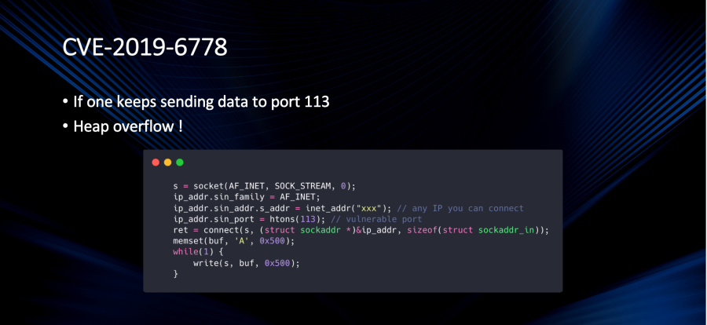 \|https://github.com/rafaeldtinoco/howtos/blob/main/images/k4G43ryoD.png]  
The exploit takes advantage of the fact the QEMU SLIRP emulated device will allocate buffers for fragmented packets, in order to reconstruct a bigger packet at the end using the initial fragmented packet allocation buffer.  
\[ 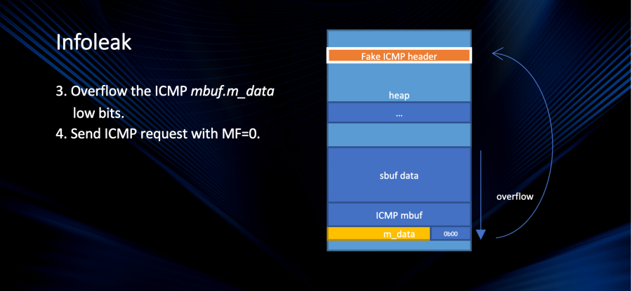 \|https://github.com/rafaeldtinoco/howtos/blob/main/images/AQ9F\-tPy\_.png]  
By causing an overflow to an allocated data buffer, and combining requests for the host emulated device to deal with fragmented packets, one can 'steal' memory data from QEMU memory (at least of the part dealing with the device emulation).  
\[ 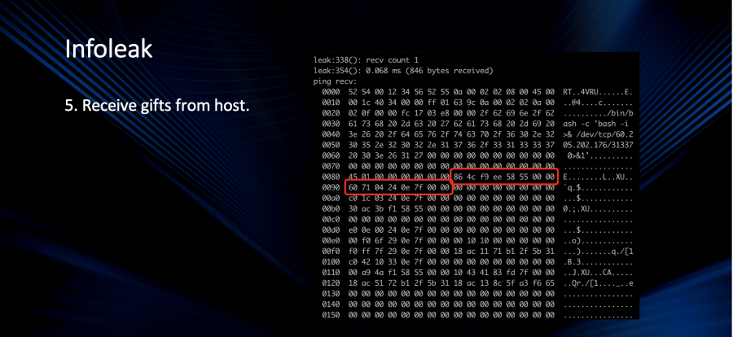 \|https://github.com/rafaeldtinoco/howtos/blob/main/images/wCmPNEvY0\.png]  
This CVE shows a real possible attack to emulated devices \- as long as you're using the SLIRP emulated device (also known as User Networking). Check **User Networking (SLIRP)** section in this same document.  
\" because \"request\" is null")

  

1. PROPOSITION (1\): Improve current LSM (apparmor) rules for the emulation layer (QEMU).
2. PROPOSITION (2\): QEMU processes running with same user privileges: isolation levels to avoid other resources being jeopardized. This item was considered 'done' by the seccomp feature entirely as you may read in previous sections.
3. PROPOSITION (3\): HostOS instrumentation for identifying, logging and blocking bloody\-minded tenants. This topic will be described in the next section.

\" because \"request\" is null")**5\.b\-) Introspection tools: avoid overhead**  
Apart from confinement, a good strategy might be runtime security detection based on known pattern behaviors (from previous CVEs OR known security exploits techniques).  
For example: knowing what to look for could turn a detection system into something better than just logging OS blocked resources which could be, most of the time, false\-positive alerts.  
Introspection is a relatively new methodology for securing OSes and cloud\-environments. As the time has passed, different tools allowed Operating Systems code to be probed and analyzed without \- or with very little \- overhead.  
The different mechanisms to probe and introspect a running OS kernel always targeted tracing \& profiling only. This has significantly changed lately.  
Some of the observability, tracing and profiling tools are:

* Dtrace (born in Solaris 10\)
* FreeBSD Dtrace (ported from Solaris)
* Systemtap (Linux version of a 'Dtrace\-like' engine)
* Ftrace (Linux Function Tracing)
* Perf (Performance Counters Tool \- Linux profiler tool)
* Valgrind (Instrumentation framework for dynamic analysis)
* ...

Without going into details about all them, instead, this document will try explain some of the key concepts that are currently being used for the security introspection subject.  
Now, to the basics:  
\" because \"request\" is null")**events**  
For the "Perf" tool, there are multiple hardware events \- provided by latest architectures \- to be used as data sources: cpu\-cycles, instructions, cache\-references, cache\-misses, branch\-instructions, branch\-misses, bus\-cycles, L1 data cache loads and stores, L1 instruction cache loads and stores, TLB loads and stores for data and instructions, etc. There are also multiple software events to be used: OS cpu\-clock, task\-clock, page\-faults, minor\-faults, major\-faults, number of context seitches, cpu\-migrations, etc.  
Apart from that, within the kernel there are multiple specifically created tracing points to be used by either perf or ftrace\-like tools. The tracing points are placed at scheduling events, interrupt handlers, memory\-mapped I/O handlers, CPU power state transitions handlers, file\-systems operators, virtualization handlers, and so.  
Some of the times, the already existing kernel events are not enough for a tool to collect needed data for a business logic: events might not exist in the kernel parts of where you need to collect data from OR they don't provide the data you need. For that you may have to work with probes.  
\" because \"request\" is null")**kprobes \& uprobes**

* **Kprobes**

Enables you to dynamically break into any kernel routine and collect debugging and performance information non\-disruptively. You can trap at almost any kernel code address, specifying a handler routine to be invoked when the breakpoint is hit. There are currently two types of probes: kprobes, and kretprobes (also called return probes). A kprobe can be inserted on virtually any instruction in the kernel. A return probe fires when a specified function returns.  
In the typical case, Kprobes\-based instrumentation is packaged as a kernel module. The module's init function registers one or more probes, and the exit function unregisters them. A registration function such as register\_kprobe() specifies where the probe is to be inserted and what handler is to be called when the probe is hit.

* **Uprobes**

Uprobes enables you to dynamically break into any routine in a user application and collect debugging and performance information non\-disruptively. You can trap at any code address, specifying a kernel handler routine to be invoked when the breakpoint is hit.  
There are currently two types of user\-space probes: uprobes and uretprobes (also called return probes). A uprobe can be inserted on any instruction in the application's virtual address space. A return probe fires when a specified user function returns. A registration function such as register\_uprobe() specifies which process is to be probed, where the probe is to be inserted, and what handler is to be called when the probe is hit.  
Typically, Uprobes\-based instrumentation is packaged as a kernel module. In the simplest case, the module's init function registers one or more probes, and the exit function unregisters them. However, probes can be registered or unregistered in response to other events as well.  
\" because \"request\" is null")**eBPF**  
Finally this is where this session headed to. The eBPF technology is the technology that allows security introspection to happen in a modern way.  
The Linux kernel has always been an ideal place to implement observability, networking, and security. Unfortunately this was often impractical as it required changing kernel source code or loading kernel modules, and resulted in layers of abstractions stacked on top of each other.  
**eBPF is a revolutionary technology that can run sandboxed programs in the Linux kernel without changing kernel source code or loading kernel modules**.  
By making the Linux kernel programmable, infrastructure software can leverage existing layers, making them more intelligent and feature\-rich without continuing to add additional layers of complexity to the system or compromising execution efficiency and safety.  
eBPF has resulted in the development of a completely new generation of software able to reprogram the behavior of the Linux kernel and even apply logic across multiple subsystems which were traditionally completely independent.  
What is eBPF being used for:

* **Security**

Building on the foundation of seeing and understanding all system calls and combining that with a packet and socket\-level view of all networking operations allows for revolutionary new approaches to securing systems. While aspects of system call filtering, network\-level filtering, and process context tracing have typically been handled by completely independent systems, eBPF allows for combining the visibility and control of all aspects to create security systems operating on more context with better level of control.

* Networking

The combination of programmability and efficiency makes eBPF a natural fit for all packet processing requirements of networking solutions. The programmability of eBPF enables adding additional protocol parsers and easily program any forwarding logic to meet changing requirements without ever leaving the packet processing context of the Linux kernel. The efficiency provided by the eBPF JIT compiler provides execution performance close to that of natively compiled in\-kernel code.

* Tracing and Profiling

The ability to attach eBPF programs to trace points \- explained previously \- as well as kernel and user application probe points \- also explained previously \- allows unprecedented visibility into the runtime behavior of applications and the system itself. By giving introspection abilities to both the application and system side, both views can be combined, allowing powerful and unique insights to troubleshoot system performance problems. Advanced statistical data structures allow to extract meaningful visibility data in an efficient manner, without requiring the export of vast amounts of sampling data as typically done by similar systems.

* Observability \& Monitoring

Instead of relying on static counters and gauges exposed by the operating system, eBPF enables the collection \& in\-kernel aggregation of custom metrics and generation of visibility events based on a wide range of possible sources. This extends the depth of visibility that can be achieved as well as reduces the overall system overhead significantly by only collecting the visibility data required and by generating histograms and similar data structures at the source of the event instead of relying on the export of samples.  
An example of portable eBPF code can be found [HERE](https://github.com/rafaeldtinoco/portablebpf/)  
\" because \"request\" is null")**5\.c\-) Near future: predict/log unwanted known behavior**  
Considering the 2 CVEs we described earlier:

* CVE\-2019\-6778 \- heap buffer overflow in SLIRP
* CVE\-2019\-14835 \- V\-gHost escape in virtio\-net / vhost\-net

And what we have read so far about eBPF and introspection tools, the idea of this session is to explain how, by knowing the CVEs 'modus operandi', the HostOS could be monitored in a way that any attempt to exploit those vulnerabilities would be **at least** logged.  
First we need to step back and talk about how the eBPF security tools work. I'll concentrate my efforts in a specific tool called [tracee](https://github.com/aquasecurity/tracee), just because it is an open\-source tool and has a company, aquasecurity, providing support behind. This is also true for the tool [falcosecurity](https://github.com/falcosecurity/falco), with the company sysdig behind, and similar functionality.  
Please do note that there are other security tools with similar functionality and that this document is tool\-agnostic. Intent here is to demonstrate those tools purposes for introspection and NOT to be an advisor for which tool to be used.  
\" because \"request\" is null")**Falco Security**  
Falco uses system calls to secure and monitor a system, by:

* Parsing the Linux system calls from the kernel at runtime
* Asserting the stream against a powerful rules engine
* Alerting when a rule is violated

it checks for:

* Privilege escalation using privileged containers
* Namespace changes using tools like setns
* Read/Writes to well\-known directories
* Creating symlinks
* Ownership and Mode changes
* Unexpected network connections or socket mutations
* Spawned processes using execve
* Executing shell binaries such as sh, bash, csh, zsh, etc
* Executing SSH binaries such as ssh, scp, sftp, etc
* Mutating Linux coreutils executables
* Mutating login binaries
* Mutating shadowutil or passwd executables such as shadowconfig, pwck, chpasswd, getpasswd, change, useradd, etc, and others.

**Falco rules**:  
Alerts are configurable downstream actions that can be as simple as logging to STDOUT or as complex as delivering a gRPC call to a client. Falco can send alerts to:

* stdout
* file
* Syslog
* spawned program
* HTTP\[s] end point
* client through the gRPC API

**Falco components**:

* Userspace program: is the CLI tool falco that you can use to interact with Falco. The userspace program handles signals, parses information from a Falco driver, and sends alerts.
* Configuration: defines how Falco is run, what rules to assert, and how to perform alerts. For more information, see Configuration.
* Driver: is a software that adheres to the Falco driver specification and sends a stream of system call information. You cannot run Falco without installing a driver. Supported drivers:
	+ (Default) Kernel module built on libscap and libsinsp C\+\+ libraries
	+ BPF probe built from the same modules
	+ Userspace instrumentation

**A falco rules example**:  
\- list: my\_programs  
items:

\[ls, cat, pwd]

  
\- rule: my\_programs\_opened\_file  
desc: track whenever a set of programs opens a file  
condition: proc.name in (my\_programs) and evt.type\=open  
output: a tracked program opened a file (user\=%user.name command\=%proc.cmdline file\=%fd.name)  
priority: INFO  
to detect when programs (ls, cat and pwd) have opened a file.  
Obviously example shown here is very simple. You will find some more examples [HERE](https://falco.org/docs/examples/).  
Indeed much of the functionality in falcosecurity can be achieved by apparmor and other LSM modules (like SELinux) but in an easier, more dynamic and configurable way.  
Despite being a more mature project, I'll explain more about 'tracee project' as the falco event sources are mostly related to syscalls only, and interpretation of what they're doing in the OS.  
\" because \"request\" is null")**Tracee**  
Now the reader might understand why I have chosen the 'tracee' tool as the one to give more details of for security purposes: Tracee tool, even being younger, seems to be more advanced into the eBPF area, covering more than just syscalls or specific events, it allows its own core to be extended by using eBPF libbpf based code, with its tracee\-ebpf core, and to process rules after they have been collected, with its tracee\-rules engine.  
**The project**:  
Tracee is a Runtime Security and forensics tool for Linux. It is using Linux eBPF technology to trace your system and applications at runtime, and analyze collected events to detect suspicious behavioral patterns. It is delivered as a Docker image that monitors the OS and detects suspicious behavior based on a pre\-defined set of behavioral patterns.  
In some cases, you might want to leverage Tracee's eBPF event collection capabilities directly, without involving the detection engine. This might be useful for debugging / troubleshooting / analysis / research / education. In this case you can run Tracee with the trace sub\-command, which will start dumping raw data directly into standard output. There are many configurations and options available so you can control exactly what is being collected and how.  
**tracee components**:  
Tracee is composed of the following sub\-projects, which are hosted in the aquasecurity/tracee git repository:

  

* Tracee\-eBPF \- Linux Tracing and Forensics using eBPF

Apart from syscalls being traced, tracee is also able to use kernel tracing events, kprobes, LSM hooks, XDP hooks (and possibly some other event sources). The current events that can be observed are:  
**Events**:  
System Calls: Sets: Arguments:  
\_\_\_\_\_\_\_\_\_\_\_\_ \_\_\_\_ \_\_\_\_\_\_\_\_\_

read \[syscalls fs fs\_read\_write] (int fd, void\* buf, size\_t count)

  

write \[syscalls fs fs\_read\_write] (int fd, void\* buf, size\_t count)

  

open \[default syscalls fs fs\_file\_ops] (const char\* pathname, int flags, mode\_t mode)

  

close \[default syscalls fs fs\_file\_ops] (int fd)

  

stat \[default syscalls fs fs\_file\_attr] (const char\* pathname, struct stat\* statbuf)

  

fstat \[default syscalls fs fs\_file\_attr] (int fd, struct stat\* statbuf)

  

lstat \[default syscalls fs fs\_file\_attr] (const char\* pathname, struct stat\* statbuf)

  

poll \[syscalls fs fs\_mux\_io] (struct pollfd\* fds, unsigned int nfds, int timeout)

  

lseek \[syscalls fs fs\_read\_write] (int fd, off\_t offset, unsigned int whence)

  

mmap \[syscalls proc proc\_mem] (void\* addr, size\_t length, int prot, int flags, int fd, off\_t off)

  

mprotect \[syscalls proc proc\_mem] (void\* addr, size\_t len, int prot)

  

munmap \[syscalls proc proc\_mem] (void\* addr, size\_t length)

  

brk \[syscalls proc proc\_mem] (void\* addr)

  

rt\_sigaction \[syscalls signals] (int signum, const struct sigaction\* act, struct sigaction\* oldact, size\_t sigsetsize)

  

rt\_sigprocmask \[syscalls signals] (int how, sigset\_t\* set, sigset\_t\* oldset, size\_t sigsetsize)

  

rt\_sigreturn \[syscalls signals] ()

  

ioctl \[syscalls fs fs\_fd\_ops] (int fd, unsigned long request, unsigned long arg)

  

pread64 \[syscalls fs fs\_read\_write] (int fd, void\* buf, size\_t count, off\_t offset)

  

pwrite64 \[syscalls fs fs\_read\_write] (int fd, const void\* buf, size\_t count, off\_t offset)

  

readv \[syscalls fs fs\_read\_write] (int fd, const struct iovec\* iov, int iovcnt)

  

writev \[syscalls fs fs\_read\_write] (int fd, const struct iovec\* iov, int iovcnt)

  

access \[default syscalls fs fs\_file\_attr] (const char\* pathname, int mode)

  

pipe \[syscalls ipc ipc\_pipe] (int\[2] pipefd)

  

select \[syscalls fs fs\_mux\_io] (int nfds, fd\_set\* readfds, fd\_set\* writefds, fd\_set\* exceptfds, struct timeval\* timeout)

  

sched\_yield \[syscalls proc proc\_sched] ()

  

mremap \[syscalls proc proc\_mem] (void\* old\_address, size\_t old\_size, size\_t new\_size, int flags, void\* new\_address)

  

msync \[syscalls fs fs\_sync] (void\* addr, size\_t length, int flags)

  

mincore \[syscalls proc proc\_mem] (void\* addr, size\_t length, unsigned char\* vec)

  

madvise \[syscalls proc proc\_mem] (void\* addr, size\_t length, int advice)

  

shmget \[syscalls ipc ipc\_shm] (key\_t key, size\_t size, int shmflg)

  

shmat \[syscalls ipc ipc\_shm] (int shmid, const void\* shmaddr, int shmflg)

  

shmctl \[syscalls ipc ipc\_shm] (int shmid, int cmd, struct shmid\_ds\* buf)

  

dup \[default syscalls fs fs\_fd\_ops] (int oldfd)

  

dup2 \[default syscalls fs fs\_fd\_ops] (int oldfd, int newfd)

  

pause \[syscalls signals] ()

  

nanosleep \[syscalls time time\_timer] (const struct timespec\* req, struct timespec\* rem)

  

getitimer \[syscalls time time\_timer] (int which, struct itimerval\* curr\_value)

  

alarm \[syscalls time time\_timer] (unsigned int seconds)

  

setitimer \[syscalls time time\_timer] (int which, struct itimerval\* new\_value, struct itimerval\* old\_value)

  

getpid \[syscalls proc proc\_ids] ()

  

sendfile \[syscalls fs fs\_read\_write] (int out\_fd, int in\_fd, off\_t\* offset, size\_t count)

  

socket \[default syscalls net net\_sock] (int domain, int type, int protocol)

  

connect \[default syscalls net net\_sock] (int sockfd, struct sockaddr\* addr, int addrlen)

  

accept \[default syscalls net net\_sock] (int sockfd, struct sockaddr\* addr, int\* addrlen)

  

sendto \[syscalls net net\_snd\_rcv] (int sockfd, void\* buf, size\_t len, int flags, struct sockaddr\* dest\_addr, int addrlen)

  

recvfrom \[syscalls net net\_snd\_rcv] (int sockfd, void\* buf, size\_t len, int flags, struct sockaddr\* src\_addr, int\* addrlen)

  

sendmsg \[syscalls net net\_snd\_rcv] (int sockfd, struct msghdr\* msg, int flags)

  

recvmsg \[syscalls net net\_snd\_rcv] (int sockfd, struct msghdr\* msg, int flags)

  

shutdown \[syscalls net net\_sock] (int sockfd, int how)

  

bind \[default syscalls net net\_sock] (int sockfd, struct sockaddr\* addr, int addrlen)

  

listen \[default syscalls net net\_sock] (int sockfd, int backlog)

  

getsockname \[default syscalls net net\_sock] (int sockfd, struct sockaddr\* addr, int\* addrlen)

  

getpeername \[syscalls net net\_sock] (int sockfd, struct sockaddr\* addr, int\* addrlen)

  

socketpair \[syscalls net net\_sock] (int domain, int type, int protocol, int\[2] sv)

  

setsockopt \[syscalls net net\_sock] (int sockfd, int level, int optname, const void\* optval, int optlen)

  

getsockopt \[syscalls net net\_sock] (int sockfd, int level, int optname, char\* optval, int\* optlen)

  

clone \[default syscalls proc proc\_life] (unsigned long flags, void\* stack, int\* parent\_tid, int\* child\_tid, unsigned long tls)

  

fork \[default syscalls proc proc\_life] ()

  

vfork \[default syscalls proc proc\_life] ()

  

execve \[default syscalls proc proc\_life] (const char\* pathname, const char\*const\* argv, const char\*const\* envp)

  

exit \[syscalls proc proc\_life] (int status)

  

wait4 \[syscalls proc proc\_life] (pid\_t pid, int\* wstatus, int options, struct rusage\* rusage)

  

kill \[default syscalls signals] (pid\_t pid, int sig)

  

uname \[syscalls system] (struct utsname\* buf)

  

semget \[syscalls ipc ipc\_sem] (key\_t key, int nsems, int semflg)

  

semop \[syscalls ipc ipc\_sem] (int semid, struct sembuf\* sops, size\_t nsops)

  

semctl \[syscalls ipc ipc\_sem] (int semid, int semnum, int cmd, unsigned long arg)

  

shmdt \[syscalls ipc ipc\_shm] (const void\* shmaddr)

  

msgget \[syscalls ipc ipc\_msgq] (key\_t key, int msgflg)

  

msgsnd \[syscalls ipc ipc\_msgq] (int msqid, struct msgbuf\* msgp, size\_t msgsz, int msgflg)

  

msgrcv \[syscalls ipc ipc\_msgq] (int msqid, struct msgbuf\* msgp, size\_t msgsz, long msgtyp, int msgflg)

  

msgctl \[syscalls ipc ipc\_msgq] (int msqid, int cmd, struct msqid\_ds\* buf)

  

fcntl \[syscalls fs fs\_fd\_ops] (int fd, int cmd, unsigned long arg)

  

flock \[syscalls fs fs\_fd\_ops] (int fd, int operation)

  

fsync \[syscalls fs fs\_sync] (int fd)

  

fdatasync \[syscalls fs fs\_sync] (int fd)

  

truncate \[syscalls fs fs\_file\_ops] (const char\* path, off\_t length)

  

ftruncate \[syscalls fs fs\_file\_ops] (int fd, off\_t length)

  

getdents \[default syscalls fs fs\_dir\_ops] (int fd, struct linux\_dirent\* dirp, unsigned int count)

  

getcwd \[syscalls fs fs\_dir\_ops] (char\* buf, size\_t size)

  

chdir \[syscalls fs fs\_dir\_ops] (const char\* path)

  

fchdir \[syscalls fs fs\_dir\_ops] (int fd)

  

rename \[syscalls fs fs\_file\_ops] (const char\* oldpath, const char\* newpath)

  

mkdir \[syscalls fs fs\_dir\_ops] (const char\* pathname, mode\_t mode)

  

rmdir \[syscalls fs fs\_dir\_ops] (const char\* pathname)

  

creat \[default syscalls fs fs\_file\_ops] (const char\* pathname, mode\_t mode)

  

link \[syscalls fs fs\_link\_ops] (const char\* oldpath, const char\* newpath)

  

unlink \[default syscalls fs fs\_link\_ops] (const char\* pathname)

  

symlink \[default syscalls fs fs\_link\_ops] (const char\* target, const char\* linkpath)

  

readlink \[syscalls fs fs\_link\_ops] (const char\* pathname, char\* buf, size\_t bufsiz)

  

chmod \[default syscalls fs fs\_file\_attr] (const char\* pathname, mode\_t mode)

  

fchmod \[default syscalls fs fs\_file\_attr] (int fd, mode\_t mode)

  

chown \[default syscalls fs fs\_file\_attr] (const char\* pathname, uid\_t owner, gid\_t group)

  

fchown \[default syscalls fs fs\_file\_attr] (int fd, uid\_t owner, gid\_t group)

  

lchown \[default syscalls fs fs\_file\_attr] (const char\* pathname, uid\_t owner, gid\_t group)

  

umask \[syscalls fs fs\_file\_attr] (mode\_t mask)

  

gettimeofday \[syscalls time time\_tod] (struct timeval\* tv, struct timezone\* tz)

  

getrlimit \[syscalls proc] (int resource, struct rlimit\* rlim)

  

getrusage \[syscalls proc] (int who, struct rusage\* usage)

  

sysinfo \[syscalls system] (struct sysinfo\* info)

  

times \[syscalls proc] (struct tms\* buf)

  

ptrace \[default syscalls proc] (long request, pid\_t pid, void\* addr, void\* data)

  

getuid \[syscalls proc proc\_ids] ()

  

syslog \[syscalls system] (int type, char\* bufp, int len)

  

getgid \[syscalls proc proc\_ids] ()

  

setuid \[default syscalls proc proc\_ids] (uid\_t uid)

  

setgid \[default syscalls proc proc\_ids] (gid\_t gid)

  

geteuid \[syscalls proc proc\_ids] ()

  

getegid \[syscalls proc proc\_ids] ()

  

setpgid \[syscalls proc proc\_ids] (pid\_t pid, pid\_t pgid)

  

getppid \[syscalls proc proc\_ids] ()

  

getpgrp \[syscalls proc proc\_ids] ()

  

setsid \[syscalls proc proc\_ids] ()

  

setreuid \[default syscalls proc proc\_ids] (uid\_t ruid, uid\_t euid)

  

setregid \[default syscalls proc proc\_ids] (gid\_t rgid, gid\_t egid)

  

getgroups \[syscalls proc proc\_ids] (int size, gid\_t\* list)

  

setgroups \[syscalls proc proc\_ids] (int size, gid\_t\* list)

  

setresuid \[syscalls proc proc\_ids] (uid\_t ruid, uid\_t euid, uid\_t suid)

  

getresuid \[syscalls proc proc\_ids] (uid\_t\* ruid, uid\_t\* euid, uid\_t\* suid)

  

setresgid \[syscalls proc proc\_ids] (gid\_t rgid, gid\_t egid, gid\_t sgid)

  

getresgid \[syscalls proc proc\_ids] (gid\_t\* rgid, gid\_t\* egid, gid\_t\* sgid)

  

getpgid \[syscalls proc proc\_ids] (pid\_t pid)

  

setfsuid \[default syscalls proc proc\_ids] (uid\_t fsuid)

  

setfsgid \[default syscalls proc proc\_ids] (gid\_t fsgid)

  

getsid \[syscalls proc proc\_ids] (pid\_t pid)

  

capget \[syscalls proc] (cap\_user\_header\_t hdrp, cap\_user\_data\_t datap)

  

capset \[syscalls proc] (cap\_user\_header\_t hdrp, const cap\_user\_data\_t datap)

  

rt\_sigpending \[syscalls signals] (sigset\_t\* set, size\_t sigsetsize)

  

rt\_sigtimedwait \[syscalls signals] (const sigset\_t\* set, siginfo\_t\* info, const struct timespec\* timeout, size\_t sigsetsize)

  

rt\_sigqueueinfo \[syscalls signals] (pid\_t tgid, int sig, siginfo\_t\* info)

  

rt\_sigsuspend \[syscalls signals] (sigset\_t\* mask, size\_t sigsetsize)

  

sigaltstack \[syscalls signals] (const stack\_t\* ss, stack\_t\* old\_ss)

  

utime \[syscalls fs fs\_file\_attr] (const char\* filename, const struct utimbuf\* times)

  

mknod \[default syscalls fs fs\_file\_ops] (const char\* pathname, mode\_t mode, dev\_t dev)

  

uselib \[syscalls proc] (const char\* library)

  

personality \[syscalls system] (unsigned long persona)

  

ustat \[syscalls fs fs\_info] (dev\_t dev, struct ustat\* ubuf)

  

statfs \[syscalls fs fs\_info] (const char\* path, struct statfs\* buf)

  

fstatfs \[syscalls fs fs\_info] (int fd, struct statfs\* buf)

  

sysfs \[syscalls fs fs\_info] (int option)

  

getpriority \[syscalls proc proc\_sched] (int which, int who)

  

setpriority \[syscalls proc proc\_sched] (int which, int who, int prio)

  

sched\_setparam \[syscalls proc proc\_sched] (pid\_t pid, struct sched\_param\* param)

  

sched\_getparam \[syscalls proc proc\_sched] (pid\_t pid, struct sched\_param\* param)

  

sched\_setscheduler \[syscalls proc proc\_sched] (pid\_t pid, int policy, struct sched\_param\* param)

  

sched\_getscheduler \[syscalls proc proc\_sched] (pid\_t pid)

  

sched\_get\_priority\_max \[syscalls proc proc\_sched] (int policy)

  

sched\_get\_priority\_min \[syscalls proc proc\_sched] (int policy)

  

sched\_rr\_get\_interval \[syscalls proc proc\_sched] (pid\_t pid, struct timespec\* tp)

  

mlock \[syscalls proc proc\_mem] (const void\* addr, size\_t len)

  

munlock \[syscalls proc proc\_mem] (const void\* addr, size\_t len)

  

mlockall \[syscalls proc proc\_mem] (int flags)

  

munlockall \[syscalls proc proc\_mem] ()

  

vhangup \[syscalls system] ()

  

modify\_ldt \[syscalls proc proc\_mem] (int func, void\* ptr, unsigned long bytecount)

  

pivot\_root \[syscalls fs] (const char\* new\_root, const char\* put\_old)

  

sysctl \[syscalls system] (struct \_\_sysctl\_args\* args)

  

prctl \[default syscalls proc] (int option, unsigned long arg2, unsigned long arg3, unsigned long arg4, unsigned long arg5\)

  

arch\_prctl \[syscalls proc] (int option, unsigned long addr)

  

adjtimex \[syscalls time time\_clock] (struct timex\* buf)

  

setrlimit \[syscalls proc] (int resource, const struct rlimit\* rlim)

  

chroot \[syscalls fs fs\_dir\_ops] (const char\* path)

  

sync \[syscalls fs fs\_sync] ()

  

acct \[syscalls system] (const char\* filename)

  

settimeofday \[syscalls time time\_tod] (const struct timeval\* tv, const struct timezone\* tz)

  

mount \[default syscalls fs] (const char\* source, const char\* target, const char\* filesystemtype, unsigned long mountflags, const void\* data)

  

umount \[default syscalls fs] (const char\* target, int flags)

  

swapon \[syscalls fs] (const char\* path, int swapflags)

  

swapoff \[syscalls fs] (const char\* path)

  

reboot \[syscalls system] (int magic, int magic2, int cmd, void\* arg)

  

sethostname \[syscalls net] (const char\* name, size\_t len)

  

setdomainname \[syscalls net] (const char\* name, size\_t len)

  

iopl \[syscalls system] (int level)

  

ioperm \[syscalls system] (unsigned long from, unsigned long num, int turn\_on)

  

create\_module \[syscalls system system\_module] ()

  

init\_module \[default syscalls system system\_module] (void\* module\_image, unsigned long len, const char\* param\_values)

  

delete\_module \[default syscalls system system\_module] (const char\* name, int flags)

  

get\_kernel\_syms \[syscalls system system\_module] ()

  

query\_module \[syscalls system system\_module] ()

  

quotactl \[syscalls system] (int cmd, const char\* special, int id, void\* addr)

  

nfsservctl \[syscalls fs] ()

  

getpmsg \[syscalls] ()

  

putpmsg \[syscalls] ()

  

afs \[syscalls] ()

  

tuxcall \[syscalls] ()

  

security \[syscalls] ()

  

gettid \[syscalls proc proc\_ids] ()

  

readahead \[syscalls fs] (int fd, off\_t offset, size\_t count)

  

setxattr \[syscalls fs fs\_file\_attr] (const char\* path, const char\* name, const void\* value, size\_t size, int flags)

  

lsetxattr \[syscalls fs fs\_file\_attr] (const char\* path, const char\* name, const void\* value, size\_t size, int flags)

  

fsetxattr \[syscalls fs fs\_file\_attr] (int fd, const char\* name, const void\* value, size\_t size, int flags)

  

getxattr \[syscalls fs fs\_file\_attr] (const char\* path, const char\* name, void\* value, size\_t size)

  

lgetxattr \[syscalls fs fs\_file\_attr] (const char\* path, const char\* name, void\* value, size\_t size)

  

fgetxattr \[syscalls fs fs\_file\_attr] (int fd, const char\* name, void\* value, size\_t size)

  

listxattr \[syscalls fs fs\_file\_attr] (const char\* path, char\* list, size\_t size)

  

llistxattr \[syscalls fs fs\_file\_attr] (const char\* path, char\* list, size\_t size)

  

flistxattr \[syscalls fs fs\_file\_attr] (int fd, char\* list, size\_t size)

  

removexattr \[syscalls fs fs\_file\_attr] (const char\* path, const char\* name)

  

lremovexattr \[syscalls fs fs\_file\_attr] (const char\* path, const char\* name)

  

fremovexattr \[syscalls fs fs\_file\_attr] (int fd, const char\* name)

  

tkill \[syscalls signals] (int tid, int sig)

  

time \[syscalls time time\_tod] (time\_t\* tloc)

  

futex \[syscalls ipc ipc\_futex] (int\* uaddr, int futex\_op, int val, const struct timespec\* timeout, int\* uaddr2, int val3\)

  

sched\_setaffinity \[syscalls proc proc\_sched] (pid\_t pid, size\_t cpusetsize, unsigned long\* mask)

  

sched\_getaffinity \[syscalls proc proc\_sched] (pid\_t pid, size\_t cpusetsize, unsigned long\* mask)

  

set\_thread\_area \[syscalls proc] (struct user\_desc\* u\_info)

  

io\_setup \[syscalls fs fs\_async\_io] (unsigned int nr\_events, io\_context\_t\* ctx\_idp)

  

io\_destroy \[syscalls fs fs\_async\_io] (io\_context\_t ctx\_id)

  

io\_getevents \[syscalls fs fs\_async\_io] (io\_context\_t ctx\_id, long min\_nr, long nr, struct io\_event\* events, struct timespec\* timeout)

  

io\_submit \[syscalls fs fs\_async\_io] (io\_context\_t ctx\_id, long nr, struct iocb\*\* iocbpp)

  

io\_cancel \[syscalls fs fs\_async\_io] (io\_context\_t ctx\_id, struct iocb\* iocb, struct io\_event\* result)

  

get\_thread\_area \[syscalls proc] (struct user\_desc\* u\_info)

  

lookup\_dcookie \[syscalls fs fs\_dir\_ops] (u64 cookie, char\* buffer, size\_t len)

  

epoll\_create \[syscalls fs fs\_mux\_io] (int size)

  

epoll\_ctl\_old \[syscalls fs fs\_mux\_io] ()

  

epoll\_wait\_old \[syscalls fs fs\_mux\_io] ()

  

remap\_file\_pages \[syscalls] (void\* addr, size\_t size, int prot, size\_t pgoff, int flags)

  

getdents64 \[default syscalls fs fs\_dir\_ops] (unsigned int fd, struct linux\_dirent64\* dirp, unsigned int count)

  

set\_tid\_address \[syscalls proc] (int\* tidptr)

  

restart\_syscall \[syscalls signals] ()

  

semtimedop \[syscalls ipc ipc\_sem] (int semid, struct sembuf\* sops, size\_t nsops, const struct timespec\* timeout)

  

fadvise64 \[syscalls fs] (int fd, off\_t offset, size\_t len, int advice)

  

timer\_create \[syscalls time time\_timer] (const clockid\_t clockid, struct sigevent\* sevp, timer\_t\* timer\_id)

  

timer\_settime \[syscalls time time\_timer] (timer\_t timer\_id, int flags, const struct itimerspec\* new\_value, struct itimerspec\* old\_value)

  

timer\_gettime \[syscalls time time\_timer] (timer\_t timer\_id, struct itimerspec\* curr\_value)

  

timer\_getoverrun \[syscalls time time\_timer] (timer\_t timer\_id)

  

timer\_delete \[syscalls time time\_timer] (timer\_t timer\_id)

  

clock\_settime \[syscalls time time\_clock] (const clockid\_t clockid, const struct timespec\* tp)

  

clock\_gettime \[syscalls time time\_clock] (const clockid\_t clockid, struct timespec\* tp)

  

clock\_getres \[syscalls time time\_clock] (const clockid\_t clockid, struct timespec\* res)

  

clock\_nanosleep \[syscalls time time\_clock] (const clockid\_t clockid, int flags, const struct timespec\* request, struct timespec\* remain)

  

exit\_group \[syscalls proc proc\_life] (int status)

  

epoll\_wait \[syscalls fs fs\_mux\_io] (int epfd, struct epoll\_event\* events, int maxevents, int timeout)

  

epoll\_ctl \[syscalls fs fs\_mux\_io] (int epfd, int op, int fd, struct epoll\_event\* event)

  

tgkill \[syscalls signals] (int tgid, int tid, int sig)

  

utimes \[syscalls fs fs\_file\_attr] (char\* filename, struct timeval\* times)

  

vserver \[syscalls] ()

  

mbind \[syscalls system system\_numa] (void\* addr, unsigned long len, int mode, const unsigned long\* nodemask, unsigned long maxnode, unsigned int flags)

  

set\_mempolicy \[syscalls system system\_numa] (int mode, const unsigned long\* nodemask, unsigned long maxnode)

  

get\_mempolicy \[syscalls system system\_numa] (int\* mode, unsigned long\* nodemask, unsigned long maxnode, void\* addr, unsigned long flags)

  

mq\_open \[syscalls ipc ipc\_msgq] (const char\* name, int oflag, mode\_t mode, struct mq\_attr\* attr)

  

mq\_unlink \[syscalls ipc ipc\_msgq] (const char\* name)

  

mq\_timedsend \[syscalls ipc ipc\_msgq] (mqd\_t mqdes, const char\* msg\_ptr, size\_t msg\_len, unsigned int msg\_prio, const struct timespec\* abs\_timeout)

  

mq\_timedreceive \[syscalls ipc ipc\_msgq] (mqd\_t mqdes, char\* msg\_ptr, size\_t msg\_len, unsigned int\* msg\_prio, const struct timespec\* abs\_timeout)

  

mq\_notify \[syscalls ipc ipc\_msgq] (mqd\_t mqdes, const struct sigevent\* sevp)

  

mq\_getsetattr \[syscalls ipc ipc\_msgq] (mqd\_t mqdes, const struct mq\_attr\* newattr, struct mq\_attr\* oldattr)

  

kexec\_load \[syscalls system] (unsigned long entry, unsigned long nr\_segments, struct kexec\_segment\* segments, unsigned long flags)

  

waitid \[syscalls proc proc\_life] (int idtype, pid\_t id, struct siginfo\* infop, int options, struct rusage\* rusage)

  

add\_key \[syscalls system system\_keys] (const char\* type, const char\* description, const void\* payload, size\_t plen, key\_serial\_t keyring)

  

request\_key \[syscalls system system\_keys] (const char\* type, const char\* description, const char\* callout\_info, key\_serial\_t dest\_keyring)

  

keyctl \[syscalls system system\_keys] (int operation, unsigned long arg2, unsigned long arg3, unsigned long arg4, unsigned long arg5\)

  

ioprio\_set \[syscalls proc proc\_sched] (int which, int who, int ioprio)

  

ioprio\_get \[syscalls proc proc\_sched] (int which, int who)

  

inotify\_init \[syscalls fs fs\_monitor] ()

  

inotify\_add\_watch \[syscalls fs fs\_monitor] (int fd, const char\* pathname, u32 mask)

  

inotify\_rm\_watch \[syscalls fs fs\_monitor] (int fd, int wd)

  

migrate\_pages \[syscalls system system\_numa] (int pid, unsigned long maxnode, const unsigned long\* old\_nodes, const unsigned long\* new\_nodes)

  

openat \[default syscalls fs fs\_file\_ops] (int dirfd, const char\* pathname, int flags, mode\_t mode)

  

mkdirat \[syscalls fs fs\_dir\_ops] (int dirfd, const char\* pathname, mode\_t mode)

  

mknodat \[default syscalls fs fs\_file\_ops] (int dirfd, const char\* pathname, mode\_t mode, dev\_t dev)

  

fchownat \[default syscalls fs fs\_file\_attr] (int dirfd, const char\* pathname, uid\_t owner, gid\_t group, int flags)

  

futimesat \[syscalls fs fs\_file\_attr] (int dirfd, const char\* pathname, struct timeval\* times)

  

newfstatat \[syscalls fs fs\_file\_attr] (int dirfd, const char\* pathname, struct stat\* statbuf, int flags)

  

unlinkat \[default syscalls fs fs\_link\_ops] (int dirfd, const char\* pathname, int flags)

  

renameat \[syscalls fs fs\_file\_ops] (int olddirfd, const char\* oldpath, int newdirfd, const char\* newpath)

  

linkat \[syscalls fs fs\_link\_ops] (int olddirfd, const char\* oldpath, int newdirfd, const char\* newpath, unsigned int flags)

  

symlinkat \[default syscalls fs fs\_link\_ops] (const char\* target, int newdirfd, const char\* linkpath)

  

readlinkat \[syscalls fs fs\_link\_ops] (int dirfd, const char\* pathname, char\* buf, int bufsiz)

  

fchmodat \[default syscalls fs fs\_file\_attr] (int dirfd, const char\* pathname, mode\_t mode, int flags)

  

faccessat \[default syscalls fs fs\_file\_attr] (int dirfd, const char\* pathname, int mode, int flags)

  

pselect6 \[syscalls fs fs\_mux\_io] (int nfds, fd\_set\* readfds, fd\_set\* writefds, fd\_set\* exceptfds, struct timespec\* timeout, void\* sigmask)

  

ppoll \[syscalls fs fs\_mux\_io] (struct pollfd\* fds, unsigned int nfds, struct timespec\* tmo\_p, const sigset\_t\* sigmask, size\_t sigsetsize)

  

unshare \[syscalls proc] (int flags)

  

set\_robust\_list \[syscalls ipc ipc\_futex] (struct robust\_list\_head\* head, size\_t len)

  

get\_robust\_list \[syscalls ipc ipc\_futex] (int pid, struct robust\_list\_head\*\* head\_ptr, size\_t\* len\_ptr)

  

splice \[syscalls ipc ipc\_pipe] (int fd\_in, off\_t\* off\_in, int fd\_out, off\_t\* off\_out, size\_t len, unsigned int flags)

  

tee \[syscalls ipc ipc\_pipe] (int fd\_in, int fd\_out, size\_t len, unsigned int flags)

  

sync\_file\_range \[syscalls fs fs\_sync] (int fd, off\_t offset, off\_t nbytes, unsigned int flags)

  

vmsplice \[syscalls ipc ipc\_pipe] (int fd, const struct iovec\* iov, unsigned long nr\_segs, unsigned int flags)

  

move\_pages \[syscalls system system\_numa] (int pid, unsigned long count, const void\*\* pages, const int\* nodes, int\* status, int flags)

  

utimensat \[syscalls fs fs\_file\_attr] (int dirfd, const char\* pathname, struct timespec\* times, int flags)

  

epoll\_pwait \[syscalls fs fs\_mux\_io] (int epfd, struct epoll\_event\* events, int maxevents, int timeout, const sigset\_t\* sigmask, size\_t sigsetsize)

  

signalfd \[syscalls signals] (int fd, sigset\_t\* mask, int flags)

  

timerfd\_create \[syscalls time time\_timer] (int clockid, int flags)

  

eventfd \[syscalls signals] (unsigned int initval, int flags)

  

fallocate \[syscalls fs fs\_file\_ops] (int fd, int mode, off\_t offset, off\_t len)

  

timerfd\_settime \[syscalls time time\_timer] (int fd, int flags, const struct itimerspec\* new\_value, struct itimerspec\* old\_value)

  

timerfd\_gettime \[syscalls time time\_timer] (int fd, struct itimerspec\* curr\_value)

  

accept4 \[default syscalls net net\_sock] (int sockfd, struct sockaddr\* addr, int\* addrlen, int flags)

  

signalfd4 \[syscalls signals] (int fd, const sigset\_t\* mask, size\_t sizemask, int flags)

  

eventfd2 \[syscalls signals] (unsigned int initval, int flags)

  

epoll\_create1 \[syscalls fs fs\_mux\_io] (int flags)

  

dup3 \[default syscalls fs fs\_fd\_ops] (int oldfd, int newfd, int flags)

  

pipe2 \[syscalls ipc ipc\_pipe] (int\* pipefd, int flags)

  

inotify\_init1 \[syscalls fs fs\_monitor] (int flags)

  

preadv \[syscalls fs fs\_read\_write] (int fd, const struct iovec\* iov, unsigned long iovcnt, unsigned long pos\_l, unsigned long pos\_h)

  

pwritev \[syscalls fs fs\_read\_write] (int fd, const struct iovec\* iov, unsigned long iovcnt, unsigned long pos\_l, unsigned long pos\_h)

  

rt\_tgsigqueueinfo \[syscalls signals] (pid\_t tgid, pid\_t tid, int sig, siginfo\_t\* info)

  

perf\_event\_open \[syscalls system] (struct perf\_event\_attr\* attr, pid\_t pid, int cpu, int group\_fd, unsigned long flags)

  

recvmmsg \[syscalls net net\_snd\_rcv] (int sockfd, struct mmsghdr\* msgvec, unsigned int vlen, int flags, struct timespec\* timeout)

  

fanotify\_init \[syscalls fs fs\_monitor] (unsigned int flags, unsigned int event\_f\_flags)

  

fanotify\_mark \[syscalls fs fs\_monitor] (int fanotify\_fd, unsigned int flags, u64 mask, int dirfd, const char\* pathname)

  

prlimit64 \[syscalls proc] (pid\_t pid, int resource, const struct rlimit64\* new\_limit, struct rlimit64\* old\_limit)

  

name\_to\_handle\_at \[syscalls fs fs\_file\_ops] (int dirfd, const char\* pathname, struct file\_handle\* handle, int\* mount\_id, int flags)

  

open\_by\_handle\_at \[syscalls fs fs\_file\_ops] (int mount\_fd, struct file\_handle\* handle, int flags)

  

clock\_adjtime \[syscalls time time\_clock] (const clockid\_t clk\_id, struct timex\* buf)

  

syncfs \[syscalls fs fs\_sync] (int fd)

  

sendmmsg \[syscalls net net\_snd\_rcv] (int sockfd, struct mmsghdr\* msgvec, unsigned int vlen, int flags)

  

setns \[syscalls proc] (int fd, int nstype)

  

getcpu \[syscalls system system\_numa] (unsigned int\* cpu, unsigned int\* node, struct getcpu\_cache\* tcache)

  

process\_vm\_readv \[default syscalls proc] (pid\_t pid, const struct iovec\* local\_iov, unsigned long liovcnt, const struct iovec\* remote\_iov, unsigned long riovcnt, unsigned long flags)

  

process\_vm\_writev \[default syscalls proc] (pid\_t pid, const struct iovec\* local\_iov, unsigned long liovcnt, const struct iovec\* remote\_iov, unsigned long riovcnt, unsigned long flags)

  

kcmp \[syscalls proc] (pid\_t pid1, pid\_t pid2, int type, unsigned long idx1, unsigned long idx2\)

  

finit\_module \[default syscalls system system\_module] (int fd, const char\* param\_values, int flags)

  

sched\_setattr \[syscalls proc proc\_sched] (pid\_t pid, struct sched\_attr\* attr, unsigned int flags)

  

sched\_getattr \[syscalls proc proc\_sched] (pid\_t pid, struct sched\_attr\* attr, unsigned int size, unsigned int flags)

  

renameat2 \[syscalls fs fs\_file\_ops] (int olddirfd, const char\* oldpath, int newdirfd, const char\* newpath, unsigned int flags)

  

seccomp \[syscalls proc] (unsigned int operation, unsigned int flags, const void\* args)

  

getrandom \[syscalls fs] (void\* buf, size\_t buflen, unsigned int flags)

  

memfd\_create \[default syscalls fs fs\_file\_ops] (const char\* name, unsigned int flags)

  

kexec\_file\_load \[syscalls system] (int kernel\_fd, int initrd\_fd, unsigned long cmdline\_len, const char\* cmdline, unsigned long flags)

  

bpf \[default syscalls system] (int cmd, union bpf\_attr\* attr, unsigned int size)

  

execveat \[default syscalls proc proc\_life] (int dirfd, const char\* pathname, const char\*const\* argv, const char\*const\* envp, int flags)

  

userfaultfd \[syscalls system] (int flags)

  

membarrier \[syscalls proc proc\_mem] (int cmd, int flags)

  

mlock2 \[syscalls proc proc\_mem] (const void\* addr, size\_t len, int flags)

  

copy\_file\_range \[syscalls fs fs\_read\_write] (int fd\_in, off\_t\* off\_in, int fd\_out, off\_t\* off\_out, size\_t len, unsigned int flags)

  

preadv2 \[syscalls fs fs\_read\_write] (int fd, const struct iovec\* iov, unsigned long iovcnt, unsigned long pos\_l, unsigned long pos\_h, int flags)

  

pwritev2 \[syscalls fs fs\_read\_write] (int fd, const struct iovec\* iov, unsigned long iovcnt, unsigned long pos\_l, unsigned long pos\_h, int flags)

  

pkey\_mprotect \[default syscalls proc proc\_mem] (void\* addr, size\_t len, int prot, int pkey)

  

pkey\_alloc \[syscalls proc proc\_mem] (unsigned int flags, unsigned long access\_rights)

  

pkey\_free \[syscalls proc proc\_mem] (int pkey)

  

statx \[syscalls fs fs\_file\_attr] (int dirfd, const char\* pathname, int flags, unsigned int mask, struct statx\* statxbuf)

  

io\_pgetevents \[syscalls fs fs\_async\_io] (aio\_context\_t ctx\_id, long min\_nr, long nr, struct io\_event\* events, struct timespec\* timeout, const struct \_\_aio\_sigset\* usig)

  

rseq \[syscalls] (struct rseq\* rseq, u32 rseq\_len, int flags, u32 sig)

  

pidfd\_send\_signal \[syscalls signals] (int pidfd, int sig, siginfo\_t\* info, unsigned int flags)

  

io\_uring\_setup \[syscalls] (unsigned int entries, struct io\_uring\_params\* p)

  

io\_uring\_enter \[syscalls] (unsigned int fd, unsigned int to\_submit, unsigned int min\_complete, unsigned int flags, sigset\_t\* sig)

  

io\_uring\_register \[syscalls] (unsigned int fd, unsigned int opcode, void\* arg, unsigned int nr\_args)

  

open\_tree \[syscalls] (int dfd, const char\* filename, unsigned int flags)

  

move\_mount \[default syscalls fs] (int from\_dfd, const char\* from\_path, int to\_dfd, const char\* to\_path, unsigned int flags)

  

fsopen \[syscalls fs] (const char\* fsname, unsigned int flags)

  

fsconfig \[syscalls fs] (int\* fs\_fd, unsigned int cmd, const char\* key, const void\* value, int aux)

  

fsmount \[syscalls fs] (int fsfd, unsigned int flags, unsigned int ms\_flags)

  

fspick \[syscalls fs] (int dirfd, const char\* pathname, unsigned int flags)

  

pidfd\_open \[syscalls] (pid\_t pid, unsigned int flags)

  

clone3 \[default syscalls proc proc\_life] (struct clone\_args\* cl\_args, size\_t size)

  

close\_range \[default syscalls fs fs\_file\_ops] (unsigned int first, unsigned int last)

  

openat2 \[default syscalls fs fs\_file\_ops] (int dirfd, const char\* pathname, struct open\_how\* how, size\_t size)

  

pidfd\_getfd \[syscalls] (int pidfd, int targetfd, unsigned int flags)

  

faccessat2 \[default syscalls fs fs\_file\_attr] (int fd, const char\* path, int mode, int flag)

  

process\_madvise \[syscalls] (int pidfd, void\* addr, size\_t length, int advice, unsigned long flags)

  

epoll\_pwait2 \[syscalls fs fs\_mux\_io] (int fd, struct epoll\_event\* events, int maxevents, const struct timespec\* timeout, const sigset\_t\* sigset)

  
  
Other Events: Sets: Arguments:  
\_\_\_\_\_\_\_\_\_\_\_\_ \_\_\_\_ \_\_\_\_\_\_\_\_\_

sys\_enter \[] (int syscall)

  

sys\_exit \[] (int syscall)

  

do\_exit \[proc proc\_life] ()

  

cap\_capable \[default] (int cap, int syscall)

  

security\_bprm\_check \[default lsm\_hooks] (const char\* pathname, dev\_t dev, unsigned long inode)

  

security\_file\_open \[default lsm\_hooks] (const char\* pathname, int flags, dev\_t dev, unsigned long inode)

  

security\_inode\_unlink \[default lsm\_hooks] (const char\* pathname)

  

vfs\_write \[] (const char\* pathname, dev\_t dev, unsigned long inode, size\_t count, off\_t pos)

  

vfs\_writev \[] (const char\* pathname, dev\_t dev, unsigned long inode, unsigned long vlen, off\_t pos)

  

mem\_prot\_alert \[] (alert\_t alert)

  

sched\_process\_exit \[default proc proc\_life] ()

  

commit\_creds \[] (int old\_euid, int new\_euid, int old\_egid, int new\_egid, int old\_fsuid, int new\_fsuid, u64 old\_cap\_eff, u64 new\_cap\_eff)

  

switch\_task\_ns \[] (pid\_t pid, u32 new\_mnt, u32 new\_pid, u32 new\_uts, u32 new\_ipc, u32 new\_net, u32 new\_cgroup)

  

magic\_write \[] (const char\* pathname, bytes bytes)

  

security\_socket\_create \[lsm\_hooks] (int family, int type, int protocol, int kern)

  

security\_socket\_listen \[lsm\_hooks] (int sockfd, struct sockaddr\* local\_addr, int backlog)

  

security\_socket\_connect \[lsm\_hooks] (int sockfd, struct sockaddr\* remote\_addr)

  

security\_socket\_accept \[lsm\_hooks] (int sockfd, struct sockaddr\* local\_addr)

  

security\_socket\_bind \[lsm\_hooks] (int sockfd, struct sockaddr\* local\_addr)

  

security\_sb\_mount \[default lsm\_hooks] (const char\* dev\_name, const char\* path, const char\* type, unsigned long flags)

  

security\_bpf \[lsm\_hooks] (int cmd)

  

security\_bpf\_map \[lsm\_hooks] (unsigned int map\_id, const char\* map\_name)

  
**Tracing**  
You can either opt to trace all registered events or select a few ones, including filters for processes and/or specific conditions. These options can be given directly at the command line in the 'collecting' phase.  
Example:  
Let's trace a 'ls' command, started in the Host (not in a container), from uid 1000, only for new pids (from now on) and all possible registered events and arguments:  
$ sudo ./dist/tracee\-ebpf \-\-trace comm\=ls \-\-trace '!container' \-\-trace 'uid\=1000' \-\-trace pid\=new  
TIME(s) UID COMM PID TID RET EVENT ARGS  
387170\.180056 1000 ls 3103403 3103403 \-2 access pathname: /etc/ld.so.preload, mode: R\_OK  
387170\.180115 1000 ls 3103403 3103403 0 security\_file\_open pathname: /etc/ld.so.cache, flags: O\_RDONLY\|O\_LARGEFILE, dev: 271581185, inode: 132379  
387170\.180151 1000 ls 3103403 3103403 3 openat dirfd: \-100, pathname: /etc/ld.so.cache, flags: O\_RDONLY\|O\_CLOEXEC, mode: 3659504856  
387170\.180171 1000 ls 3103403 3103403 0 fstat fd: 3, statbuf: 0x7FFC73471DA0  
387170\.180203 1000 ls 3103403 3103403 0 close fd: 3  
387170\.180237 1000 ls 3103403 3103403 0 security\_file\_open pathname: /usr/lib/x86\_64\-linux\-gnu/libselinux.so.1, flags: O\_RDONLY\|O\_LARGEFILE, dev: 271581185, inode: 2763066  
387170\.180261 1000 ls 3103403 3103403 3 openat dirfd: \-100, pathname: /lib/x86\_64\-linux\-gnu/libselinux.so.1, flags: O\_RDONLY\|O\_CLOEXEC, mode: 3659504856  
387170\.180291 1000 ls 3103403 3103403 0 fstat fd: 3, statbuf: 0x7FFC73471DF0  
387170\.180405 1000 ls 3103403 3103403 0 close fd: 3  
387170\.180451 1000 ls 3103403 3103403 0 security\_file\_open pathname: /usr/lib/x86\_64\-linux\-gnu/libc\-2\.32\.so, flags: O\_RDONLY\|O\_LARGEFILE, dev: 271581185, inode: 2759030  
387170\.180490 1000 ls 3103403 3103403 3 openat dirfd: \-100, pathname: /lib/x86\_64\-linux\-gnu/libc.so.6, flags: O\_RDONLY\|O\_CLOEXEC, mode: 3659504856  
387170\.180519 1000 ls 3103403 3103403 0 fstat fd: 3, statbuf: 0x7FFC73471DD0  
387170\.180608 1000 ls 3103403 3103403 0 close fd: 3  
387170\.180632 1000 ls 3103403 3103403 0 security\_file\_open pathname: /usr/lib/x86\_64\-linux\-gnu/libpcre2\-8\.so.0\.9\.0, flags: O\_RDONLY\|O\_LARGEFILE, dev: 271581185, inode: 2762979  
387170\.180645 1000 ls 3103403 3103403 3 openat dirfd: \-100, pathname: /lib/x86\_64\-linux\-gnu/libpcre2\-8\.so.0, flags: O\_RDONLY\|O\_CLOEXEC, mode: 3659504856  
387170\.180660 1000 ls 3103403 3103403 0 fstat fd: 3, statbuf: 0x7FFC73471DB0  
387170\.180714 1000 ls 3103403 3103403 0 close fd: 3  
387170\.180732 1000 ls 3103403 3103403 0 security\_file\_open pathname: /usr/lib/x86\_64\-linux\-gnu/libdl\-2\.32\.so, flags: O\_RDONLY\|O\_LARGEFILE, dev: 271581185, inode: 2759032  
387170\.180745 1000 ls 3103403 3103403 3 openat dirfd: \-100, pathname: /lib/x86\_64\-linux\-gnu/libdl.so.2, flags: O\_RDONLY\|O\_CLOEXEC, mode: 3659504856  
387170\.180759 1000 ls 3103403 3103403 0 fstat fd: 3, statbuf: 0x7FFC73471D90  
387170\.180907 1000 ls 3103403 3103403 0 close fd: 3  
387170\.180934 1000 ls 3103403 3103403 0 security\_file\_open pathname: /usr/lib/x86\_64\-linux\-gnu/libpthread\-2\.32\.so, flags: O\_RDONLY\|O\_LARGEFILE, dev: 271581185, inode: 2759049  
387170\.180968 1000 ls 3103403 3103403 3 openat dirfd: \-100, pathname: /lib/x86\_64\-linux\-gnu/libpthread.so.0, flags: O\_RDONLY\|O\_CLOEXEC, mode: 3659504856  
387170\.181009 1000 ls 3103403 3103403 0 fstat fd: 3, statbuf: 0x7FFC73471D50  
387170\.181106 1000 ls 3103403 3103403 0 close fd: 3  
387170\.181587 1000 ls 3103403 3103403 0 security\_file\_open pathname: /proc/filesystems, flags: O\_RDONLY\|O\_LARGEFILE, dev: 22, inode: 4026532091  
387170\.181642 1000 ls 3103403 3103403 3 openat dirfd: \-100, pathname: /proc/filesystems, flags: O\_RDONLY\|O\_CLOEXEC, mode: 3658189323  
387170\.181677 1000 ls 3103403 3103403 0 fstat fd: 3, statbuf: 0x7FFC73472A50  
387170\.181726 1000 ls 3103403 3103403 0 close fd: 3  
387170\.181749 1000 ls 3103403 3103403 \-2 access pathname: /etc/selinux/config, mode: F\_OK  
387170\.181814 1000 ls 3103403 3103403 0 security\_file\_open pathname: /usr/lib/locale/locale\-archive, flags: O\_RDONLY\|O\_LARGEFILE, dev: 271581185, inode: 2621445  
387170\.181831 1000 ls 3103403 3103403 3 openat dirfd: \-100, pathname: /usr/lib/locale/locale\-archive, flags: O\_RDONLY\|O\_CLOEXEC, mode: 3658212476  
387170\.181841 1000 ls 3103403 3103403 0 fstat fd: 3, statbuf: 0x7FCCDA1957A0  
387170\.181877 1000 ls 3103403 3103403 0 close fd: 3  
387170\.182021 1000 ls 3103403 3103403 0 security\_file\_open pathname: /, flags: O\_RDONLY\|O\_NONBLOCK\|O\_LARGEFILE\|O\_DIRECTORY, dev: 271581185, inode: 2  
387170\.182046 1000 ls 3103403 3103403 3 openat dirfd: \-100, pathname: /, flags: O\_RDONLY\|O\_NONBLOCK\|O\_DIRECTORY\|O\_CLOEXEC, mode: 3658212476  
387170\.182062 1000 ls 3103403 3103403 0 fstat fd: 3, statbuf: 0x7FFC73472750  
387170\.182120 1000 ls 3103403 3103403 752 getdents64 fd: 3, dirp: 0x563B7EA4AA30, count: 32768  
387170\.182157 1000 ls 3103403 3103403 0 getdents64 fd: 3, dirp: 0x563B7EA4AA30, count: 32768  
387170\.182169 1000 ls 3103403 3103403 0 close fd: 3  
387170\.182238 1000 ls 3103403 3103403 0 fstat fd: 1, statbuf: 0x7FFC73470620  
387170\.182307 1000 ls 3103403 3103403 0 close fd: 1  
387170\.182342 1000 ls 3103403 3103403 0 close fd: 2  
387170\.182558 1000 ls 3103403 3103403 0 sched\_process\_exit   
End of events stream  
Stats: {eventCounter:44 errorCounter:0 lostEvCounter:0 lostWrCounter:0}  
As you can see, this looks very close to what a 'strace' output would look like. Nevertheless, the core engine for tracee allows for customized filters, not necessarily based in syscalls, that will tell whether a set of events and arguments happened... and THAT is what might warn you about security breakage.  
Like for example a tenant trying to access a file it should not, or trying to memory map address areas it should not, trying to create device node files it should not, etc.  
One might ask what is the difference from that and apparmor, or other LSM engines. The difference is that LSM hooks are just ONE kind of events that might be supported in tracee. Other events might be created based on SPECIFIC needs, like internal\-to\-kernel access attempts, etc.  
Another example, tracee is able to warn if another application has tampered itself and its internal ebpf kernel structures, by having 2 events coming from the LSM hooks inside the kernel.  
Like explained before, tracee has an eBPF core to introspect the kernel, and has maps shared among its userland and kernel ebpf code. If a ill\-intentioned person tries to alter its internal structures, to remove or change the list of events to be monitored, for example, it can monitor itself by observing kernel functions responsible for dealing with those requests:  
$ sudo ./dist/tracee\-ebpf \-\-debug \-\-trace comm\=bpftool \-\-trace event\=security\_bpf\_map   
found bpf object file at: /tmp/tracee/tracee.bpf.5\_8\_0\-43\-generic.v0\_5\_1\-24\-g22a3058\.o  
TIME(s) UID COMM PID TID RET EVENT ARGS  
387505\.754238 0 bpftool 3149471 3149471 0 security\_bpf\_map map\_id: 935, map\_name: args\_map  
387505\.754556 0 bpftool 3149471 3149471 0 security\_bpf\_map map\_id: 936, map\_name: bin\_args\_map  
387505\.754729 0 bpftool 3149471 3149471 0 security\_bpf\_map map\_id: 937, map\_name: bufs  
387505\.754902 0 bpftool 3149471 3149471 0 security\_bpf\_map map\_id: 938, map\_name: bufs\_off  
387505\.755072 0 bpftool 3149471 3149471 0 security\_bpf\_map map\_id: 939, map\_name: chosen\_events\_m  
387505\.755240 0 bpftool 3149471 3149471 0 security\_bpf\_map map\_id: 940, map\_name: comm\_filter  
387505\.755411 0 bpftool 3149471 3149471 0 security\_bpf\_map map\_id: 941, map\_name: config\_map  
387505\.755588 0 bpftool 3149471 3149471 0 security\_bpf\_map map\_id: 942, map\_name: events  
387505\.755762 0 bpftool 3149471 3149471 0 security\_bpf\_map map\_id: 943, map\_name: file\_filter  
387505\.755937 0 bpftool 3149471 3149471 0 security\_bpf\_map map\_id: 944, map\_name: file\_writes  
Here the bpftool (userland tool) is reading all existing eBPF maps within the running kernel. Tracee was able to realize that it read its own eBPF maps and would be able to tell you if its internal structures were 'tainted' or 'tampared' by a 3rd party program.  
This is just one example.  
For the an Host OS, one could create RULES based on previous CVEs behavior that would monitor the OS kernel for security breakage attempts based on known/existent security issues (CVEs)  
**OR**  
Generic security\-related 'recipes' (called 'signatures') could be created based in 'generic ways of security breakage attempt'.  
**SO**,  
Both approaches would allow HostOS admins to be warned about bad cloud citizens to could be better investigated or even blocked from the service.  
Okay, we've collected all this events data. And now ?

  

* Tracee\-Rules \- Runtime Security Detection Engine

Tracee supports authoring rules in Golang or in Rego (the language of Open Policy Agent). See [tracee\-rules rego examples](https://github.com/aquasecurity/tracee/tree/main/tracee-rules/signatures/rego/examples) for example Rego signatures, or [tracee\-rules golang examples](https://github.com/aquasecurity/tracee/tree/main/tracee-rules/signatures/golang/examples)  
As explained in previous section, there are some generic security 'signatures' that could be created in order to avoid malicious code to be executed.  
One good example is when attacker tries to use LD\_LIBRARY\_PATH ordering to hijack library calls from a binary and execute arbitrary code. A good recipe made in 'REGO' can be found [HERE](https://github.com/aquasecurity/tracee/blob/main/tracee-rules/signatures/rego/ld_preload.rego).  
\" because \"request\" is null")**@ \- PROPOSITION 3**  
**THIS IS THE THIRD PROPOSITION OF THIS DOCUMENT STEP**  
As a medium/long term approach, introspection tools should be analyzed for the HostOS environment. HostOS kernel should provide means for the next\-generation security analysis tools to be available to run in a way that no impact is made (like eBPF support with CO.RE feature \- compile once, run everywhere \- and the BTF debugging format support \- available in most recent kernels).  
With time, recipes (or signatures, in case of tracee) could be created in order to log security breakage attempts based on known CVEs and known access or execution patterns.  
This will definitely be more effective than trying to 'log' a common set of existing events in order to guarantee the environment safety.  
\" because \"request\" is null")**6\-) REFERENCE**  
[https://en.wikipedia.org/wiki/QEMU](https://en.wikipedia.org/wiki/QEMU)  
[https://wiki.QEMU.org/Documentation/TCG](https://wiki.QEMU.org/Documentation/TCG)  
[https://wiki.QEMU.org/Features/](https://wiki.QEMU.org/Features/)  
[https://en.wikipedia.org/wiki/Kernel\-based\_Virtual\_Machine](https://en.wikipedia.org/wiki/Kernel-based_Virtual_Machine)  
[https://vfio.blogspot.com/2014/08/iommu\-groups\-inside\-and\-out.html](https://vfio.blogspot.com/2014/08/iommu-groups-inside-and-out.html)  
[https://en.wikipedia.org/wiki/Input%E2%80%93output\_memory\_management\_unit](https://en.wikipedia.org/wiki/Input%E2%80%93output_memory_management_unit)  
[https://www.redhat.com/en/blog/introduction\-virtio\-networking\-and\-vhost\-net](https://www.redhat.com/en/blog/introduction-virtio-networking-and-vhost-net)  
[https://www.redhat.com/en/blog/deep\-dive\-virtio\-networking\-and\-vhost\-net](https://www.redhat.com/en/blog/deep-dive-virtio-networking-and-vhost-net)  
[https://www.redhat.com/en/blog/achieving\-network\-wirespeed\-open\-standard\-manner\-introducing\-vdpa](https://www.redhat.com/en/blog/achieving-network-wirespeed-open-standard-manner-introducing-vdpa)  
[https://www.programmersought.com/article/84854610738/](https://www.programmersought.com/article/84854610738/)  
[https://www.slideshare.net/janghoonsim/KVM\-performance\-optimization\-for\-ubuntu](https://www.slideshare.net/janghoonsim/KVM-performance-optimization-for-ubuntu)  
[https://www.redhat.com/en/blog/journey\-vhost\-users\-realm](https://www.redhat.com/en/blog/journey-vhost-users-realm)  
[https://access.redhat.com/documentation/en\-us/red\_hat\_enterprise\_linux/7/html/virtualization\_deployment\_and\_administration\_guide/sect\-pci\_devices\-pci\_passthrough](https://access.redhat.com/documentation/en-us/red_hat_enterprise_linux/7/html/virtualization_deployment_and_administration_guide/sect-pci_devices-pci_passthrough)  
[https://wiki.ubuntu.com/rafaeldtinoco?action\=AttachFile\&do\=view\&target\=QEMU\_vuln\_and\_mit\_explained.html](https://wiki.ubuntu.com/rafaeldtinoco?action=AttachFile&do=view&target=QEMU_vuln_and_mit_explained.html)  
[https://en.wikipedia.org/wiki/Kernel\_page\-table\_isolation](https://en.wikipedia.org/wiki/Kernel_page-table_isolation)  
[https://www.programmersought.com/article/30564621193/](https://www.programmersought.com/article/30564621193/)  
[https://software.intel.com/security\-software\-guidance/resources/processors\-affected\-special\-register\-buffer\-data\-sampling](https://software.intel.com/security-software-guidance/resources/processors-affected-special-register-buffer-data-sampling)  
[https://software.intel.com/security\-software\-guidance/deep\-dives/deep\-dive\-special\-register\-buffer\-data\-sampling](https://software.intel.com/security-software-guidance/deep-dives/deep-dive-special-register-buffer-data-sampling)  
[https://software.intel.com/security\-software\-guidance/deep\-dives/deep\-dive\-intel\-transactional\-synchronization\-extensions\-intel\-tsx\-asynchronous\-abort](https://software.intel.com/security-software-guidance/deep-dives/deep-dive-intel-transactional-synchronization-extensions-intel-tsx-asynchronous-abort)  
[https://www.QEMU.org/2021/01/19/virtio\-blk\-scsi\-configuration/](https://www.QEMU.org/2021/01/19/virtio-blk-scsi-configuration/)  
[https://en.wikipedia.org/wiki/LIO\_(SCSI\_target](https://en.wikipedia.org/wiki/LIO_(SCSI_target))  
[https://en.wikipedia.org/wiki/Ceph\_(software](https://en.wikipedia.org/wiki/Ceph_(software))  
[https://www.programmersought.com/article/29323748848/](https://www.programmersought.com/article/29323748848/)  
[https://QEMU.readthedocs.io/en/latest/system/security.htm](https://QEMU.readthedocs.io/en/latest/system/security.htm)  
[https://readthedocs.org/projects/QEMU/downloads/pdf/latest/](https://readthedocs.org/projects/QEMU/downloads/pdf/latest/)  
[https://en.wikipedia.org/wiki/AppArmor](https://en.wikipedia.org/wiki/AppArmor)  
[https://gitlab.com/apparmor/apparmor/\-/wikis/Libvirt](https://gitlab.com/apparmor/apparmor/-/wikis/Libvirt)  
[https://blade.tencent.com/en/advisories/v\-ghost/](https://blade.tencent.com/en/advisories/v-ghost/)  
[https://github.com/0xKira/QEMU\-vm\-escape](https://github.com/0xKira/QEMU-vm-escape)  
Tensec2019\-Vulnerability\_Discovery\_and\_Exploitation\_of\_Virtualization\_Solutions\_for\_Cloud\_Computing\_and\_Desktops.pdf  
Intel Doc: PCI\-SIG SR\-IOV Primer (Introd to SR\-IOV Technology)  
[https://libvirt.org/cgroups.html](https://libvirt.org/cgroups.html)  
[https://en.wikipedia.org/wiki/Linux\_namespaces](https://en.wikipedia.org/wiki/Linux_namespaces)  
[https://en.wikipedia.org/wiki/Seccomp](https://en.wikipedia.org/wiki/Seccomp)  
[https://vmsplice.net/\~stefan/stefanha\-KVM\-forum\-2018\.pdf](https://vmsplice.net/~stefan/stefanha-KVM-forum-2018.pdf)  
[https://wiki.QEMU.org/Documentation/QMP](https://wiki.QEMU.org/Documentation/QMP)  
[https://libvirt.org/kbase/debuglogs.html\#turning\-on\-debug\-logs](https://libvirt.org/kbase/debuglogs.html#turning-on-debug-logs)  
[https://github.com/0xKira/QEMU\-vm\-escape/blob/master/Tensec2019\-Vulnerability\_Discovery\_and\_Exploitation\_of\_Virtualization\_Solutions\_for\_Cloud\_Computing\_and\_Desktops.pdf](https://github.com/0xKira/QEMU-vm-escape/blob/master/Tensec2019-Vulnerability_Discovery_and_Exploitation_of_Virtualization_Solutions_for_Cloud_Computing_and_Desktops.pdf)  
[https://wiki.QEMU.org/Documentation/Networking](https://wiki.QEMU.org/Documentation/Networking)  
[https://www.openwall.com/lists/oss\-security/2019/09/17/1](https://www.openwall.com/lists/oss-security/2019/09/17/1)  
[https://www.kernel.org/doc/Documentation/kprobes.txt](https://www.kernel.org/doc/Documentation/kprobes.txt)  
[https://github.com/jav/systemtap/blob/master/runtime/uprobes/uprobes.txt](https://github.com/jav/systemtap/blob/master/runtime/uprobes/uprobes.txt)  
[https://perf.wiki.kernel.org/index.php/Tutorial](https://perf.wiki.kernel.org/index.php/Tutorial)  
[https://ebpf.io/](https://ebpf.io/)  
[https://github.com/aquasecurity/libbpfgo](https://github.com/aquasecurity/libbpfgo)  
[https://github.com/libbpf/libbpf/](https://github.com/libbpf/libbpf/)  
[https://aquasecurity.github.io/tracee/v0\.5\.1/rules\-authoring/](https://aquasecurity.github.io/tracee/v0.5.1/rules-authoring/)  
[https://github.com/falcosecurity/falco](https://github.com/falcosecurity/falco)

## Attachments:

[worddav027eb3e2d7e281d4b286e84e3e6ba237\.png](attachments/206080635/206080639.png) (image/png)
   

[worddav643f2e07c36d8acbfb0a09b3229b70f8\.png](attachments/206080635/206080640.png) (image/png)
   

[worddav51f19e4d353042f021634775c8b320a4\.png](attachments/206080635/206080641.png) (image/png)
   

[worddav10520f4a20c4d2dce5b19899c8634695\.png](attachments/206080635/206080642.png) (image/png)
   

[worddavc5c85ece7f533aa3e1adb63201967b93\.png](attachments/206080635/206080643.png) (image/png)
   

[worddavd24cc02c3000f9e04eb831afced1fa20\.png](attachments/206080635/206080644.png) (image/png)
   

[worddav471b2a79f20db4de8a3f5e14f0b54122\.png](attachments/206080635/206080645.png) (image/png)
   

[worddav29649278218927f89541c8ce44446388\.png](attachments/206080635/206080646.png) (image/png)
   

[worddav0a79cc38edce7214a4d25be1627df933\.png](attachments/206080635/206080647.png) (image/png)
   

[worddavb3398c6e64c54842cb0fc58592151bc8\.png](attachments/206080635/206080648.png) (image/png)
   

[worddav13931522ab855d44c9475c7c8ad5ffd7\.png](attachments/206080635/206080649.png) (image/png)
   

[worddavdfe309bfc3cb7b47661760ec630e43f6\.png](attachments/206080635/206080650.png) (image/png)
   

[worddav6ed9fe7f12878cbf0553880d0d2ccc45\.png](attachments/206080635/206080651.png) (image/png)
   

[worddavdc8b01acb5d093d952461cfbe7a2ebb6\.png](attachments/206080635/206080652.png) (image/png)
   

[worddavf437b4a6434bb9681a1e8f6209a17694\.png](attachments/206080635/206080653.png) (image/png)
   

[worddav30d9178063810544af3c1f7a423db939\.png](attachments/206080635/206080654.png) (image/png)
   

[worddav1d61a4bbd41eaca11e9ef3b6b7368948\.png](attachments/206080635/206080655.png) (image/png)
   

[worddavb8f31957329e255818d0f2ef99ff9d9c.png](attachments/206080635/206080656.png) (image/png)
   

[worddav534881289315d6045870f1d1dee628e7\.png](attachments/206080635/206080657.png) (image/png)
   

[worddavc7e301d8abfef0459f2971ff2a521a9b.png](attachments/206080635/206080658.png) (image/png)
   

[worddavd91ebc6a4b4dcbc2491b5975fde66f5c.png](attachments/206080635/206080659.png) (image/png)
   

[worddav8f8cc120c48e27e094e9868e79721658\.png](attachments/206080635/206080660.png) (image/png)
   

[worddavb7316aa7d448df140cf11020d7abd1cf.png](attachments/206080635/206080661.png) (image/png)
   

[worddavb167982350ede27c3cb15439e93e3807\.png](attachments/206080635/206080662.png) (image/png)
   

[worddavc656e42b976f8f0f2c284818fdc626f0\.png](attachments/206080635/206080663.png) (image/png)
   

[worddav8afda6701b6cd5b9050e0f779648c924\.png](attachments/206080635/206080664.png) (image/png)
   

[worddav68871bc4aa47fa844ea01651260f201d.png](attachments/206080635/206080665.png) (image/png)
   

[worddav27acddf71838c656d0f323640beb41ea.png](attachments/206080635/206080666.png) (image/png)
   

[worddav9cf43b0e0ebb44ffddaff2b902324bbb.png](attachments/206080635/206080667.png) (image/png)
   

[worddav37bc1a98f5fdd7af242f09dcfbafffd6\.png](attachments/206080635/206080668.png) (image/png)
   

[worddav27df9f94b7eb3009e2c3926286796551\.png](attachments/206080635/206080669.png) (image/png)
   

[worddavf41a40ff969398ebfcc0a24733dc069b.png](attachments/206080635/206080670.png) (image/png)
   

[Qemu\_Security\_Webex.mp4](attachments/206080635/206080673.mp4) (video/mp4\)
   

 

Document generated by Confluence on Aug 01, 2024 22:21

[Atlassian](https://www.atlassian.com/)

 

