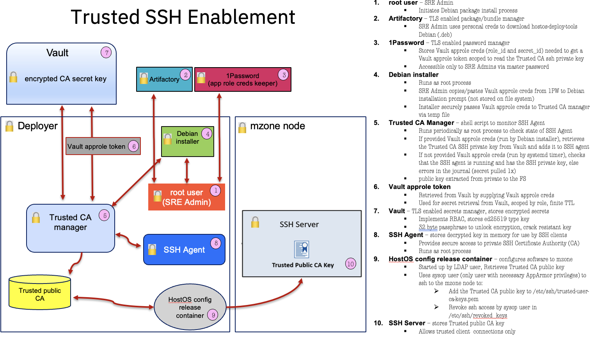
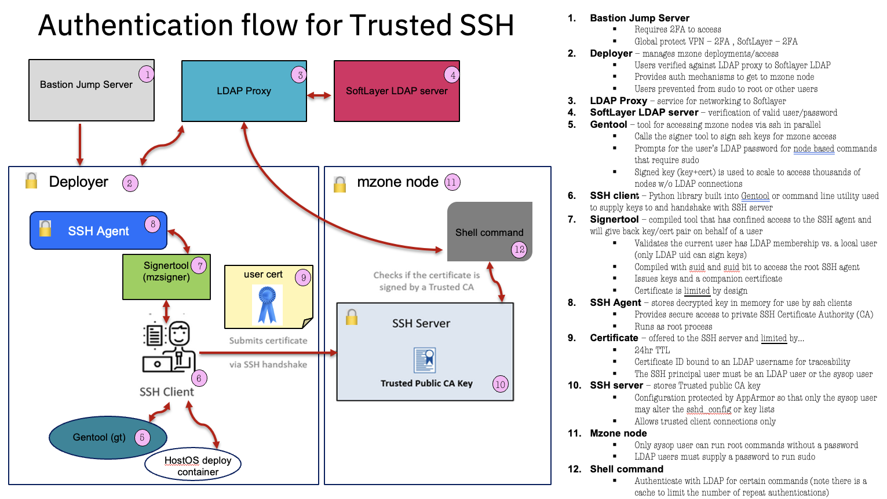
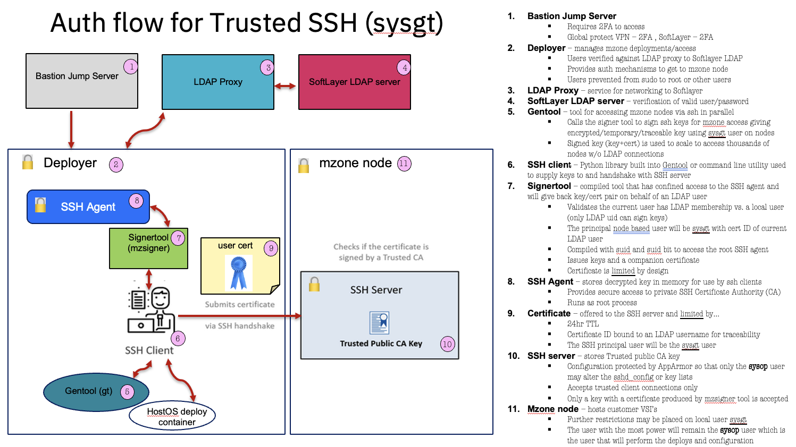

## Security enhancement for access to mzone nodes

HostOS has an outstanding PCE to cover some gaps in traceability in which an action made to a hypervisor node can't be easily tied back to a user ID.  Further, SYSOP user is too broadly used and the principle of least privilege is not well implemented. see [PCE](https://github.ibm.com/cloud-security-reviews/exceptions/blob/master/is.vpc/PCE-VPC-000741.md)    LDAP is now implemented across production nodes.   This means all users may log in to the hypervisor nodes using the same LDAP user account that is available on a deployer.     The primary goal is that the SYSOP user must be used exclusively for HostOS deployment and all other GT(gentool) commands  must be performed with LDAP user IDs .   This includes GT login or other direct login to the hypervisor nodes.  Essentially, SYSOP should never login directly to the nodes, only LDAP users.      As a secondary goal, the SYSOP key must be  better secured and available to deployments only.    A third goal is that since SYSOP is a deploy only resource, it's private key can be revoked from mzone nodes and the deployer host can be better secured by removing sudo access to regular users since the SYSOP FS key is not required to be accessed over sudo (can be given read if key is used for non mzone acesss in short term).  The last goal is that keys that access the hypervisor nodes must be rotated and secure.    Here is a summary of the goals:

**GOALS:**

\*  User traceability must be improved  
\*  SYSOP user is a HostOS deploy only resource  
\*  SYSOP private key can be revoked from mzone nodes  
\*  The deployer must remove sudo access for regular users because SYSOP key can be given read access if key is still used for non mzone acesss in short term  
\*  Any key used to access a hypervisor node must be encrypted then obsolete according to a policy of 24 hrs TTL  
\*  Keys are tightly coupled to a user ID  
\*  When users gain login access a node and interact in a shell, they must use their password to use sudo

HostOS has implemented a **Trusted SSH** method of node authentication leveraging LDAP that will help move toward the above goals.



The critical resource in this diagram is the private SSH Certificate Authority (CA).    This is a vault secure, encrypted and difficult to crack secret that is the basis for signing a user's keys.    Crack resistant keys mean, to create key with slower passphrase verification by specifying more KDF rounds which gives increased resistance to brute\-force password cracking (should the keys be stolen)



The user SSH client process is given just enough permission (confined) to ask the CA service to sign a set of keys.   Those keys will come with a certificate.     The SSH server is backed by the public portion of the CA.    When the user attempts authentication and offers the key with the companion certificate (signed keys) , the server knows that the user can be trusted and is allowed to authenticate.

**DESIGN**:

- A debian (hostos\-deploy\-tools_1\.x.deb) will be provided that will set up a systemd service to manage the private SSH CA key on the deployers and provide a user signer tool.
- The signer tool is an install time, compiled tool that confines the user signing against the CA for use by both HostOS deploys and GT.  
- ssh\-agent securely serves up the private SSH CA key from vault and is backed by a periodic systemd service to check its health  
- The private SSH CA key will never be stored on the file system \- It is none\-the\-less encrypted.
- Signing is done by a regular user using the privileged signer tool which has access to the SSH agent.  
- All signed keys are tied to a principal user, are password protected/encrypted and have a TTL of 24 hours (become obsolete).  
- Loose dependency on vault network given the criticality of maintaining access to the mzone nodes.
- Vault is accessed only 1x as long as the SSH agent stays running.
- The private SSH CA key secret access is scoped to a specific approle only accessible to SRE admins.
- No secret is stored on the FS, 1Password is used for SRE admins to paste the approle creds into Debian install prompt.
- Vault path is cached so there is no chance of losing the path to the secret by an undercloud yaml mistake.
- The auth log on the hypervisor nodes will show who is the principal user behind the login (true of sysop login too).  
- The signer tool requires a passphrase be securely supplied and will give back a base64 string that can be either unpacked with tar for files or parsed for key/cert inside gentool  
- Three elements are handed back by the signer tool \- a fresh private ssh key with it's public key and a certificate.  
- The SSH server will test for Trust and will also reject certs that were not created with the privileged signer tool.
- TLS/SSL used for network flows.  
- Key rotation/distribution over thousands of nodes is no longer an issue.

**certificate sysop**

Type: [ssh\-ed25519\-cert\-v01@openssh.com](mailto:ssh-ed25519-cert-v01@openssh.com) user certificate  
        Public key: ED25519\-CERT SHA256:nTGjsTihU4fzb4Xdvrj/QdhfVtef0oE\+qAM609BoAbw  
        Signing CA: ED25519 SHA256:Xv\+8xPGLGx580b8xBJ270YLoSx8GjNwaSe3cq4HfvbI  
        Key ID: "jdepetrillo_id_mzone_key_cert"  
        Serial: 1693402996438372092  
        Valid: from 2023\-08\-30T13:42:00 to 2023\-08\-31T13:43:16  
        Principals:  
                sysop

**certificate jdepetrillo**

Type: [ssh\-ed25519\-cert\-v01@openssh.com](mailto:ssh-ed25519-cert-v01@openssh.com) user certificate  
        Public key: ED25519\-CERT SHA256:1uEcurbQs4NFW/eKHooLoQ1c0Y\+3tkzl8X7uqh3\+u2Q  
        Signing CA: ED25519 SHA256:Xv\+8xPGLGx580b8xBJ270YLoSx8GjNwaSe3cq4HfvbI  
        Key ID: "jdepetrillo_id_mzone_key_cert"  
        Serial: 1693403546561002833  
        Valid: from 2023\-08\-30T13:51:00 to 2023\-08\-31T13:52:26  
        Principals:  
                jdepetrillo

| threat                                                                      | protection                                                                   |
| --------------------------------------------------------------------------- | ---------------------------------------------------------------------------- |
| stealing Trusted CA from vault and doing private key signing to gain access | approle creds given only to SRE admins                                       |
|                                                                             | per region secret limits blast radius                                        |
|                                                                             | rotation plan to revoke CA from nodes                                        |
|                                                                             | secondary protection against CA being used outside of compiled mzsigner tool |
|                                                                             | monitoring syslog for bad actor activity                                     |
| reading memory to steal Trusted CA from agent                               | plan to remove sudo from deployers                                           |
| altering Trusted manager script to steal Trusted CA                         | plan to remove sudo from deployers                                           |
|                                                                             |                                                                              |

**ASSUMPTIONS**:

**\***  the deployer based LDAP proxy must be running and healthy see OPSREQ\-109  
**\***  hostos\-deploy\-tools debian must be installed on the deployer  
**\***  the debian starts up services to get the CA from vault  
**\***  hosos\-config deploy runs after the debian has been installed and will put the public portion of the  CA behind the sshd servers on nodes and allow for Trusted SSH

**LEGACY DESIGN**:

**\***  unprotected ssh key on the filesystem  
**\***  key is accessible by any user via sudo from deployer  
**\***  public key is stuffed in authorized_keys file on server side  
**\***  rotation is difficult in that every node needs to be touched on a change  
**\***  every user is allowed to access the key and authenticate as same sysop user  
**\***  traceability is cumbersome and flawed

**PROPOSAL for GT:**

_phase 1_  
**\***  add support for regular user maybe this is the default if sysop is not specified.     
**\***  if LDAP is healthy and the signer tool is available/executable (signal for readiness)  then proceed or warn and exit  
**\***  gt needs to call the signer tool for use with node authentication.     
**\***  generate a password supplied to the signer tool and use returned key/cert for auth to the node    
**\***  prompt user for LDAP password and augment commands with something like echo $pass \| sudo \-k \-S \<command\>  
  **\***  prompt is needed because regular users lack PASSWORDLESS sudo on the nodes

_phase 2_  
**\***  Do not allow users  to login to the nodes using SYSOP user unless LDAP is down.

\=\=\=\=\=\=\=\=\=\=\=\=\=\=\=\=\=\=\=\=\=\=\=\=\=\=\=\=\=\=\=\=\=\=\=\=\=\=\=\=\=\=\=\=\=\=\=\=\=\=\=\=  APPENDIX A \=\=\=\=\=\=\=\=\=\=\=\=\=\=\=\=\=\=\=\=\=\=\=\=\=\=\=\=\=\=\=\=\=\=\=\=\=\=\=\=\=\=\=\=\=\=\=\=\=\=\=\=\=\=


\=\=\=\=\=\=\=\=\=\=\=\=\=\=\=\=\=\=\=\=\=\=\=\=\=\=\=\=\=\=\=\=\=\=\=\=\=\=\=\=\=\=\=\=\=\=\=\=\=\=\=\=  APPENDIX B  \=\=\=\=\=\=\=\=\=\=\=\=\=\=\=\=\=\=\=\=\=\=\=\=\=\=\=\=\=\=\=\=\=\=\=\=\=\=\=\=\=\=\=\=\=\=\=\=\=\=\=\=\=\=

**Installation Runbook:**

In one window, run a tail command to watch the syslog for installation and initialization of the **trusted_ca_mgr.service**

```
sudo bash -c 'tail -F /var/log/syslog | /bin/grep --line-buffered -E "hostos-deploy-tools|trusted_ca_mgr|mzsigner"'
```

In a separate window, install the **hostos\-deploy\-tools** debian

```
sudo -i 
root@dal2-qz2-sr2-rk219-s04:~# apt install hostos-deploy-tools


Reading package lists... Done
Building dependency tree
Reading state information... Done
...
The following NEW packages will be installed:
hostos-deploy-tools
...
Preparing to unpack .../hostos-deploy-tools_0.1+20231110.141927~0c604cb_amd64.deb ...
Unpacking hostos-deploy-tools (0.1+20231110.141927~0c604cb) ...
Setting up hostos-deploy-tools (0.1+20231110.141927~0c604cb) ...
enter SSH CA app role token credentials:
```

The debian install requires credentials to get the **SSH CA app role token** from Vault.  Only **SRE Admins** will be given these approle scoped credentials.   They should be safely stored in 1Password via a master password and should **never** be stored on any file system.   Credentials should be supplied via copy and paste to the prompt in the form of:

```
{ "role_id": "XXX", "secret_id": "XXX" }
```

installation will complete

```
INFO: building /opt/hostos-deploy-tools/bin/mzsigner utility
doing systemctl daemon-reload
systemctl restart trusted_ca_mgr.timer
doing systemctl is-active --quiet trusted_ca_mgr.timer


root@dal2-qz2-sr2-rk219-s04:~#
```

your syslog tail output will look like this after 2 minutes

```
Nov 14 13:08:05 dal2-qz2-sr2-rk219-s04 systemd[1]: Started A timer to run trusted_ca_mgr.service.
Nov 14 13:08:08 dal2-qz2-sr2-rk219-s04 root: root [61063]: apt install hostos-deploy-tools [0]

Nov 14 13:09:05 dal2-qz2-sr2-rk219-s04 systemd[1]: Starting oneshot service to run trusted_ca_mgr.sh...
Nov 14 13:09:05 dal2-qz2-sr2-rk219-s04 trusted_ca_mgr.sh[64390]: INFO: *** BEGIN ***
Nov 14 13:09:05 dal2-qz2-sr2-rk219-s04 trusted_ca_mgr.sh[64390]: INFO: checking the ssh-agent
Nov 14 13:09:05 dal2-qz2-sr2-rk219-s04 trusted_ca_mgr.sh[64390]: INFO: creating a new ssh-agent
Nov 14 13:09:05 dal2-qz2-sr2-rk219-s04 trusted_ca_mgr.sh[64390]: INFO: clearing ssh key listing
Nov 14 13:09:05 dal2-qz2-sr2-rk219-s04 trusted_ca_mgr.sh[64390]: All identities removed.
Nov 14 13:09:05 dal2-qz2-sr2-rk219-s04 trusted_ca_mgr.sh[64390]: INFO: utilizing /root/.cas/.vpathcache
Nov 14 13:09:05 dal2-qz2-sr2-rk219-s04 trusted_ca_mgr.sh[64390]: INFO: fetching token from vault
Nov 14 13:09:06 dal2-qz2-sr2-rk219-s04 trusted_ca_mgr.sh[64390]: INFO: fetching data from vault
Nov 14 13:09:06 dal2-qz2-sr2-rk219-s04 trusted_ca_mgr.sh[64390]: INFO: loading the trusted CA key to the root ssh-agent to allow cert signing
Nov 14 13:09:11 dal2-qz2-sr2-rk219-s04 trusted_ca_mgr.sh[64390]: INFO: ssh-add results: Identity added: /dev/fd/63 (./trusted_user_ca_dal-dev_2023_05_09_15_01_48)
Nov 14 13:09:11 dal2-qz2-sr2-rk219-s04 trusted_ca_mgr.sh[64390]: INFO: looking for matching key /var/lib/nextgen/vault/trusted-user-ca.pub
Nov 14 13:09:11 dal2-qz2-sr2-rk219-s04 trusted_ca_mgr.sh[64390]: INFO: enabling access to signer tool (/opt/hostos-deploy-tools/bin/mzsigner)
Nov 14 13:09:11 dal2-qz2-sr2-rk219-s04 trusted_ca_mgr.sh[64390]: INFO: *** COMPLETE ***
Nov 14 13:09:11 dal2-qz2-sr2-rk219-s04 systemd[1]: Started oneshot service to run trusted_ca_mgr.sh.
Nov 14 13:09:11 dal2-qz2-sr2-rk219-s04 audit type=SERVICE_START msg=audit(1699967351.713:1019101): pid=1 uid=0 auid=4294967295 ses=4294967295 msg='unit=trusted_ca_mgr comm="systemd" exe="/lib/systemd/systemd" hostname=? addr=? terminal=? res=success'
Nov 14 13:09:11 dal2-qz2-sr2-rk219-s04 audit type=SERVICE_STOP msg=audit(1699967351.713:1019102): pid=1 uid=0 auid=4294967295 ses=4294967295 msg='unit=trusted_ca_mgr comm="systemd" exe="/lib/systemd/systemd" hostname=? addr=? terminal=? res=success'
```

testing the signer (supply the passphrase with a secure, **conforming** one)

```

jdepetrillo@dal2-qz2-sr2-rk219-s04:~#  echo -n "enter passphrase for new key: "; read -s  pass && _secr="$pass" /opt/hostos-deploy-tools/bin/mzsigner | /bin/grep -o "KEYDATA:.*" | sed s'/KEYDATA://' | base64 -d | gunzip -cf | tar xf -


Signed user key /tmp/qJrxhQMr.kyd.tmp/id_mzone_key-cert.pub: id "jdepetrillo_id_mzone_key_cert" serial 52361 for sysgt valid from 2023-11-14T13:41:00 to 2023-11-15T13:42:26

tar: Removing leading `/' from member names
/tmp/qJrxhQMr.kyd.tmp/id_mzone_key
/tmp/qJrxhQMr.kyd.tmp/id_mzone_key-cert.pub
/tmp/qJrxhQMr.kyd.tmp/id_mzone_key.pub


```

**IF** hostos\-config\-release bundle was run **after** the  installation of **hostos\-deploy\-tools** debian, then you should have the **public trusted SSH CA** behind the **sshd.service**for your **mzone node**.   You should be able to authenticate by using a signed key to authenticate.   To check the readiness of you node to accept signed keys, on the node do:

```
sysop@dal2-qz2-sr2-rk115-s16:~$ sudo cat  /etc/ssh/sshd_config | grep Trust | awk '{print $NF}' | xargs cat     # public CA behind the sshd.service ?

ssh-ed25519 AAAAC3NzaC1lZDI1NTE5AAAAIL9PJVtEOTbhq3/5xfJe7jo0fIBbMhQBElUaEM08KxjN ./trusted_user_ca_dal-dev_2023_05_09_15_01_48
```

signed keys authentication test.    supply the passphrase.

```
jdepetrillo@dal2-qz2-sr2-rk219-s04:~# ssh -o IdentitiesOnly=yes -i tmp/qJrxhQMr.kyd.tmp/id_mzone_key  sysgt@192.168.115.33  "hostname -I"

Authorized uses only. All activity may be monitored and reported.
Enter passphrase for key 'tmp/qJrxhQMr.kyd.tmp/id_mzone_key':
192.168.115.33 172.17.0.1 172.31.38.33 172.31.38.161 169.254.1.2 169.254.2.0 11.28.208.2 10.12.60.88
```

\=\=\= KILLED AGENT CONDITION: \=\=\=  
**IF** the ssh\-agent is killed or does not contain the **private Trusted SSH CA** your syslog output will look like this:

```
Nov 14 18:12:05 dal2-qz2-sr2-rk219-s04 systemd[1]: Starting oneshot service to run trusted_ca_mgr.sh...
Nov 14 18:12:05 dal2-qz2-sr2-rk219-s04 trusted_ca_mgr.sh[30279]: INFO: *** BEGIN ***
Nov 14 18:12:05 dal2-qz2-sr2-rk219-s04 trusted_ca_mgr.sh[30279]: WARNING: failure connecting to the ssh-agent
Nov 14 18:12:05 dal2-qz2-sr2-rk219-s04 trusted_ca_mgr.sh[30279]: INFO: checking the ssh-agent
Nov 14 18:12:05 dal2-qz2-sr2-rk219-s04 trusted_ca_mgr.sh[30279]: INFO: creating a new ssh-agent
Nov 14 18:12:05 dal2-qz2-sr2-rk219-s04 trusted_ca_mgr.sh[30279]: FATAL: no creds to auth with vault
Nov 14 18:12:05 dal2-qz2-sr2-rk219-s04 trusted_ca_mgr.sh[30279]: WARNING: access to /opt/hostos-deploy-tools/bin/mzsigner is disabled
Nov 14 18:12:05 dal2-qz2-sr2-rk219-s04 systemd[1]: trusted_ca_mgr.service: Main process exited, code=exited, status=255/n/a
Nov 14 18:12:05 dal2-qz2-sr2-rk219-s04 systemd[1]: trusted_ca_mgr.service: Failed with result 'exit-code'.
Nov 14 18:12:05 dal2-qz2-sr2-rk219-s04 systemd[1]: Failed to start oneshot service to run trusted_ca_mgr.sh.
Nov 14 18:12:05 dal2-qz2-sr2-rk219-s04 audit type=SERVICE_START msg=audit(1699985525.559:1050485): pid=1 uid=0 auid=4294967295 ses=4294967295 msg='unit=trusted_ca_mgr comm="systemd" exe="/lib/systemd/systemd" hostname=? addr=? terminal=? res=failed'
```

To restore the **trusted_ca_mgr.service** to a functioning state you will have to inject creds into the process.     Run this command to open up your editor

```
jdepetrillo@dal2-qz2-sr2-rk219-s04:~#  sudo bash -c 'f=/root/.cas/.crd && rm -f $f && touch $f && chmod 600 $f && vi $f && rm -vf $f'
```

You must add an entry to the opened file in the form shown below and get your credentials from 1Password again.

```
approlecreds={ "role_id": "XXX", "secret_id": "XXX" }
```

**Write** out your file but keep the file open in vi until you see the syslog output sucessfully initializing the **trusted_ca_mgr.service**

```
Nov 14 18:23:05 dal2-qz2-sr2-rk219-s04 systemd[1]: Starting oneshot service to run trusted_ca_mgr.sh...
Nov 14 18:23:05 dal2-qz2-sr2-rk219-s04 trusted_ca_mgr.sh[42586]: INFO: *** BEGIN ***
Nov 14 18:23:05 dal2-qz2-sr2-rk219-s04 trusted_ca_mgr.sh[42586]: INFO: checking the ssh-agent
Nov 14 18:23:05 dal2-qz2-sr2-rk219-s04 trusted_ca_mgr.sh[42586]: INFO: clearing ssh key listing
Nov 14 18:23:05 dal2-qz2-sr2-rk219-s04 trusted_ca_mgr.sh[42586]: All identities removed.
Nov 14 18:23:05 dal2-qz2-sr2-rk219-s04 trusted_ca_mgr.sh[42586]: INFO: utilizing /root/.cas/.vpathcache
Nov 14 18:23:05 dal2-qz2-sr2-rk219-s04 trusted_ca_mgr.sh[42586]: INFO: fetching token from vault
Nov 14 18:23:06 dal2-qz2-sr2-rk219-s04 trusted_ca_mgr.sh[42586]: INFO: fetching data from vault
Nov 14 18:23:07 dal2-qz2-sr2-rk219-s04 trusted_ca_mgr.sh[42586]: INFO: loading the trusted CA key to the root ssh-agent to allow cert signing
Nov 14 18:23:12 dal2-qz2-sr2-rk219-s04 trusted_ca_mgr.sh[42586]: INFO: ssh-add results: Identity added: /dev/fd/63 (./trusted_user_ca_dal-dev_2023_05_09_15_01_48)
Nov 14 18:23:12 dal2-qz2-sr2-rk219-s04 trusted_ca_mgr.sh[42586]: INFO: looking for matching key /var/lib/nextgen/vault/trusted-user-ca.pub
Nov 14 18:23:12 dal2-qz2-sr2-rk219-s04 trusted_ca_mgr.sh[42586]: INFO: enabling access to signer tool (/opt/hostos-deploy-tools/bin/mzsigner)
Nov 14 18:23:12 dal2-qz2-sr2-rk219-s04 trusted_ca_mgr.sh[42586]: INFO: *** COMPLETE ***
Nov 14 18:23:12 dal2-qz2-sr2-rk219-s04 systemd[1]: Started oneshot service to run trusted_ca_mgr.sh.
Nov 14 18:23:12 dal2-qz2-sr2-rk219-s04 audit type=SERVICE_START msg=audit(1699986192.157:1051493): pid=1 uid=0 auid=4294967295 ses=4294967295 msg='unit=trusted_ca_mgr comm="systemd" exe="/lib/systemd/systemd" hostname=? addr=? terminal=? res=success'
Nov 14 18:23:12 dal2-qz2-sr2-rk219-s04 audit type=SERVICE_STOP msg=audit(1699986192.157:1051494): pid=1 uid=0 auid=4294967295 ses=4294967295 msg='unit=trusted_ca_mgr comm="systemd" exe="/lib/systemd/systemd" hostname=? addr=? terminal=? res=success'
```

Close your editor

\=\=\=\=\=\=\=\=\=\=\=\=\=\=\=\=\=\=\=\=\=\=\=\=\=\=\=\=\=\=\=\=\=\=\=\=\=\=\=\=\=\=\=\=\=\=\=\=\=\=\=\=  APPENDIX C   \=\=\=\=\=\=\=\=\=\=\=\=\=\=\=\=\=\=\=\=\=\=\=\=\=\=\=\=\=\=\=\=\=\=\=\=\=\=\=\=\=\=\=\=\=\=\=\=\=\=\=\=\=\=



\=\=\=\=\=\=\=\=\=\=\=\=\=\=\=\=\=\=\=\=\=\=\=\=\=\=\=\=\=\=\=\=\=\=\=\=\=\=\=\=\=\=\=\=\=\=\=\=\=\=\=\=  APPENDIX D   \=\=\=\=\=\=\=\=\=\=\=\=\=\=\=\=\=\=\=\=\=\=\=\=\=\=\=\=\=\=\=\=\=\=\=\=\=\=\=\=\=\=\=\=\=\=\=\=\=\=\=\=\=\=  
**handshake:**

**auth.log shows ldap user jdepetrillo and session id 121064**

```
Jul 18 15:20:38 dal2-qz2-sr2-rk033-s14 sshd[61662]:<INFO> <AUTH>  Accepted publickey for sysgt from 192.168.219.17 port 64450 ssh2:
ED25519-CERT ID jdepetrillo_id_mzone_key_cert (serial 50363) CA ED25519 SHA256:Xv+8xPGLGx580b8xBJ270YLoSx8GjNwaSe3cq4HfvbI
Jul 18 15:20:38 dal2-qz2-sr2-rk033-s14 sshd[61662]:<INFO> <AUTHPRIV>  pam_unix(sshd:session): session opened for user sysgt by (uid=0)
Jul 18 15:20:38 dal2-qz2-sr2-rk033-s14 systemd-logind[1064]:<INFO> <AUTH>  New session 121064 of user sysgt.
```

**traceability/monitoring**

**syslog showing audit entries for session id 121064**

```
Jul 18 15:23:43 dal2-qz2-sr2-rk033-s14 audit<NOTICE> <LOCAL0> type=USER_CMD msg=audit(1721316223.801:937468): pid=1875 uid=1001 auid=1001 ses=121064
msg='cwd="/home/sysgt" cmd=69707461626C6573202D5020464F52574152442044524F50 terminal=pts/2 res=success'
Jul 18 15:23:43 dal2-qz2-sr2-rk033-s14 audit<NOTICE> <LOCAL0> type=CRED_REFR msg=audit(1721316223.801:937469): pid=1875 uid=0 auid=1001 ses=121064
msg='op=PAM:setcred acct="root" exe="/usr/bin/sudo" hostname=? addr=? terminal=/dev/pts/2 res=success'
Jul 18 15:23:43 dal2-qz2-sr2-rk033-s14 audit<NOTICE> <LOCAL0> type=USER_START msg=audit(1721316223.801:937470): pid=1875 uid=0 auid=1001 ses=121064
msg='op=PAM:session_open acct="root" exe="/usr/bin/sudo" hostname=? addr=? terminal=/dev/pts/2 res=success'
Jul 18 15:23:43 dal2-qz2-sr2-rk033-s14 audit<NOTICE> <LOCAL0> type=SYSCALL msg=audit(1721316223.805:937471): arch=c000003e syscall=54
success=yes exit=0 a0=4 a1=0 a2=40 a3=7f7012513010 items=0 ppid=1877 pid=1878 auid=1001 uid=0 gid=0 euid=0 suid=0 fsuid=0 egid=0 sgid=0
fsgid=0 tty=pts3 ses=121064 comm="iptables" exe="/sbin/xtables-multi" key=(null)
Jul 18 15:23:43 dal2-qz2-sr2-rk033-s14 audit<NOTICE> <LOCAL0> type=USER_END msg=audit(1721316223.805:937472): pid=1875 uid=0 auid=1001 ses=121064
msg='op=PAM:session_close acct="root" exe="/usr/bin/sudo" hostname=? addr=? terminal=/dev/pts/2 res=success'
Jul 18 15:23:43 dal2-qz2-sr2-rk033-s14 audit<NOTICE> <LOCAL0> type=CRED_DISP msg=audit(1721316223.805:937473): pid=1875 uid=0 auid=1001 ses=121064
msg='op=PAM:setcred acct="root" exe="/usr/bin/sudo" hostname=? addr=? terminal=/dev/pts/2 res=success'
Jul 18 15:24:01 dal2-qz2-sr2-rk033-s14 hostos-debug:<ALERT> <USER>  IPTABLES-AUDIT: type=PROCTITLE msg=audit(07/18/24 15:23:43.805:937471) :
proctitle=iptables -P FORWARD DROP type=SYSCALL msg=audit(07/18/24 15:23:43.805:937471) : arch=x86_64 syscall=setsockopt
success=yes exit=0 a0=0x4 a1=ip a2=IPT_SO_SET_REPLACE a3=0x7f7012513010 items=0 ppid=1877 pid=1878 auid=sysgt
uid=root gid=root euid=root suid=root fsuid=root egid=root sgid=root fsgid=root tty=pts3 ses=121064
comm=iptables exe=/sbin/xtables-multi key=(null) type=NETFILTER_CFG msg=audit(07/18/24 15:23:43.805:937471) : table=filter family=ipv4 entries=358
=====  sysgt is prevented by apparmor of changing /etc/ssh/sshd_config ====

Jul 18 15:34:03 dal2-qz2-sr2-rk033-s14 audit<NOTICE> <LOCAL0> type=SYSCALL msg=audit(1721316843.625:937666): arch=c000003e syscall=257
success=no exit=-17 a0=ffffff9c a1=55b1e95a9670 a2=200c1 a3=8180 items=2 ppid=16407 pid=16408
auid=1001 uid=0 gid=0 euid=0 suid=0 fsuid=0 egid=0 sgid=0 fsgid=0 tty=pts3 ses=121064 comm="vi" exe="/usr/bin/vim.basic" key="sshd-changed"
```

## Vault

### Requirement

| Secert Required  | Secret Type             | Read Consumer  | write Consumer |
| ---------------- | ----------------------- | -------------- | -------------- |
| Private CA       | string : {name}:{value} | Deployer admin | None           |
| ssh key/password | string : {name}:{value} | Deployer admin | None           |

### Design

- Layout of Vault

1. New KV path will be introduced ?

- Access

1. None of the existing vault consumers will have vault secret access.
2. We need to restrict access based on region ( DAL/ WDC ... )
3. Need restriction based on env ( staging/prod ... )
