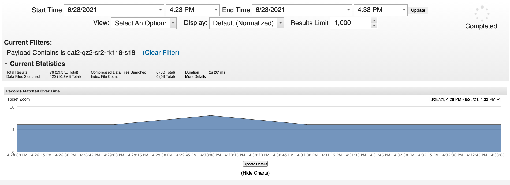
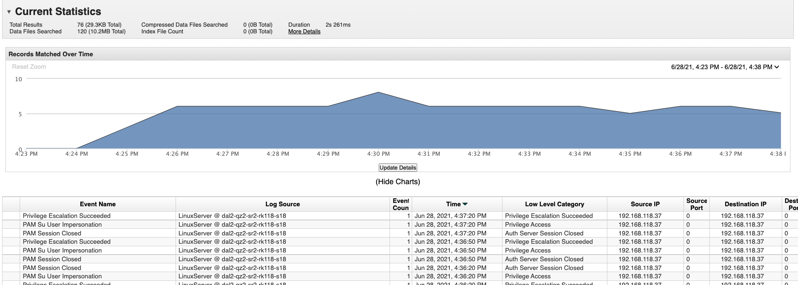

##  Using Qradar

 
 
 
 
 
 
 
 
 Created by  Shashikant Shelke, last modified on Jun 29, 2021
 

The purpose to use Qradar is that to send severs logs to a central place, which is Qradar. Qradar collects log data from hosts. Then performs real\-time analysis of the log data to identify any abnormal activities, easy to examine log data from various hosts and so on .

  

* **The logs of sshd and sudo from /var/log/auth.log :**

Jun 28 09:42:03 dal2\-qz2\-sr2\-rk118\-s18 sshd\[38371]:\<INFO\> \<AUTH\>  Received disconnect from 192\.168\.219\.17 port 40226:11: disconnected by user

Jun 28 09:42:03 dal2\-qz2\-sr2\-rk118\-s18 sshd\[38371]:\<INFO\> \<AUTH\>  Disconnected from user sysop 192\.168\.219\.17 port 40226

Jun 28 09:42:03 dal2\-qz2\-sr2\-rk118\-s18 sshd\[38359]:\<INFO\> \<AUTHPRIV\>  pam\_unix(sshd:session): session closed for user sysop

Jun 28 09:42:03 dal2\-qz2\-sr2\-rk118\-s18 systemd\-logind\[1042]:\<INFO\> \<AUTH\>  Removed session 169\.

Jun 28 09:42:07 dal2\-qz2\-sr2\-rk118\-s18 sudo:\<NOTICE\> \<AUTHPRIV\>      root : TTY\=unknown ; PWD\=/ ; USER\=root ; COMMAND\=/bin/journalctl \-u kubelet \-n 1

Jun 28 09:42:07 dal2\-qz2\-sr2\-rk118\-s18 sudo:\<INFO\> \<AUTHPRIV\>  pam\_unix(sudo:session): session opened for user root by (uid\=0\)

  

* **Redirecting logging to QRadar :**

To send logs to QRadar, add a line to the rules section in the /etc/rsyslog.d/50\-default.conf file. Use the IP address of the QRadar host with default port 514\. To use TCP, prefix the IP with two @ signs (@@) and restart rsyslog service.

**auth,authpriv.\*       @@192\.168\.219\.128:514**

  

* **Check logs are received on QRadar :**

           Since telemetry team owns QRadar, please check with them to get confirmation that logs are received on QRadar side. Few screenshots attached here.

  

I.) QRadar console shows the graph of number of events for that particular host(dal2\-qz2\-sr2\-rk118\-s18\)

  

II.) Here, QRadar reveals some more info about the Event Name, Log Source, Source IP and etc.

  

   III.) It's the actual log recorded on QRadar.

  

## Attachments:

 

Document generated by Confluence on Aug 01, 2024 22:21

[Atlassian](https://www.atlassian.com/)

 

