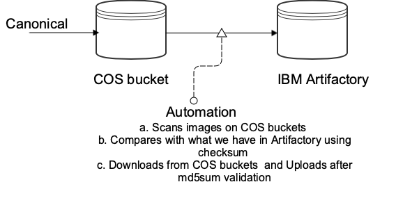
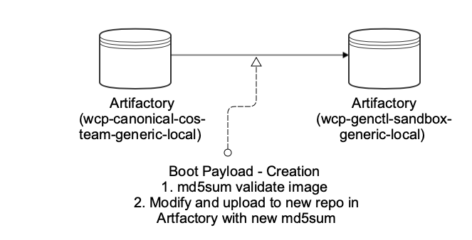

## Image Supply Chain

## **Overview**

**This document covers secured way of utilising HostOS images provided by canonical.**

### Canonical Image supply chain

1. **Authorization considerations**
   1. All IBM user Can not write to canonical image location.
   2. As image passes through different location, Only CI user can write to image location, no other individual user can write and modify image

 **Stage 1 \- from Canonical to inside IBM
  

| Secret | owner | Secret Managementmethod |
| --- | --- | --- |
| COS bucket API key | HostOS team | Vault ( key will be put in value by CI team \- they have access ) |
| Artifactory API key | HostOS team ( New functional ID For write access ) | Valut ( key will be put in value by CI team \- they have access ) |

| Storage Location | Access info | Note |
| --- | --- | --- |
| COS bucket | Canonical \- Write IBM \- Read ( no IBM user can write to Bucket ) |  |
| Artifactory | Canonical \- no Access IBM \-  Only Functional ID can write to | wcp\-canonical\-cos\-team\-generic\-local |

### **Stage 2 Boot payload modification**

| Access info \- Artifactory | Type |
| --- | --- |
| [wcp\-canonical\-cos\-team\-generic\-local](https://na.artifactory.swg-devops.com/artifactory/api/storage/wcp-canonical-cos-team-generic-local) | Read access |
| wcp\-genctl\-generic\-local | CI user write Access , all IBM user read access. |
