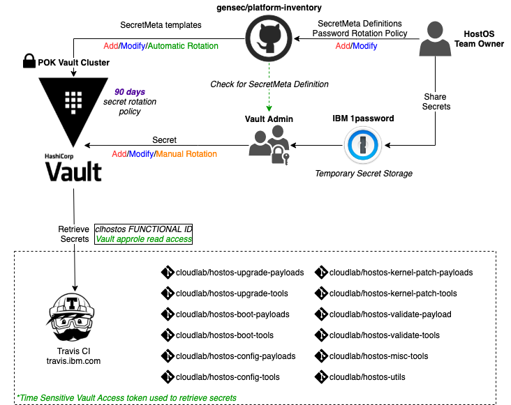

## Vault Secret Management and CI Integration


This document intends to highlight the process and steps involved in

1. **Vault Secret Management** : HostOS CI pipeline secret addition, rotation and request process
2. **Vault CI Integration**: enhancements in HostOS travisCI build pipelines to utilise build secrets from Vault




## Vault Secret Management Process

HostOS team currently uses the [POK\-dev](https://github.ibm.com/gensec/OperatorVault-Wiki/wiki/POK-Operator-Vault-Endpoint) Vault cluster for its CI secret management.This instance is maintained by the  gensec team.

HostOS currently follows a **90 day manual secret rotation policy**.

  


**To request creation of a new secret**, we need to follow the below process:

1. Submit a pull request to [https://github.ibm.com/gensec/platform\-inventory](https://github.ibm.com/gensec/platform-inventory) providing details of the secret and the rotation policy.  
Vault maintains yaml templates for secret details and configuration.Please refer this [documentation](https://github.ibm.com/gensec/platform-inventory/blob/main/README.md) to create a secret template.  
Sample reference template : [https://github.ibm.com/gensec/platform\-inventory/pull/651](https://github.ibm.com/gensec/platform-inventory/pull/651)
2. All hostos\-ci secrets are restricted and can only be viewed by user's with **hostos\-ci** approle.  
Make sure you add the secret only under **hostsos\-ci** taxonomy and not any other
3. Reach out to John Kevlin or this [slack channel](https://ibmcloudlab.slack.com/archives/CGE6P6T5H) to request for review and merge of this pull request
4. Once the pull request is merged you are required to submit a Jira ticket to add the secret details in Vault.  
Please check this [document](https://github.ibm.com/gensec/OperatorVault-Wiki/wiki/How-To:-Submit-Request-for-Operator-Vault-Access-or-Secret-Management)[ation](https://github.ibm.com/gensec/OperatorVault-Wiki/wiki/How-To:-Submit-Request-for-Operator-Vault-Access-or-Secret-Management) for ticket submission steps  
Sample Jira ticket: 

[SCM\-3040](https://jiracloud.swg.usma.ibm.com:8443/browse/SCM-3040?src=confmacro) \- Jira issue doesn't exist or you don't have permission to view it.
5. The ticket will be picked by the Vault admin team and you will be requested to provide the secret details.  
Please share the secret value with the Vault Admin through a temporary secret vault created in [IBM 1password](https://ibm.ent.1password.com/signin).  
Delete the temporary vault after sharing is complete
6. Once the secret is added you can test its availability by using following Vault Api. Vault server endpoint ip can be obtained from [https://github.ibm.com/gensec/OperatorVault\-Wiki/wiki/Operator\-Vault\-Endpoints](https://github.ibm.com/gensec/OperatorVault-Wiki/wiki/Operator-Vault-Endpoints)  


```
curl --cacert cert_pok.crt -H "X-Vault-Namespace: nextgen"  -H "X-Vault-Token: xxxx" -X GET https://9.114.87.48:8200/v1/hostos-ci/data/travis/ci/<secret_name>
```

**To request update/rotation of an existing secret**, we need to follow the below process:

1. Submit a Jira ticket to update/rotate a given secret if you follow manual rotation policy.  
This needs to be submitted well in advance of the expiration date for a given secret
2. The ticket will be picked by the Vault admin team and you will be requested to provide the secret details.  
Please share the secret value with the Vault Admin through a temporary secret vault created in [IBM 1password](https://ibm.ent.1password.com/signin).  
Delete the temporary vault after sharing is complete
3. Once the secret is added you can test its availability by using Vault Api

  


## Vault CI Integration

HostOS TravisCI build pipelines will be enhanced to retrieve secrets only from Vault and do away with the existing local secret management provided by travis.

This provides a secure and regulated process for secret management and rotation.  
The secret retrieval process involves 2 steps:

1. Request a time\-sensitive vault access token.  
This will be requested using a Vault approle account of a HostOS Functional User Id.
2. Retrieve the require secret by providing the access token for authentication

Sample vault integration script: [https://github.ibm.com/cloudlab/hostos\-upgrade\-payloads/blob/b06a78958a4dc2e199ef1889730e61e178e041b0/travis.sh\#L23](https://github.ibm.com/cloudlab/hostos-upgrade-payloads/blob/b06a78958a4dc2e199ef1889730e61e178e041b0/travis.sh#L23)

  


## HostOS Vault secrets

Following are the vault secrets in use as part of HostOS pipelines.These secrets follow a 90 day rotation policy.

New secrets are stored in 1password and shared appropriately with the Vault team member assisting on the SCM ticket


| Secret Name | Secret Meta | Usage | Secret associated Functional ID | Availability | Secret Rotation ticket |
| --- | --- | --- | --- | --- | --- |
| HOSTOS\_CI\_PPA\_TOKEN | [https://github.ibm.com/gensec/platform\-inventory/blob/main/secops/v1/secretmeta/hostos\-ci\-travis\-ci\-ppa\-token.yaml](https://github.ibm.com/gensec/platform-inventory/blob/main/secops/v1/secretmeta/hostos-ci-travis-ci-ppa-token.yaml) | Canonical PPA repo access token | clhostos@us.ibm.com | pok\-dev | [SCM\-6594](https://jiracloud.swg.usma.ibm.com:8443/browse/SCM-6594?src=confmacro) \- Jira issue doesn't exist or you don't have permission to view it. |
| HOSTOS\_CI\_ARTIFACTORY\_TOKEN\_HSTOSPRD | [https://github.ibm.com/gensec/platform\-inventory/blob/main/secops/v1/secretmeta/hostos\-ci\-travis\-ci\-artifactory\-tokens.yaml](https://github.ibm.com/gensec/platform-inventory/blob/main/secops/v1/secretmeta/hostos-ci-travis-ci-artifactory-tokens.yaml) | Artifactory access token to publish HostOS artifacts to production repos and registries | hstosprd@us.ibm.com | pok\-dev | [SCM\-6595](https://jiracloud.swg.usma.ibm.com:8443/browse/SCM-6595?src=confmacro) \- Jira issue doesn't exist or you don't have permission to view it. |
| HOSTOS\_CI\_ARTIFACTORY\_TOKEN\_CLHOSTOS | [https://github.ibm.com/gensec/platform\-inventory/blob/main/secops/v1/secretmeta/hostos\-ci\-travis\-ci\-artifactory\-tokens.yaml](https://github.ibm.com/gensec/platform-inventory/blob/main/secops/v1/secretmeta/hostos-ci-travis-ci-artifactory-tokens.yaml) | Artifactory access token to publish boot images and kernel patches to artifactory | [clhostos@us.ibm.com](mailto:clhostos@us.ibm.com) | pok\-dev | [SCM\-6599](https://jiracloud.swg.usma.ibm.com:8443/browse/SCM-6599?src=confmacro) \- Jira issue doesn't exist or you don't have permission to view it. |
| HOSTOS\_CI\_ARTIFACTORY\_TOKEN\_HOSTOSTEST | [https://github.ibm.com/gensec/platform\-inventory/blob/main/secops/v1/secretmeta/genctl\-hostos\-ci\-hostos\-artif\-token.yaml](https://github.ibm.com/gensec/platform-inventory/blob/main/secops/v1/secretmeta/genctl-hostos-ci-hostos-artif-token.yaml) | General purpose Artifactory read\-only access token for HostOS validate release | [HostOsTest@ibm.com](mailto:HostOsTest@ibm.com) | pok\-dev, dal\-qz2 all zones | [SCM\-6600](https://jiracloud.swg.usma.ibm.com:8443/browse/SCM-6600?src=confmacro) \- Jira issue doesn't exist or you don't have permission to view it. |
| HOSTOS\_CI\_COS\_API\_KEY | [https://github.ibm.com/gensec/platform\-inventory/blob/main/secops/v1/secretmeta/hostos\-ci\-travis\-ci\-cos\-secret.yaml](https://github.ibm.com/gensec/platform-inventory/blob/main/secops/v1/secretmeta/hostos-ci-travis-ci-cos-secret.yaml) | Canonical COS bucket access token.Submit a Canonical support ticket to request a [new secret](https://portal.support.canonical.com/ua/s/case/5004K00000TJu6BQAT/hostos-request-for-new-ibmcloud-service-credential-for-the-user-clhostosusibmcom) | [clhostos@us.ibm.com](mailto:clhostos@us.ibm.com) | pok\-dev | [SCM\-6669](https://jiracloud.swg.usma.ibm.com:8443/browse/SCM-6669?src=confmacro) \- Jira issue doesn't exist or you don't have permission to view it. |
| HOSTOS\_CI\_GIT\_PAT | [https://github.ibm.com/gensec/platform\-inventory/blob/main/secops/v1/secretmeta/hostos\-ci\-travis\-ci\-git\-pat.yaml](https://github.ibm.com/gensec/platform-inventory/blob/main/secops/v1/secretmeta/hostos-ci-travis-ci-git-pat.yaml) | Git Personal access token | [clhostos@us.ibm.com](mailto:clhostos@us.ibm.com) | pok\-dev | [SCM\-6441](https://jiracloud.swg.usma.ibm.com:8443/browse/SCM-6441?src=confmacro) \- Jira issue doesn't exist or you don't have permission to view it. |

## Vault access accounts

Following functional id accounts have been configured for vault secret access. For 1pass vault access, please reach out to [Dan Wiggins](https://confluence.swg.usma.ibm.com:8445/display/~danwig@us.ibm.com) 


| Functional Id | Vault namespace account | Purpose | 1password Vault |
| --- | --- | --- | --- |
| [clhostos@us.ibm.com](mailto:clhostos@us.ibm.com) | hostos\-ci | access HostOS CI secretsThe role id and secret are also configured in jenkins and travis CI apps for hostos pipelines | [https://start.1password.com/open/i?a\=CTGAMKNWBZFNJFBH5VL7IA7MJU\&v\=hmfwlo2xpwttkpa4qg27jzj2uq\&i\=dq63plgxc2snhybb6jq7wxblo4\&h\=ibm.ent.1password.com](https://start.1password.com/open/i?a=CTGAMKNWBZFNJFBH5VL7IA7MJU&v=hmfwlo2xpwttkpa4qg27jzj2uq&i=dq63plgxc2snhybb6jq7wxblo4&h=ibm.ent.1password.com) |
| hostostest@ibm.com | genctl | access deployment secretscurrently in use only for HostOS Validate Release | [https://start.1password.com/open/i?a\=CTGAMKNWBZFNJFBH5VL7IA7MJU\&v\=nww3goo3mbbybgh6yaurrwvrym\&i\=gaeyp5oqrt5oasgwmp2abnx33q\&h\=ibm.ent.1password.com](https://start.1password.com/open/i?a=CTGAMKNWBZFNJFBH5VL7IA7MJU&v=nww3goo3mbbybgh6yaurrwvrym&i=gaeyp5oqrt5oasgwmp2abnx33q&h=ibm.ent.1password.com) |


