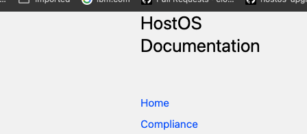

# HostOS Documenation 
Welcome to the documentation for the HostOS Team.
{: .fs-6 .fw-300 }

<details markdown="block">
  <summary>
    Table of Contents
  </summary>
____
- TOC
{:toc}
____
</details>

---

[View on Github](https://github.ibm.com/cloudlab/hostos-reports){: .btn .btn-blue .fs-5 .mb-4 .mb-md-0 .mr-2 }

## About

The VPC NextGen Host OS is an IBM customized Canonical-built Ubuntu LTS-based Linux
operating system used as the base OS underneath the mzone nodes in our
next-generation hardware fleet. The nodes are primarily hypervisor nodes
on which VSIs run; we call these compute nodes. The Host OS also operates
the other mzone node types—edge, master, and control nodes—whose software
stack designs and threat models are covered via other VPC NG security review materials.


## Contributing Guide

Please follow following procedure  to contribute to this  documentation.

<details markdown="block">
  <summary>
    Table of Contents
  </summary>
____
- TOC
{:toc}
____
</details>

---

### Prereqs

* Be sure to have access to [cloudlab github org](https://github.ibm.com/cloudlab)

### Updating existing doc

1. Clone repo

      ```bash
      git clone  git@github.ibm.com:cloudlab/hostos-docs.git -b docs-r1
      ```

2. Create branch

      ```bash
      git checkout -b feature-branch
      ```

3. `Docs` are at root folder, search `title` of the file you want to make change to.

      ```bash
      $ grep -inr 'title: contributing' .        
      ./docs/contributing.md:3:title: contributing 
      ```

4. Make Required changes

    Important
      {: .label .label-ibm-red }

      Please keep images in `attachments` folder, your md file will refer them like this

      ```bash
      attachments/contributing1.png
      ```

5. Create PR

### Adding new doc

1. Create branch

      ```bash
      git checkout -b feature-branch
      ```

2. `Docs` are at root folder, it follows following structure.

      ```bash
      docs
      ├── attachments
      │   └── contributing1.png
      ├── compliance
      │   ├── Cipher.md
      │   ├── Compliance.md
      │   ├── Critical-Security-Control-Failure-Monitoring-Policies.md
      │   ├── Debian-Inventory-validation.md
      │   ├── Iptables-rules-validation--HostOS-Mzone-nodes.md
      │   ├── Onboarding_services_protocol_daemon.md
      │   ├── Secure-Supply-Chain.md
      │   ├── attachments
      │   │   ├── 383943440
      │   │   │   ├── 383943441.png
      │   │   │   └── 383943465.png
      │   │   ├── 383943687
      │   │   │   └── 383943713.png
      │   │   ├── 429272138
      │   │   │   ├── 429272178.png
      │   │   │   ├── 429272182.png
      │   │   │   ├── 429272184.png
      │   │   │   ├── 429272185.png
      │   │   │   ├── 429272186.png
      │   │   │   ├── 429272292.png
      │   │   │   ├── 429272298.png
      │   │   │   ├── 429272299.png
      │   │   │   ├── 500532050.png
      │   │   │   ├── 500532051.png
      │   │   │   └── 500532053.png
      │   │   └── 429274090
      │   │       └── 429274138.png
      │   └── process_overview
      │       ├── Code-change-and-review-procedures_429272138.md
      │       ├── Onboarding-New-Debian-Package_392634320.md
      │       ├── Process-Overview_392634318.md
      │       └── attachments
      │           └── 429272138
      │               ├── 429272178.png
      │               ├── 429272182.png
      │               ├── 429272184.png
      │               ├── 429272185.png
      │               ├── 429272186.png
      │               ├── 429272292.png
      │               ├── 429272298.png
      │               ├── 429272299.png
      │               ├── 500532050.png
      │               ├── 500532051.png
      │               └── 500532053.png
      ├── contributing.md
      └── index.md


      ```

      Top level directory under `docs` shows current top level section in navigation sidebar

      

3. Add `md` file  under required section.

4. Add required title info based on section you are adding under

      ```bash
      ---
      layout: default
      title: Critical Security Control Failure Monitoring Policies 
      parent: Compliance
      ---
      ```

      Title will refer to Title of your md file.
      nav order will be updated counter of last page in that section.

      Important
      {: .label .label-ibm-red }

      if you are adding new top level section

      * Please create required dir under `docs` folder with new section
      * In Corresponding md file, please add `nav_order:` section to indicate where it should be shown. `nav_order:1` is reserved for `Home`

      if you don't add `nav_order:`, it will be last section page on sidebar.

5. Create PR.
