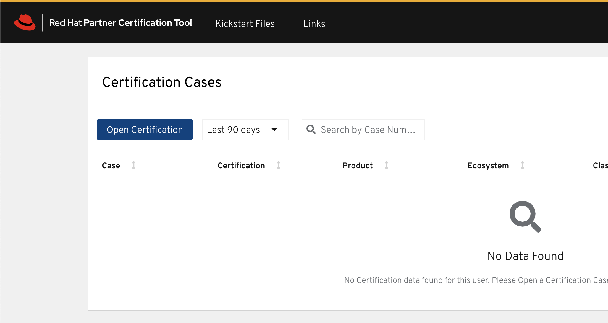
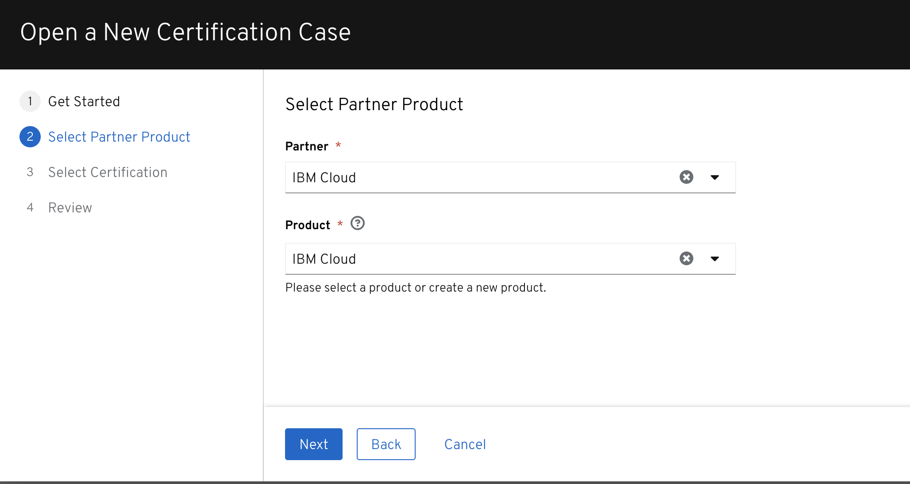
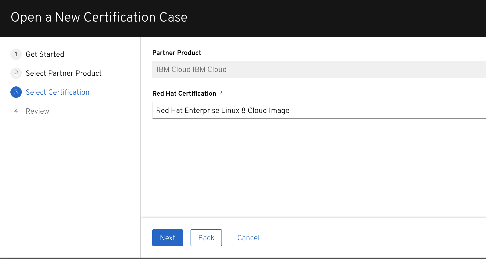
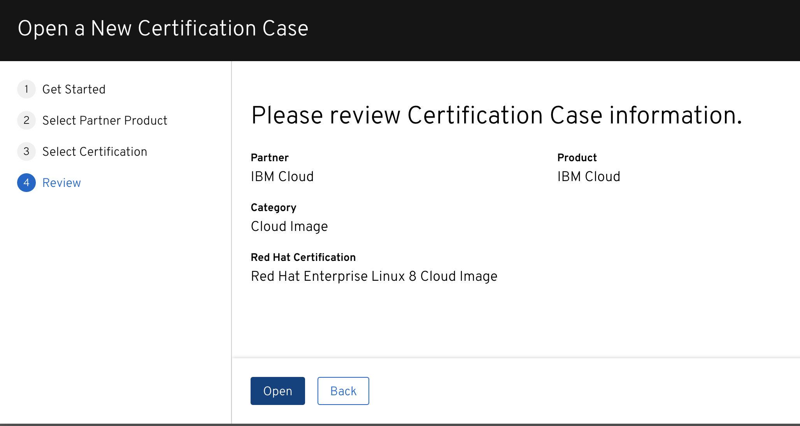
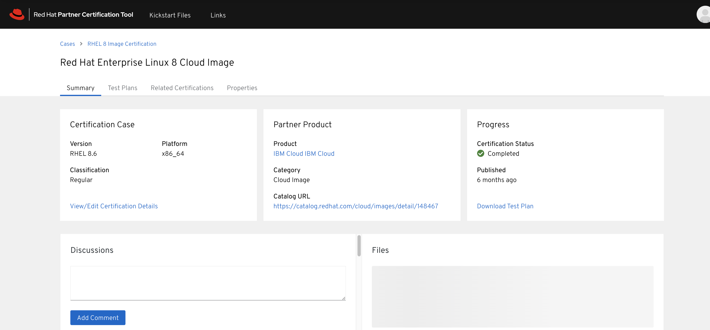
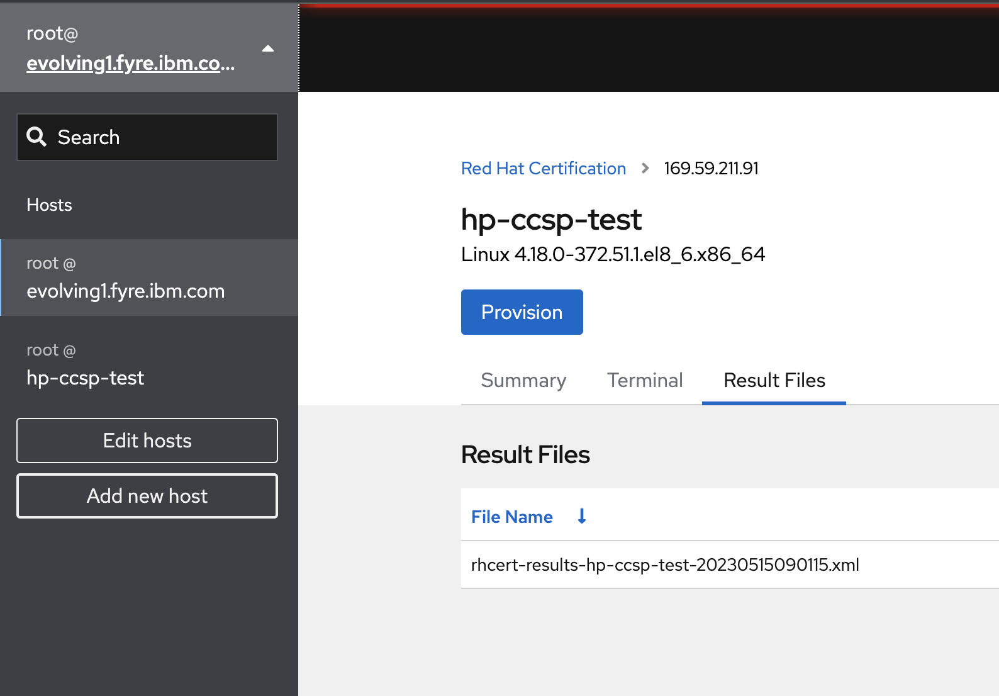
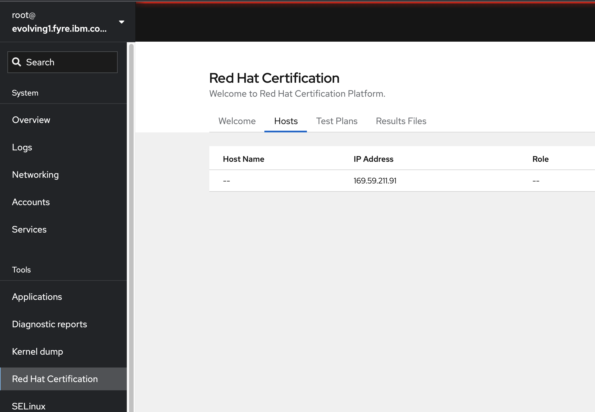
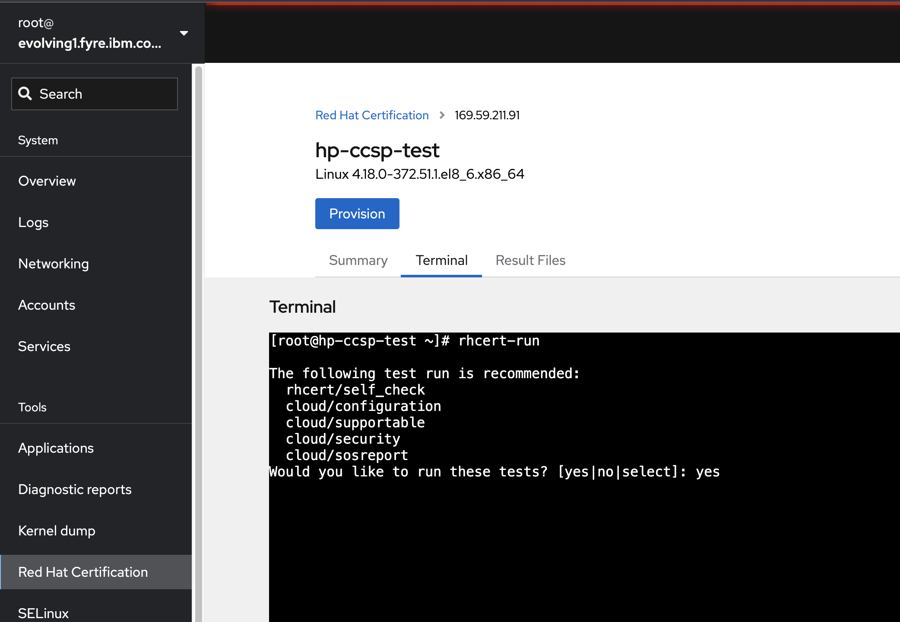
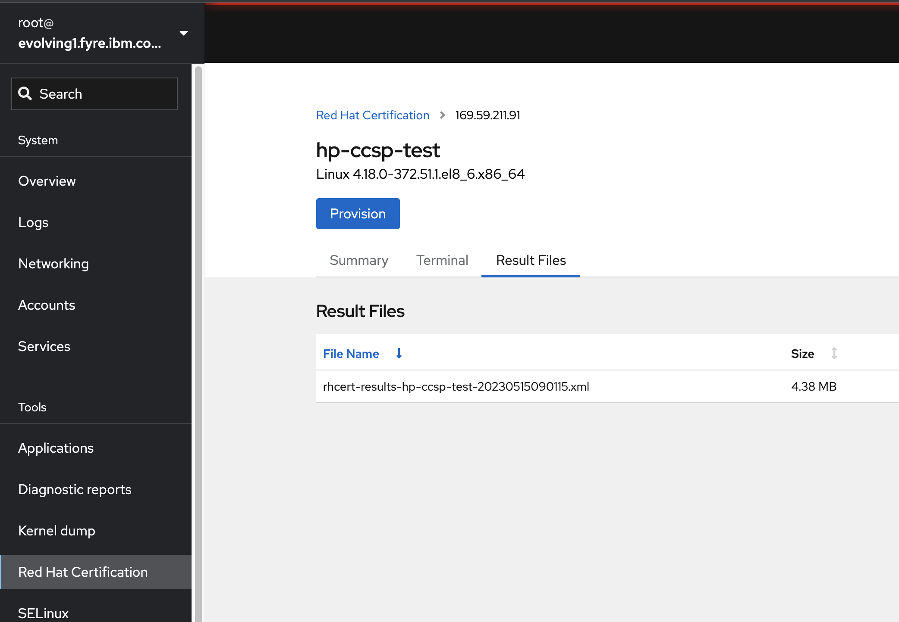
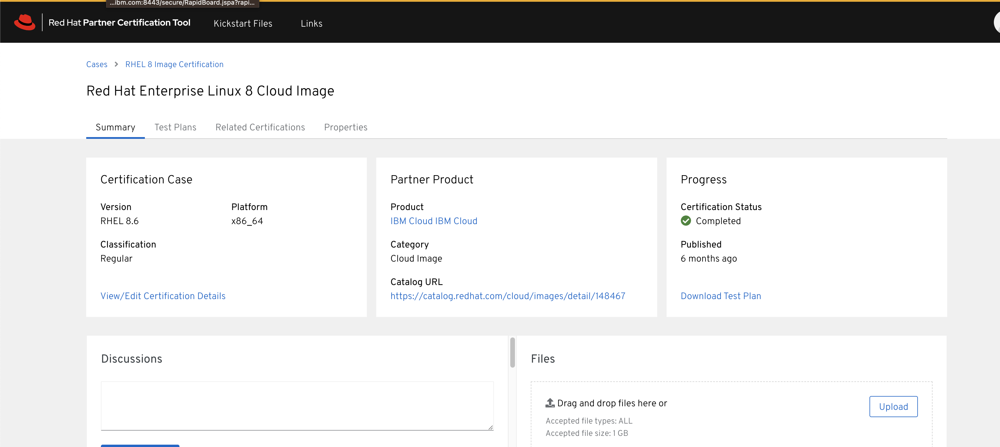

## HostOS Redhat CCSP Certification Workflow

This a reference document intended for performing all the setups and processes followed for certifying a HostOS Kernel for Redhat CCSP

Redhat CCSP certification: [cert](https://access.redhat.com/documentation/en-us/red_hat_certified_cloud_and_service_provider_certification/8.61/html/red_hat_certified_cloud_and_service_provider_certification_workflow_guide/index)

## A redhat ccsp framework consists of the following components:


1. **RHEL System under test VSI (SUT)**: this is a redhat vsi deployed on IBM Nextgen VPC cluster hosted on a HostOS Dev mzone with the required HostOS Kernel that needs to be Redhat CCSP certified.The certification tests are executed on this vsi.
2. **RHEL Cockpit Test Server** : this is a rhel fyre vm that acts as a test server and helps to delegate test execution on the required rhel vsi acting as the system under test (SUT)
3. **Redhat Cockpit Service**: this is a web based application hosted on the Test Server thats accessible for performing CCSP certification activities for a given redhat vsi

### Step 1: Redhat Cockpit Test Server setup

1. Create a RHEL vm in fyre for RHEL 8\.6\. Fyre documentation → [Requesting a VM using Fyre](https://confluence.swg.usma.ibm.com:8445/display/HCP/Requesting+a+VM+using+Fyre)
2. Download the following latest rpms for redhat\-certification\-cockpit from this [l](https://access.redhat.com/downloads/content/282/ver=8/rhel---8/8/x86_64/packages)[ink](https://access.redhat.com/downloads/content/282/ver=8/rhel---8/8/x86_64/packages).For account details check with [Shashikant Shelke](https://confluence.swg.usma.ibm.com:8445/display/~ShashikantShelke@ibm.com)   
\- redhat\-certification\-cockpit\-\<version\>.rpm  
\- redhat\-certification\-cloud\-\<version\>.rpm  
\- redhat\-certification\-backend\-\<version\>.rpm
3. Copy the cockpit rpm package (redhat\-certification\-cockpit\-\<version\>.rpm) to the fyre rhel vm using filezilla or any other sftp tool
4. Update the current rpm packages on the fyre vm


```
dnf clean all
dnf update
```
5. Install the cockpit server  


```
yum install redhat-certification-cockpit-<version>.rpm
```
6. Enable cockpit server  


```
systemctl enable --now cockpit.socket
```
7. Check if the cockpit service is accessible from your browser \-\> https://\<rhel\_vm\_ip\>:9090
8. Login to the cockpit server using the vm's root username and password

  


### Step 2: Redhat System under test VSI setup

1. Deploy a HostOS dev Mzone with require kernel and with kube and genctl stacks deployed successfully.
2. Create a Redhat VSI on this mzone using ibm cloud cli → [Using IBM Cloud Nextgen VPC service on Dev Mzones](https://confluence.swg.usma.ibm.com:8445/display/HCP/Using+IBM+Cloud+Nextgen+VPC+service+on+Dev+Mzones)
3. Set a root password and enable root password ssh authenthication


```
'passwd' -> set anew password
'vi /etc/ssh/sshd_config' and set 'PasswordAuthentication yes'
systemctl restart sshd   -> restart sshd service
```
4. Copy following packages to the vsi  
\- redhat\-certification\-cloud\-\<version\>.rpm  
\- redhat\-certification\-backend\-\<version\>.rpm
5. Install the certification packages


```
yum install redhat-certification-cloud-<version>.rpm redhat-certification-backend-<version>.r
```

### Step 3: Submit a CCSP certification request for your new HostOS Kernel

1. Login to <https://rhcert.connect.redhat.com/>. Account details can be checked with [Shashikant Shelke](https://confluence.swg.usma.ibm.com:8445/display/~ShashikantShelke@ibm.com)
2. Submit a ticket request outlining the certification details by clicking on **Open Certification** button form the Dashboard. Sample ticket to follow: [https://rhcert.connect.redhat.com/\#/cases/03340386](https://rhcert.connect.redhat.com/#/cases/03340386)  
  
  
  

3. Once submitted you can access the associated test plan by accessing the ticket  


### Step 4: Register vsi system on the Cockpit Test Server

1. Access the cockpit service at https://\<rhel\_vm\_ip\>:9090
2. Login to the cockpit server using the fyre vm's root username and password
3. Access the option on the top left corner to add a new host  

4. Provide the user host details and follow the instructions to add the System Under Test VSI
5. Navigate back to the dashboard by clicking on the arrow in the top left corner and visit the Red Hat Certification section  

6. Under the Hosts section , you should find the vsi you have registered  

7. Select the vsi and click on the **Provision** button
8. This will open a section on the right hand side to upload the test plan associated with the ccsp certification. Download the test plan from your ccsp certification ticket request created in Step 3\.
9. Upload the test plan xml file
10. Once the upload is complete the application will open a terminal window to the vsi and request for additional details. You may choose to ignore these settings
11. Start the certification tests by executing \`**rhcert\-run**\` command from the terminal window  

12. The test will ask for user inputs for certain scripts. Please continue to monitor and provide valid justifications.  
Some of these justifications are already provided on the sample ticket: [https://rhcert.connect.redhat.com/\#/cases/03340386](https://rhcert.connect.redhat.com/#/cases/03340386)
13. Once completed, the result will be available for download at  

14. Download the report and attach it on the certification ticket under the Upload section  

15. Once the certification is approved and  published , upgrade our tracker at [HostOS Redhat CCSP Certification Tracker](HostOS-Redhat-CCSP-Certification-Tracker_357447038.html)


## HostOS Redhat CCSP Certification Tracker

This page is to track Redhat Certified Cloud and Service Provider (CCSP) certification for HostOS Hypervisor.

We perform this certification for every new HostOS Hypervisor Kernel Release.

The certification process involves the following steps:

1. Deploy dev mzone with Latest HostOS releases for a given Kernel version
2. Deploy and setup Genctl and Rias components to provision a Nextgen VPC cluster on Dev mzone
3. Provision a Redhat VSI on the dev mzone cluster
4. Execute CCSP certification tests as per the Redhat Official [guide](https://access.redhat.com/documentation/en-us/red_hat_certified_cloud_and_service_provider_certification/8.53/html/red_hat_certified_cloud_and_service_provider_certification_workflow_guide/index)

The following table provides details of all certifications conducted till date:

| HostOS Hypervisor Version | Release Versions | Certification VSI | Certification Case | Published Certification |
| --- | --- | --- | --- | --- |
| 5\.x Ubuntu\-18\.04\.6\-LTS\-(Bionic\-Beaver), Kernel: 4\.15\.0\-1108\-ibm\-gt | *hostos\-boot\-release:5\.0\.7\-20221027T083954Z\_6ba5665**hostos\-config\-release:5\.5\.92\-20221027T120529Z\_27f0184**hostos\-base\-os\-sw\-release:5\.4\.94\-20221027T115554Z\_3566f81**hostos\-base\-net\-sw\-release:5\.8\.25\-20221101T022437Z\_4a570c9**hostos\-nextgen\-os\-sw\-release:5\.1\.101\-20221027T055130Z\_2488836**hostos\-kernel\-patch\-release:5\.1\.11\-20220907T092451Z\_9e60e87* | Redhat 8\.6 | [https://rhcert.connect.redhat.com/\#/cases/03340386](https://rhcert.connect.redhat.com/#/cases/03340386) | <https://catalog.redhat.com/cloud/images/detail/6980603> |
| 6\.x **Ubuntu 22\.04\.4 LTS \- (**Jammy Jellyfish) Linux Kernel 6\.5, Mesa 23\.2 |  | Redhat 8\.6 | [https://rhcert.connect.redhat.com/\#/cases/03549469](https://rhcert.connect.redhat.com/#/cases/03549469) | ``` [https://catalog.redhat.com/cloud/images/detail/148467](https://catalog.redhat.com/cloud/detail/148467) ``` |
|  |  |  |  |  |
